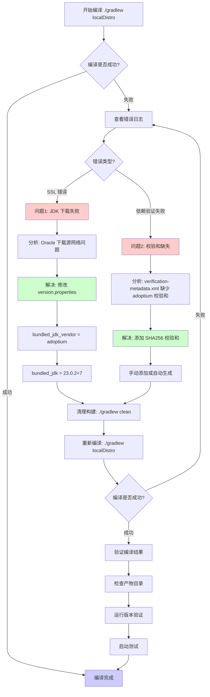
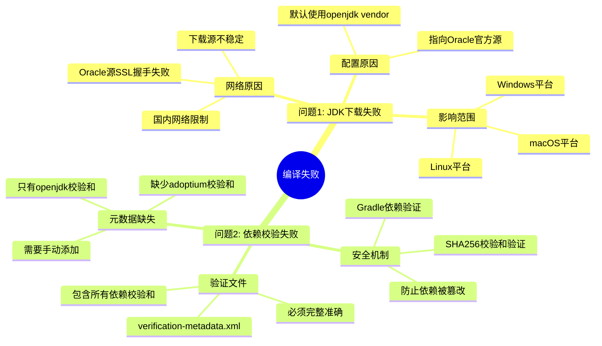
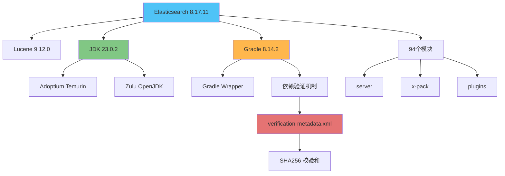
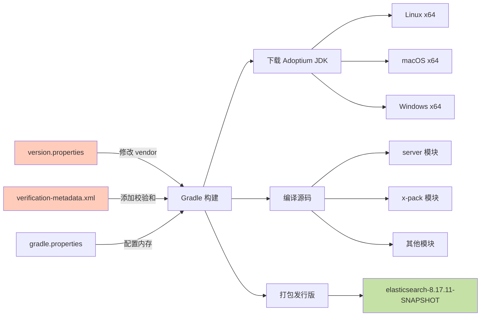

# Elasticsearch 编译问题解决流程图

## 问题诊断与解决流程

```mermaid
graph TD
    A[开始编译 ./gradlew localDistro] --> B{编译是否成功?}
    B -->|成功| Z[编译完成]
    B -->|失败| C[查看错误日志]
    
    C --> D{错误类型?}
    
    D -->|SSL 错误| E[问题1: JDK 下载失败]
    E --> F[分析: Oracle 下载源网络问题]
    F --> G[解决: 修改 version.properties]
    G --> H[bundled_jdk_vendor = adoptium]
    H --> I[bundled_jdk = 23.0.2+7]
    
    D -->|依赖验证失败| J[问题2: 校验和缺失]
    J --> K[分析: verification-metadata.xml 缺少 adoptium 校验和]
    K --> L[解决: 添加 SHA256 校验和]
    L --> M[手动添加或自动生成]
    
    I --> N[清理构建: ./gradlew clean]
    M --> N
    
    N --> O[重新编译: ./gradlew localDistro]
    O --> P{编译是否成功?}
    P -->|成功| Q[验证编译结果]
    P -->|失败| C
    
    Q --> R[检查产物目录]
    R --> S[运行版本验证]
    S --> T[启动测试]
    T --> Z
    
    style E fill:#ffcccc
    style J fill:#ffcccc
    style G fill:#ccffcc
    style L fill:#ccffcc
    style Z fill:#ccccff
```

## 环境配置流程

```mermaid
graph LR
    A[安装 sdkman] --> B[安装 JDK 23]
    B --> C[配置 JAVA_HOME]
    C --> D[验证 Java 版本]
    D --> E[修改项目配置]
    E --> F[开始编译]
    
    style A fill:#e1f5ff
    style B fill:#e1f5ff
    style C fill:#e1f5ff
    style D fill:#fff9c4
    style E fill:#fff9c4
    style F fill:#c8e6c9
```

## 问题根因分析

```mermaid
mindmap
  root((编译失败))
    问题1: JDK下载失败
      网络原因
        Oracle源SSL握手失败
        国内网络限制
        下载源不稳定
      配置原因
        默认使用openjdk vendor
        指向Oracle官方源
      影响范围
        Linux平台
        macOS平台
        Windows平台
    问题2: 依赖校验失败
      安全机制
        Gradle依赖验证
        SHA256校验和验证
        防止依赖被篡改
      元数据缺失
        只有openjdk校验和
        缺少adoptium校验和
        需要手动添加
      验证文件
        verification-metadata.xml
        包含所有依赖校验和
        必须完整准确
```

## 解决方案对比

```mermaid
graph TB
    subgraph "方案1: 切换到 Adoptium (推荐)"
        A1[修改 JDK vendor] --> A2[添加校验和]
        A2 --> A3[重新编译]
        A3 --> A4[✅ 成功]
    end
    
    subgraph "方案2: 配置代理"
        B1[设置 HTTP 代理] --> B2[设置 HTTPS 代理]
        B2 --> B3[重新编译]
        B3 --> B4[⚠️ 不稳定]
    end
    
    subgraph "方案3: 使用本地 JDK"
        C1[配置 gradle.properties] --> C2[使用 installDist]
        C2 --> C3[不打包 JDK]
        C3 --> C4[⚠️ 功能受限]
    end
    
    style A4 fill:#c8e6c9
    style B4 fill:#fff9c4
    style C4 fill:#fff9c4
```

## 编译时间线

```mermaid
gantt
    title Elasticsearch 编译时间线
    dateFormat  HH:mm
    section 首次编译
    环境准备           :done, 00:00, 5m
    依赖下载           :done, 00:05, 10m
    模块编译           :done, 00:15, 15m
    打包发行版         :done, 00:30, 5m
    
    section 增量编译
    检查变更           :done, 00:35, 1m
    编译变更模块       :done, 00:36, 2m
    重新打包           :done, 00:38, 1m
```

## 依赖关系图

```mermaid
graph TD
    A[Elasticsearch 8.17.11] --> B[Lucene 9.12.0]
    A --> C[JDK 23.0.2]
    A --> D[Gradle 8.14.2]
    
    C --> E[Adoptium Temurin]
    C --> F[Zulu OpenJDK]
    
    D --> G[Gradle Wrapper]
    D --> H[依赖验证机制]
    
    H --> I[verification-metadata.xml]
    I --> J[SHA256 校验和]
    
    A --> K[94个模块]
    K --> L[server]
    K --> M[x-pack]
    K --> N[plugins]
    
    style A fill:#4fc3f7
    style C fill:#81c784
    style D fill:#ffb74d
    style I fill:#e57373
```

## 文件修改关系

```mermaid
graph LR
    A[version.properties] -->|修改 vendor| B[Gradle 构建]
    C[verification-metadata.xml] -->|添加校验和| B
    D[gradle.properties] -->|配置内存| B
    
    B --> E[下载 Adoptium JDK]
    B --> F[编译源码]
    B --> G[打包发行版]
    
    E --> H[Linux x64]
    E --> I[macOS x64]
    E --> J[Windows x64]
    
    F --> K[server 模块]
    F --> L[x-pack 模块]
    F --> M[其他模块]
    
    G --> N[elasticsearch-8.17.11-SNAPSHOT]
    
    style A fill:#ffccbc
    style C fill:#ffccbc
    style N fill:#c5e1a5
```

---

**说明**: 以上流程图使用 Mermaid 语法，可以在支持 Mermaid 的 Markdown 查看器中渲染。
