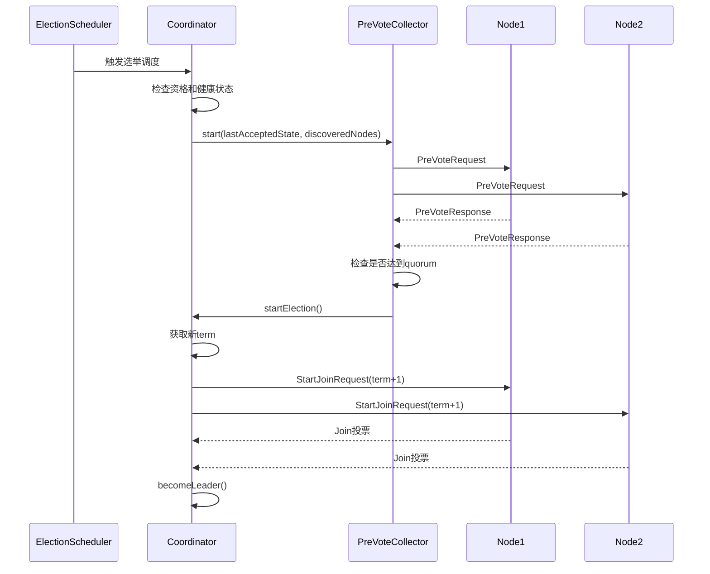
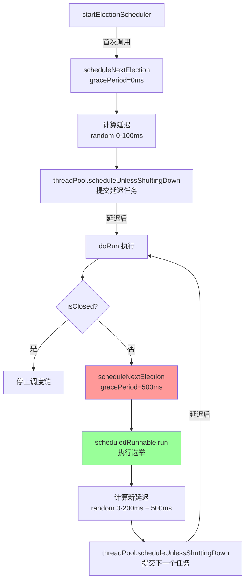
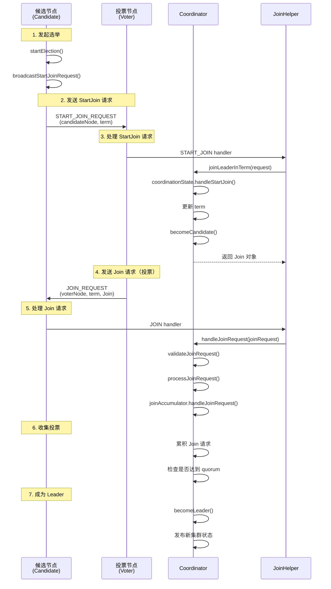
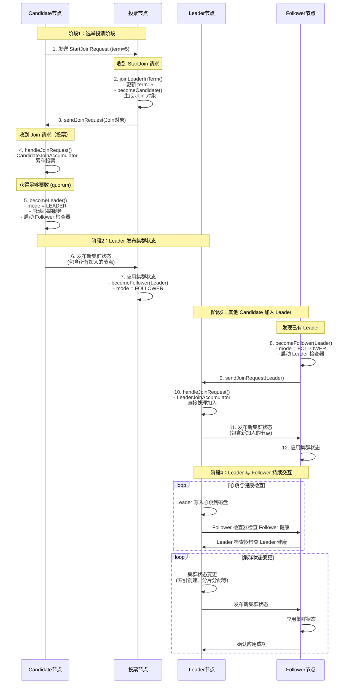
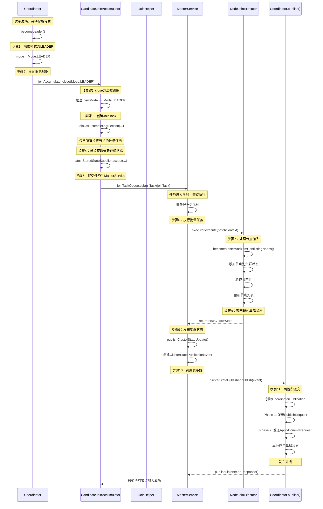
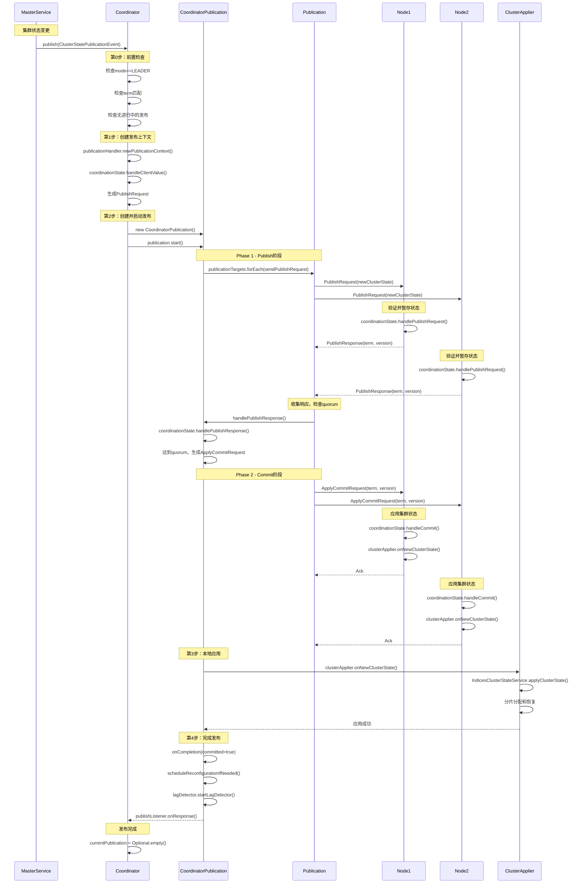

# 集群启动分析

在启动一个ES集群时，需要启动多个节点。每个节点就是一个es进程，通过elasticsearch.yaml文件进行配置。
启动es节点时，必然先从yaml文件中读取配置，看自己是什么角色。

配置：
discovery.seed_hosts: ["10.0.0.1:9300", "10.0.0.2:9300", "10.0.0.3:9300"].
用来找组织，节点每次重启都会使用这个。 每个节点都需要配置。
cluster.initial_master_nodes: ["es-node-1", "es-node-2", "es-node-3"].
用来构建组织，仅集群初次形成时。仅具有master资格的节点配置。


## Elasticsearch.java

启动主要分为三个阶段，分别对应initPhase1、initPhase2、initPhase3。涉及到Bootstrap类。

initPhase1：

initPhase2:

1. SecurityManager是什么？为什么initPhase3之前必须要设置这个？
2.

initPhase3:
1. 检查lucene版本是否和es匹配；
2. 生成node实例；

通过NodeConstruction生成node，而不是把逻辑全放到Node中。

## 选主代码分析
以理论+代码的方法分析es集群形成的过程，即各个节点启动到最终形成es集群的详细过程。

### 一、集群形成的核心概念

#### 1.1 关键配置项
- **discovery.seed_hosts**: 种子节点列表，用于节点发现。每个节点启动时都会尝试连接这些地址来发现集群中的其他节点。
- **cluster.initial_master_nodes**: 初始主节点候选列表，仅在集群首次启动时使用，用于引导集群形成。一旦集群形成后应该移除此配置（TODO：不需要吧？）。

#### 1.2 核心组件
- **Coordinator**: 集群协调器，负责选主、集群状态发布等核心功能
- **PeerFinder**: 节点发现器，负责发现和连接其他节点
- **ClusterBootstrapService**: 集群引导服务，负责集群的初始化引导
- **PreVoteCollector**: 预投票收集器，实现预投票机制防止脑裂
- **JoinHelper**: 加入助手，处理节点加入集群的逻辑
- **ElectionScheduler**: 选举调度器，控制选举的时机

#### 1.3 节点模式（Mode）
- **CANDIDATE**: 候选者模式，节点正在尝试成为主节点或寻找主节点
- **LEADER**: 领导者模式，节点已成为集群的主节点
- **FOLLOWER**: 跟随者模式，节点已加入集群并跟随某个主节点

### 二、选主详细流程概述

Elasticsearch的选主机制基于Raft共识算法的变体实现，整个流程可以分为以下几个阶段：
参考链接：https://www.cnblogs.com/shanml/p/16684887.html

节点发现
PeerFinder: peersByAddress, handleWakeup(), startProbe()
Peer: handleWakeup(), establishConnection(), requestPeers()

理解：
节点启动后开始节点发现（一是从持久化中获取上一次的节点信息，二是从yaml配置文件中读取seed_hosts），会将发现的节点保存到
peersByAddress。在节点发现过程中，会涉及两个方法的调用onFoundPeersUpdated和onActiveMasterFound。

onActiveMasterFound：是在requestPeers()中处理PeersResponse时，如果peer是正在leading的master，则调用该函数尝试加入；
onActiveMasterFound() -> joinHelper.sendJoinRequest() TODO

onFoundPeersUpdated：peersByAddress有更新时会调用（这个是集群还没形成的时候，各个节点在互相发现过程中会调用这个方法判断自己能否发起选举）；
onFoundPeersUpdated() -> startElectionScheduler() -> ClusterBootstrapService.onFoundPeersUpdated() -> startBootstrap() -> ...
-> startElectionScheduler()?


节点发现过程中，应该就会判断自己是否有资格发起选举（ES会有一个预投票环节）。如果有，则
Coordinator: PeerFinder, CoordinationState

PeersResponse: 包含masterNode、knownPeers以及term


CoordinationState：协商状态，包括相关的各种变量

StartJoinRequest
sendJoinRequest()

StatefulPreVoteCollector.handlePreVoteRequest/Response()

ensureTermAtLeast() -> joinLeaderInTerm() -> handleStartJoin()



ElectionSchedulerFactory.scheduleNextElection()逻辑理解（实现方式值得学习！！！）：
1. 为什么在执行runnable之前又调用了scheduleNextElection()，不会无限调度但不执行runnable嘛？
2. 理解threadpool.scheduleUnlessShuttingDown这里不是定期执行任务除非被关闭，这里是
   一次性调度任务，UnlessShuttingDown表示如果这个threadpool已经关闭，则静默输出debug信息即可，不会抛异常


选举流程 TODO：


becomeLeader, becomeFollower的变化：


从becomeLeader到publish的逻辑链路：


成为leader后发布集群状态的流程：


#### 2.1 集群首次启动的选主流程

**阶段1：节点启动与初始化**
1. 各个节点启动ES进程，读取`elasticsearch.yml`配置文件
2. 节点初始化各种服务组件（TransportService、ClusterService等）
3. 节点进入**CANDIDATE（候选者）模式**
4. 从磁盘加载持久化的元数据（如果存在）

**阶段2：节点发现（Peer Discovery）**
1. 节点激活PeerFinder（节点发现器）
2. 解析`discovery.seed_hosts`配置，获取种子节点地址列表
3. 向种子节点发送**PeersRequest**请求，询问对方已知的节点信息
4. 接收**PeersResponse**响应，获取对方知道的所有节点（包括主节点和普通节点）
5. 继续探测响应中的新节点，形成**传播式发现**
6. 定期重复探测（默认每1秒），不断更新已知节点列表

**阶段3：集群引导（Cluster Bootstrap）**
1. ClusterBootstrapService监听<节点发现>的更新
2. 检查发现的节点是否匹配`cluster.initial_master_nodes`配置
3. 当满足**引导条件**时触发引导流程：
    - 条件：`发现的匹配节点数 * 2 > 配置的节点总数`
    - 例如：配置3个节点，至少发现2个才能引导
    - **重要**：这里的"匹配节点"**仅指具有主节点资格的节点**（`isMasterNode() == true`）
    - 普通数据节点不参与引导条件的计算
4. 创建**初始投票配置（VotingConfiguration）**：
    - 包含所有匹配的节点ID
    - 对未发现的节点使用占位符
5. 将投票配置应用到CoordinationState（协调状态）

**代码证据**：
```java
// ClusterBootstrapService.java - startBootstrap()
private void startBootstrap(Set<DiscoveryNode> discoveryNodes, List<String> unsatisfiedRequirements) {
    // 断言：所有参与引导的节点都必须是主节点候选者
    assert discoveryNodes.stream().allMatch(DiscoveryNode::isMasterNode) : discoveryNodes;
    // ...
}
```

**阶段4：预投票（Pre-Vote）**
1. 满足引导条件后，ElectionScheduler（选举调度器）启动
2. 使用**随机退避算法**，避免所有节点同时发起选举
3. 某个节点的退避时间到期，发起**预投票轮次**：
    - 向其他节点发送**PreVoteRequest**
    - 请求中包含：候选者信息、当前任期号
4. 其他节点收到预投票请求后，检查：
    - 候选者的任期是否足够新
    - 候选者的集群状态是否足够新
    - 自己是否已经知道活跃的主节点
5. 如果检查通过，返回**PreVoteResponse**表示支持
6. 候选者收集预投票响应：
    - 如果获得**多数节点**的支持 → 进入正式选举
    - 如果未获得多数支持 → 增加退避时间，稍后重试

**阶段5：正式选举（Election）**
1. 候选者增加**任期号（Term）**
2. 向自己投票，并向其他节点发送**JoinRequest（加入请求）**
    - JoinRequest实际上就是投票请求
    - 包含：候选者信息、新的任期号
3. 其他节点收到JoinRequest后：
    - 检查任期号是否比自己的大
    - 检查是否已经在当前任期投过票
    - 如果检查通过，接受加入请求（即投票给候选者）
4. 候选者通过**JoinAccumulator（加入累加器）**收集投票
5. 当获得**多数投票**时：
    - 候选者调用`becomeLeader()`成为主节点
    - 切换到**LEADER模式**

**阶段6：主节点确立**
1. 新主节点执行以下操作：
    - 停用PeerFinder（不再主动发现节点）
    - 启动**LeaderHeartbeatService**（领导者心跳服务）
    - 启动**FollowersChecker**（跟随者检查器）
    - 切换JoinAccumulator为LeaderJoinAccumulator
2. 其他节点发现活跃主节点后：
    - 调用`becomeFollower()`成为跟随者
    - 切换到**FOLLOWER模式**
    - 停用PeerFinder
    - 启动**LeaderChecker**（领导者检查器）

**阶段7：集群状态发布**
1. 主节点构建包含所有节点的**ClusterState（集群状态）**
2. 通过**两阶段提交**发布集群状态：
    - **Phase 1 - Publish**：向所有节点发送新的集群状态
    - 节点接收后验证并暂存，返回确认
    - **Phase 2 - Commit**：主节点收到多数确认后，发送提交指令
    - 节点收到提交指令后，应用新的集群状态
3. 集群状态包含：
    - 所有节点信息（DiscoveryNodes）
    - 元数据（Metadata）
    - 路由表（RoutingTable）
    - 投票配置（VotingConfiguration）

**阶段8：集群形成完成**
1. 所有节点应用相同的集群状态
2. 主节点开始接受客户端请求
3. 跟随者节点定期检查主节点健康状态
4. 主节点定期检查跟随者健康状态
5. 集群进入正常运行状态

#### 2.2 节点加入现有集群的流程

当一个新节点启动并加入已有集群时：

**步骤1：节点启动**
- 节点启动，进入CANDIDATE模式
- 激活PeerFinder开始节点发现

**步骤2：发现主节点**
- 通过`discovery.seed_hosts`连接种子节点
- 种子节点返回当前的主节点信息
- 直接探测主节点

**步骤3：加入集群**
- 向主节点发送JoinRequest
- 主节点验证请求的合法性
- 主节点通过LeaderJoinAccumulator累积加入请求

**步骤4：状态同步**
- 主节点发布包含新节点的集群状态
- 新节点接收并应用集群状态
- 新节点切换到FOLLOWER模式

**步骤5：完成加入**
- 新节点启动LeaderChecker监控主节点
- 主节点的FollowersChecker开始监控新节点
- 新节点开始处理分片分配等任务

#### 2.3 主节点故障与重新选举

当主节点发生故障时：

**步骤1：故障检测**
- 跟随者的LeaderChecker检测到主节点无响应
- 连续多次检查失败后，判定主节点失联
- 跟随者调用`becomeCandidate()`重新进入候选者模式

**步骤2：重新选举**
- 多个节点同时进入CANDIDATE模式
- 通过ElectionScheduler的随机退避，错开选举时间
- 某个节点先发起预投票和正式选举
- 获得多数投票的节点成为新主节点

**步骤3：集群恢复**
- 新主节点发布集群状态
- 其他节点加入新主节点
- 集群恢复正常运行

#### 2.4 关键机制说明

**多数派原则（Quorum）**
- 选举需要获得**超过半数**节点的投票
- 集群状态提交需要**超过半数**节点确认
- 这确保了任意时刻最多只有一个主节点

**任期机制（Term）**
- 每次选举都会增加任期号
- 任期号单调递增，永不回退
- 旧任期的消息会被忽略
- 防止网络分区后的冲突

**预投票机制（Pre-Vote）**
- 在正式选举前先进行预投票
- 网络分区的少数节点无法获得预投票
- 避免不必要的任期增长
- 减少对集群的影响

**投票配置（VotingConfiguration）**
- 定义哪些节点有投票权
- 动态调整，适应节点变化
- 确保集群的容错能力

**心跳与健康检查**
- 主节点定期写入心跳，证明自己活跃
- LeaderChecker：跟随者检查主节点
- FollowersChecker：主节点检查跟随者
- 及时发现故障，触发重新选举

**脑裂防护**
- 预投票机制防止少数派发起选举
- 多数派原则确保只有一个主节点
- 任期机制防止旧主节点干扰
- 投票配置动态调整保持一致性

#### 2.5 选主流程时序图

```
时间轴 │ 节点A (候选者)          │ 节点B (候选者)          │ 节点C (候选者)
──────┼────────────────────────┼────────────────────────┼────────────────────────
T0    │ 启动 → CANDIDATE        │ 启动 → CANDIDATE        │ 启动 → CANDIDATE
      │ 激活PeerFinder          │ 激活PeerFinder          │ 激活PeerFinder
──────┼────────────────────────┼────────────────────────┼────────────────────────
T1    │ 探测seed_hosts          │ 探测seed_hosts          │ 探测seed_hosts
      │ 发送PeersRequest ─────→ │                         │
      │                         │ ←───── PeersResponse    │
──────┼────────────────────────┼────────────────────────┼────────────────────────
T2    │ 发现节点B、C            │ 发现节点A、C            │ 发现节点A、B
      │ 满足引导条件            │ 满足引导条件            │ 满足引导条件
      │ 创建VotingConfig        │ 创建VotingConfig        │ 创建VotingConfig
──────┼────────────────────────┼────────────────────────┼────────────────────────
T3    │ 启动ElectionScheduler   │ 启动ElectionScheduler   │ 启动ElectionScheduler
      │ 退避时间: 150ms         │ 退避时间: 300ms         │ 退避时间: 450ms
──────┼────────────────────────┼────────────────────────┼────────────────────────
T4    │ 退避到期，发起预投票    │                         │
      │ PreVoteRequest ───────→ │                         │
      │ PreVoteRequest ─────────┼───────────────────────→ │
──────┼────────────────────────┼────────────────────────┼────────────────────────
T5    │                         │ 检查通过，支持A         │ 检查通过，支持A
      │ ←───── PreVoteResponse  │                         │
      │ ←───────────────────────┼───────────────────────  │
      │ 获得多数预投票 ✓        │                         │
──────┼────────────────────────┼────────────────────────┼────────────────────────
T6    │ Term: 0 → 1             │                         │
      │ 发起正式选举            │                         │
      │ JoinRequest ──────────→ │                         │
      │ JoinRequest ────────────┼───────────────────────→ │
──────┼────────────────────────┼────────────────────────┼────────────────────────
T7    │                         │ 投票给A (Term=1)        │ 投票给A (Term=1)
      │ ←───── JoinResponse     │                         │
      │ ←───────────────────────┼───────────────────────  │
      │ 获得多数投票 ✓          │                         │
──────┼────────────────────────┼────────────────────────┼────────────────────────
T8    │ becomeLeader()          │                         │
      │ 模式: LEADER            │                         │
      │ 启动心跳服务            │                         │
      │ 启动FollowersChecker    │                         │
──────┼────────────────────────┼────────────────────────┼────────────────────────
T9    │ 发布ClusterState        │                         │
      │ PublishRequest ───────→ │                         │
      │ PublishRequest ─────────┼───────────────────────→ │
──────┼────────────────────────┼────────────────────────┼────────────────────────
T10   │                         │ 接受并暂存状态          │ 接受并暂存状态
      │ ←───── PublishResponse  │                         │
      │ ←───────────────────────┼───────────────────────  │
      │ 获得多数确认 ✓          │                         │
──────┼────────────────────────┼────────────────────────┼────────────────────────
T11   │ 发送Commit指令          │                         │
      │ CommitRequest ────────→ │                         │
      │ CommitRequest ──────────┼───────────────────────→ │
──────┼────────────────────────┼────────────────────────┼────────────────────────
T12   │                         │ 应用ClusterState        │ 应用ClusterState
      │                         │ becomeFollower()        │ becomeFollower()
      │                         │ 模式: FOLLOWER          │ 模式: FOLLOWER
      │                         │ 启动LeaderChecker       │ 启动LeaderChecker
──────┼────────────────────────┼────────────────────────┼────────────────────────
T13   │ 集群形成完成 ✓          │ 集群形成完成 ✓          │ 集群形成完成 ✓
      │ 主节点运行              │ 跟随者运行              │ 跟随者运行
```

### 三、集群启动流程详解

#### 3.1 Node启动阶段（Node.start()）

从`Node.java`的`start()`方法开始：

```java
public Node start() throws NodeValidationException {
    // 1. 启动各种服务组件
    injector.getInstance(IndicesService.class).start();
    injector.getInstance(ClusterService.class).start();

    // 2. 启动传输服务
    TransportService transportService = injector.getInstance(TransportService.class);
    transportService.start();

    // 3. 加载磁盘上的元数据
    final GatewayMetaState gatewayMetaState = injector.getInstance(GatewayMetaState.class);
    gatewayMetaState.start(...);

    // 4. 启动协调器
    final Coordinator coordinator = injector.getInstance(Coordinator.class);
    coordinator.start();
    clusterService.start();

    // 5. 开始初始加入过程（关键步骤）
    coordinator.startInitialJoin();

    // 6. 等待初始集群状态
    if (initialStateTimeout.millis() > 0) {
        // 等待发现主节点
    }

    return this;
}
```

#### 3.2 初始加入流程（startInitialJoin）

**代码位置**: `Coordinator.java#startInitialJoin()`

```java
public void startInitialJoin() {
    synchronized (mutex) {
        becomeCandidate("startInitialJoin");  // 成为候选者
    }
    clusterBootstrapService.scheduleUnconfiguredBootstrap();  // 调度未配置的引导
}
```

**关键步骤**：
1. 节点首先进入CANDIDATE模式
2. 如果没有配置discovery相关设置，会在超时后尝试自动引导

#### 3.3 成为候选者（becomeCandidate）

**代码位置**: `Coordinator.java#becomeCandidate()`

```java
void becomeCandidate(String method) {
    assert Thread.holdsLock(mutex);

    if (mode != Mode.CANDIDATE) {
        mode = Mode.CANDIDATE;

        // 1. 关闭当前的发布任务
        cancelActivePublication("become candidate: " + method);

        // 2. 重置加入累加器
        joinAccumulator.close(mode);
        joinAccumulator = joinHelper.new CandidateJoinAccumulator();

        // 3. 激活节点发现器（关键）
        peerFinder.activate(coordinationState.get().getLastAcceptedState().nodes());

        // 4. 启动集群形成失败检测
        clusterFormationFailureHelper.start();

        // 5. 停止心跳服务和检查器
        leaderHeartbeatService.stop();
        leaderChecker.setCurrentNodes(DiscoveryNodes.EMPTY_NODES);
        leaderChecker.updateLeader(null);
        followersChecker.clearCurrentNodes();

        // 6. 更新预投票收集器
        preVoteCollector.update(getPreVoteResponse(), null);
    }
}
```

**核心作用**：
- 将节点状态切换到候选者模式
- 激活PeerFinder开始发现其他节点
- 准备参与选举或加入现有集群

#### 3.4 节点发现过程（PeerFinder）

**代码位置**: `PeerFinder.java#activate()`

```java
public void activate(final DiscoveryNodes lastAcceptedNodes) {
    synchronized (mutex) {
        active = true;
        this.lastAcceptedNodes = lastAcceptedNodes;
        leader = Optional.empty();
        handleWakeUp();  // 开始探测
    }
    onFoundPeersUpdated();  // 触发检查
}
```

**探测流程（handleWakeUp）**：

```java
private boolean handleWakeUp() {
    // 1. 探测上次集群状态中的主节点
    for (DiscoveryNode discoveryNode : lastAcceptedNodes.getMasterNodes().values()) {
        startProbe(discoveryNode.getAddress());
    }

    // 2. 解析并探测配置的种子节点（discovery.seed_hosts）
    configuredHostsResolver.resolveConfiguredHosts(providedAddresses -> {
        synchronized (mutex) {
            lastResolvedAddresses = providedAddresses;
            providedAddresses.forEach(this::startProbe);
        }
    });

    // 3. 定期重复探测
    transportService.getThreadPool().scheduleUnlessShuttingDown(
        findPeersInterval,
        clusterCoordinationExecutor,
        new Runnable() {
            public void run() {
                synchronized (mutex) {
                    if (handleWakeUp() == false) return;
                }
                onFoundPeersUpdated();
            }
        }
    );
}
```

**探测单个节点（startProbe）**：

```java
protected void startProbe(TransportAddress transportAddress) {
    if (peersByAddress.containsKey(transportAddress) == false) {
        final Peer peer = new Peer(transportAddress);
        peersByAddress.put(transportAddress, peer);
        peer.establishConnection();  // 建立连接
    }
}
```

**建立连接后请求对等节点信息（requestPeers）**：

```java
private void requestPeers() {
    // 发送PeersRequest请求
    transportService.sendRequest(
        discoveryNode,
        REQUEST_PEERS_ACTION_NAME,
        new PeersRequest(getLocalNode(), knownNodes),
        TransportRequestOptions.timeout(requestPeersTimeout),
        peersResponseHandler
    );
}
```

**处理对等节点响应**：

```java
public void handleResponse(PeersResponse response) {
    synchronized (mutex) {
        // 1. 记录对方知道的主节点
        lastKnownMasterNode = response.getMasterNode();

        // 2. 探测响应中的主节点
        response.getMasterNode().ifPresent(node -> startProbe(node.getAddress()));

        // 3. 探测响应中的其他节点
        for (DiscoveryNode node : response.getKnownPeers()) {
            startProbe(node.getAddress());
        }
    }

    // 4. 如果对方认为自己是主节点，尝试加入
    if (response.getMasterNode().equals(Optional.of(discoveryNode))) {
        onActiveMasterFound(discoveryNode, response.getTerm());
    }
}
```

#### 3.5 集群引导过程（ClusterBootstrapService）

**代码位置**: `ClusterBootstrapService.java#onFoundPeersUpdated()`

当发现的节点更新时，会触发此方法：

```java
public void onFoundPeersUpdated() {
    final Set<DiscoveryNode> nodes = getDiscoveredNodes();

    if (bootstrappingPermitted.get()
        && transportService.getLocalNode().isMasterNode()
        && bootstrapRequirements.isEmpty() == false
        && isBootstrappedSupplier.getAsBoolean() == false) {

        // 1. 检查发现的节点是否满足引导要求
        final Tuple<Set<DiscoveryNode>, List<String>> requirementMatchingResult
            = checkRequirements(nodes);

        final Set<DiscoveryNode> nodesMatchingRequirements = requirementMatchingResult.v1();
        final List<String> unsatisfiedRequirements = requirementMatchingResult.v2();

        // 2. 检查本地节点是否在要求列表中
        if (nodesMatchingRequirements.contains(transportService.getLocalNode()) == false) {
            bootstrappingPermitted.set(false);
            return;
        }

        // 3. 如果满足要求的节点数量超过半数，开始引导
        if (nodesMatchingRequirements.size() * 2 > bootstrapRequirements.size()) {
            startBootstrap(nodesMatchingRequirements, unsatisfiedRequirements);
        }
    }
}
```

**匹配要求的逻辑**：

```java
private Tuple<Set<DiscoveryNode>, List<String>> checkRequirements(Set<DiscoveryNode> nodes) {
    final Set<DiscoveryNode> selectedNodes = new HashSet<>();
    final List<String> unmatchedRequirements = new ArrayList<>();

    for (final String bootstrapRequirement : bootstrapRequirements) {
        // 通过节点名称、地址或IP匹配
        final Set<DiscoveryNode> matchingNodes = nodes.stream()
            .filter(n -> matchesRequirement(n, bootstrapRequirement))
            .collect(Collectors.toSet());

        if (matchingNodes.size() == 0) {
            unmatchedRequirements.add(bootstrapRequirement);
        }

        if (matchingNodes.size() > 1) {
            throw new IllegalStateException(
                "requirement [" + bootstrapRequirement + "] matches multiple nodes"
            );
        }

        selectedNodes.addAll(matchingNodes);
    }

    return Tuple.tuple(selectedNodes, unmatchedRequirements);
}
```

**开始引导**：

```java
private void startBootstrap(Set<DiscoveryNode> discoveryNodes, List<String> unsatisfiedRequirements) {
    if (bootstrappingPermitted.compareAndSet(true, false)) {
        // 创建初始投票配置
        doBootstrap(
            new VotingConfiguration(
                Stream.concat(
                    discoveryNodes.stream().map(DiscoveryNode::getId),
                    unsatisfiedRequirements.stream()
                        .map(s -> BOOTSTRAP_PLACEHOLDER_PREFIX + s)
                ).collect(Collectors.toSet())
            )
        );
    }
}

private void doBootstrap(VotingConfiguration votingConfiguration) {
    try {
        // 将投票配置应用到协调状态
        votingConfigurationConsumer.accept(votingConfiguration);
    } catch (Exception e) {
        // 失败后重试
        transportService.getThreadPool()
            .scheduleUnlessShuttingDown(
                TimeValue.timeValueSeconds(10),
                transportService.getThreadPool().generic(),
                () -> doBootstrap(votingConfiguration)
            );
    }
}
```

#### 3.6 选举过程

##### 3.6.1 预投票机制（PreVote）

ES使用预投票机制来防止不必要的选举和脑裂：

1. **候选者发起预投票**：在真正发起选举前，先进行预投票
2. **收集预投票响应**：只有获得多数节点的预投票支持，才能发起真正的选举
3. **防止脑裂**：网络分区的少数节点无法获得足够的预投票，因此不会发起选举

##### 3.6.2 选举调度（ElectionScheduler）

**代码位置**: `Coordinator.java#startElectionScheduler()`

```java
private void startElectionScheduler() {
    assert electionScheduler == null;

    // 计算优雅期（grace period）
    final TimeValue gracePeriod = ...;

    // 启动选举调度器
    electionScheduler = electionSchedulerFactory.startElectionScheduler(
        gracePeriod,
        new Runnable() {
            public void run() {
                synchronized (mutex) {
                    // 发起选举
                    if (mode == Mode.CANDIDATE) {
                        // 开始预投票轮次
                        startPreVotingRound();
                    }
                }
            }
        }
    );
}
```

**选举调度器特点**：
- 使用随机退避算法，避免多个节点同时发起选举
- 每次失败后，退避时间会增加
- 确保最终会有节点成功当选

##### 3.6.3 成为领导者（becomeLeader）

**代码位置**: `Coordinator.java#becomeLeader()`

```java
private void becomeLeader() {
    assert mode == Mode.CANDIDATE;

    final var leaderTerm = getCurrentTerm();
    mode = Mode.LEADER;

    // 1. 切换加入累加器为领导者模式
    joinAccumulator.close(mode);
    joinAccumulator = joinHelper.new LeaderJoinAccumulator();

    // 2. 记录自己为已知领导者
    lastKnownLeader = Optional.of(getLocalNode());

    // 3. 停用节点发现器
    peerFinder.deactivate(getLocalNode());

    // 4. 停止集群形成失败检测
    clusterFormationFailureHelper.stop();

    // 5. 启动领导者心跳服务
    leaderHeartbeatService.start(getLocalNode(), leaderTerm, ...);

    // 6. 更新跟随者检查器
    followersChecker.updateFastResponseState(leaderTerm, mode);
}
```

##### 3.6.4 成为跟随者（becomeFollower）

当节点发现活跃的主节点时：

```java
void becomeFollower(String method, DiscoveryNode leaderNode) {
    assert Thread.holdsLock(mutex);

    mode = Mode.FOLLOWER;

    // 1. 记录领导者
    lastKnownLeader = Optional.of(leaderNode);

    // 2. 停用节点发现器
    peerFinder.deactivate(leaderNode);

    // 3. 停止集群形成失败检测
    clusterFormationFailureHelper.stop();

    // 4. 关闭选举调度器
    closeElectionScheduler();

    // 5. 启动领导者检查器
    leaderChecker.updateLeader(leaderNode);

    // 6. 清理跟随者检查器
    followersChecker.clearCurrentNodes();
}
```

#### 3.7 节点加入集群（JoinHelper）

**加入请求处理**：

当一个节点想要加入集群时：

1. **发送加入请求**：节点向主节点发送`JoinRequest`
2. **主节点验证**：主节点验证加入请求的合法性
3. **累积加入请求**：主节点使用`JoinAccumulator`累积加入请求
4. **发布新的集群状态**：当收集到足够的加入请求后，主节点发布包含新节点的集群状态

**代码逻辑**：

```java
// 候选者累加器：收集投票
class CandidateJoinAccumulator implements JoinAccumulator {
    public void handleJoinRequest(DiscoveryNode sender, ActionListener<Void> joinListener) {
        // 收集加入请求作为投票
        // 当获得多数投票时，成为领导者
        if (hasEnoughVotes()) {
            becomeLeader();
        }
    }
}

// 领导者累加器：处理节点加入
class LeaderJoinAccumulator implements JoinAccumulator {
    public void handleJoinRequest(DiscoveryNode sender, ActionListener<Void> joinListener) {
        // 将节点加入到待发布的集群状态中
        // 批量处理加入请求，提高效率
    }
}
```

### 四、集群形成的完整时序

```
节点启动
  ↓
Node.start()
  ↓
Coordinator.start()
  ↓
Coordinator.startInitialJoin()
  ↓
becomeCandidate("startInitialJoin")
  ↓
PeerFinder.activate()
  ↓
┌─────────────────────────────────────────┐
│  节点发现循环（每1秒）                      │
│  1. 探测lastAcceptedNodes中的主节点       │
│  2. 解析discovery.seed_hosts并探测        │
│  3. 对每个地址建立连接                     │
│  4. 发送PeersRequest获取对方已知节点      │
│  5. 如果对方是活跃主节点，尝试加入          │
└─────────────────────────────────────────┘
  ↓
ClusterBootstrapService.onFoundPeersUpdated()
  ↓
检查是否满足cluster.initial_master_nodes要求
  ↓
  ├─ 不满足 → 继续等待发现更多节点
  │
  └─ 满足（超过半数）→ startBootstrap()
       ↓
     创建初始VotingConfiguration
       ↓
     应用到CoordinationState
       ↓
     ┌──────────────────────────────────┐
     │  选举过程                          │
     │  1. 启动ElectionScheduler         │
     │  2. 发起PreVote（预投票）          │
     │  3. 收集PreVote响应               │
     │  4. 如果获得多数支持，发起真实选举   │
     │  5. 收集Join请求（投票）           │
     │  6. 获得多数投票 → becomeLeader()  │
     └──────────────────────────────────┘
       ↓
     成为主节点（LEADER模式）
       ↓
     ├─ 停用PeerFinder
     ├─ 启动LeaderHeartbeatService
     ├─ 启动FollowersChecker
     └─ 开始接受其他节点的加入请求
       ↓
     发布包含所有节点的集群状态
       ↓
     集群形成完成
```

### 五、关键机制详解

#### 5.1 投票配置（VotingConfiguration）

- **作用**：定义哪些节点有资格参与选举投票
- **初始化**：通过`cluster.initial_master_nodes`配置初始化
- **动态调整**：集群运行后，通过`Reconfigurator`动态调整投票配置
- **占位符**：未发现的节点使用占位符`{bootstrap-placeholder}-<node-name>`

#### 5.2 任期（Term）

- **单调递增**：每次选举都会增加任期号
- **防止冲突**：旧任期的消息会被忽略
- **持久化**：任期号会持久化到磁盘，防止重启后的冲突

#### 5.3 心跳机制

- **领导者心跳**：主节点定期写入心跳，证明自己仍然活跃
- **跟随者检查**：主节点检查跟随者是否响应
- **领导者检查**：跟随者检查主节点是否仍然活跃

#### 5.4 脑裂防护

ES通过多种机制防止脑裂：

1. **预投票机制**：网络分区的少数节点无法获得足够的预投票
2. **投票配置**：需要多数节点同意才能当选
3. **任期机制**：旧任期的主节点无法影响新任期
4. **心跳检测**：及时发现网络分区

### 六、常见场景分析

#### 6.1 集群首次启动

1. 所有节点启动，进入CANDIDATE模式
2. 通过`discovery.seed_hosts`互相发现
3. 满足`cluster.initial_master_nodes`要求后开始引导
4. 发起选举，某个节点成为主节点
5. 其他节点加入该主节点
6. 集群形成完成

#### 6.2 节点重启加入现有集群

1. 节点启动，进入CANDIDATE模式
2. 通过`discovery.seed_hosts`发现其他节点
3. 发现活跃的主节点
4. 发送加入请求
5. 主节点验证并接受加入
6. 主节点发布包含新节点的集群状态
7. 节点进入FOLLOWER模式

#### 6.3 主节点故障切换

1. 跟随者检测到主节点失联
2. 跟随者进入CANDIDATE模式
3. 启动选举调度器
4. 发起预投票和选举
5. 某个节点获得多数投票，成为新主节点
6. 其他节点加入新主节点
7. 集群恢复正常

### 七、配置最佳实践

#### 7.1 discovery.seed_hosts

- 配置所有主节点候选的地址
- 使用稳定的主机名或IP地址
- 至少配置3个节点以保证高可用

#### 7.2 cluster.initial_master_nodes

- 仅在集群首次启动时配置
- 配置所有初始主节点候选的节点名称
- 集群形成后应该移除此配置
- 节点名称必须与`node.name`完全匹配

#### 7.3 主节点数量

- 建议使用奇数个主节点候选（3、5、7）
- 最少3个节点以支持容错
- 过多的主节点会增加协调开销

### 八、选主过程中的重要类和变量

#### 8.1 核心类详解

##### Coordinator（协调器）
- **包路径**：`org.elasticsearch.cluster.coordination.Coordinator`
- **职责**：集群协调的核心类，管理整个选举和集群状态发布流程
- **关键字段**：
    - `Mode mode`：当前节点模式（CANDIDATE/LEADER/FOLLOWER）
    - `CoordinationState coordinationState`：协调状态，包含任期、投票配置等
    - `PeerFinder peerFinder`：节点发现器
    - `JoinHelper joinHelper`：加入助手
    - `PreVoteCollector preVoteCollector`：预投票收集器
    - `ElectionScheduler electionScheduler`：选举调度器
    - `Optional<DiscoveryNode> lastKnownLeader`：最后已知的领导者
- **关键方法**：
    - `startInitialJoin()`：开始初始加入流程
    - `becomeCandidate()`：成为候选者
    - `becomeLeader()`：成为领导者
    - `becomeFollower()`：成为跟随者
    - `handleJoinRequest()`：处理加入请求

##### CoordinationState（协调状态）
- **包路径**：`org.elasticsearch.cluster.coordination.CoordinationState`
- **职责**：维护协调相关的状态信息，实现Raft协议的核心逻辑
- **关键字段**：
    - `long currentTerm`：当前任期号
    - `ClusterState lastAcceptedState`：最后接受的集群状态
    - `VotingConfiguration lastCommittedConfiguration`：最后提交的投票配置
    - `VotingConfiguration lastAcceptedConfiguration`：最后接受的投票配置
- **关键方法**：
    - `handleStartJoin()`：处理开始加入
    - `handleJoin()`：处理加入请求
    - `handlePublishRequest()`：处理发布请求
    - `handleCommit()`：处理提交

##### PeerFinder（节点发现器）
- **包路径**：`org.elasticsearch.discovery.PeerFinder`
- **职责**：发现和连接集群中的其他节点
- **关键字段**：
    - `boolean active`：是否处于活跃状态
    - `Map<TransportAddress, Peer> peersByAddress`：按地址索引的对等节点
    - `Optional<DiscoveryNode> leader`：当前领导者
    - `DiscoveryNodes lastAcceptedNodes`：最后接受的节点列表
    - `List<TransportAddress> lastResolvedAddresses`：最后解析的种子地址
- **关键方法**：
    - `activate()`：激活节点发现
    - `deactivate()`：停用节点发现
    - `handleWakeUp()`：执行探测循环
    - `startProbe()`：探测单个地址
    - `onActiveMasterFound()`：发现活跃主节点时的回调

##### ClusterBootstrapService（集群引导服务）
- **包路径**：`org.elasticsearch.cluster.coordination.ClusterBootstrapService`
- **职责**：负责集群的初始化引导，处理`cluster.initial_master_nodes`配置
- **关键字段**：
    - `Set<String> bootstrapRequirements`：引导要求（来自cluster.initial_master_nodes）
    - `AtomicBoolean bootstrappingPermitted`：是否允许引导
    - `Supplier<Boolean> isBootstrappedSupplier`：检查是否已引导的供应商
- **关键方法**：
    - `onFoundPeersUpdated()`：当发现的节点更新时调用
    - `checkRequirements()`：检查是否满足引导要求
    - `startBootstrap()`：开始引导流程
    - `doBootstrap()`：执行引导

##### PreVoteCollector（预投票收集器）
- **包路径**：`org.elasticsearch.cluster.coordination.PreVoteCollector`（接口）
- **实现类**：`StatefulPreVoteCollector`
- **职责**：实现预投票机制，防止不必要的选举
- **关键方法**：
    - `update()`：更新预投票响应
    - `start()`：开始预投票轮次

##### JoinHelper（加入助手）
- **包路径**：`org.elasticsearch.cluster.coordination.JoinHelper`
- **职责**：处理节点加入集群的逻辑
- **内部类**：
    - `CandidateJoinAccumulator`：候选者模式下的加入累加器，收集投票
    - `LeaderJoinAccumulator`：领导者模式下的加入累加器，处理节点加入
- **关键方法**：
    - `sendJoinRequest()`：发送加入请求
    - `handleJoinRequest()`：处理加入请求

##### ElectionScheduler（选举调度器）
- **包路径**：`org.elasticsearch.cluster.coordination.ElectionSchedulerFactory`
- **职责**：控制选举的时机，使用随机退避算法
- **特点**：
    - 避免多个节点同时发起选举
    - 失败后增加退避时间
    - 确保最终有节点成功当选

##### LeaderChecker（领导者检查器）
- **包路径**：`org.elasticsearch.cluster.coordination.LeaderChecker`
- **职责**：跟随者检查主节点是否仍然活跃
- **机制**：定期向主节点发送检查请求，超时则认为主节点失联

##### FollowersChecker（跟随者检查器）
- **包路径**：`org.elasticsearch.cluster.coordination.FollowersChecker`
- **职责**：主节点检查跟随者是否仍然响应
- **机制**：定期向跟随者发送检查请求，超时则从集群中移除该节点

#### 8.2 关键数据结构

##### VotingConfiguration（投票配置）
- **作用**：定义哪些节点有资格参与选举投票
- **结构**：包含一组节点ID的集合
- **特点**：
    - 需要获得配置中多数节点的同意才能当选
    - 可以包含占位符（用于未发现的节点）
    - 通过`Reconfigurator`动态调整

##### Term（任期）
- **类型**：`long`
- **作用**：标识选举轮次，防止冲突
- **特点**：
    - 单调递增
    - 每次选举都会增加
    - 持久化到磁盘

##### Mode（节点模式）
- **类型**：枚举 `Coordinator.Mode`
- **取值**：
    - `CANDIDATE`：候选者，正在寻找或竞选主节点
    - `LEADER`：领导者，当前主节点
    - `FOLLOWER`：跟随者，已加入集群的普通节点

##### DiscoveryNode（发现节点）
- **包路径**：`org.elasticsearch.cluster.node.DiscoveryNode`
- **作用**：表示集群中的一个节点
- **关键字段**：
    - `String id`：节点唯一ID
    - `String name`：节点名称
    - `TransportAddress address`：传输地址
    - `Set<Role> roles`：节点角色（master、data等）

##### ClusterState（集群状态）
- **包路径**：`org.elasticsearch.cluster.ClusterState`
- **作用**：表示集群的完整状态
- **关键字段**：
    - `long version`：状态版本号
    - `String stateUUID`：状态UUID
    - `DiscoveryNodes nodes`：集群中的所有节点
    - `Metadata metadata`：集群元数据
    - `RoutingTable routingTable`：路由表

#### 8.3 关键配置项详解

##### discovery.seed_hosts
- **类型**：列表
- **作用**：提供种子节点地址用于节点发现
- **格式**：`["host1:port1", "host2:port2", ...]`
- **特点**：
    - 可以配置任何节点（不限于主节点候选者）
    - 通过传播机制发现所有节点
    - 每次重启都会使用
- **最佳实践**：配置所有主节点候选者的地址

##### cluster.initial_master_nodes
- **类型**：列表
- **作用**：定义集群首次启动时的初始主节点候选者
- **格式**：`["node-name-1", "node-name-2", ...]`
- **特点**：
    - 仅在集群首次形成时使用
    - 必须是节点名称（`node.name`），不是地址
    - 需要超过半数的节点被发现才能开始引导
    - 集群形成后应该移除此配置
- **引导条件**：`nodesMatchingRequirements.size() * 2 > bootstrapRequirements.size()`

##### discovery.find_peers_interval
- **类型**：时间值
- **默认值**：1秒
- **作用**：节点发现的探测间隔

##### cluster.election.duration
- **类型**：时间值
- **作用**：选举超时时间

#### 8.4 选举流程中的关键变量

##### 在Coordinator中：
```java
// 当前模式
private Mode mode = Mode.CANDIDATE;

// 协调状态
private final CoordinationState coordinationState;

// 加入累加器（根据模式切换）
private JoinAccumulator joinAccumulator;

// 最后已知的领导者
private Optional<DiscoveryNode> lastKnownLeader = Optional.empty();

// 选举调度器
private ElectionScheduler electionScheduler;
```

##### 在CoordinationState中：
```java
// 当前任期
private long currentTerm;

// 最后接受的状态
private ClusterState lastAcceptedState;

// 最后提交的投票配置
private VotingConfiguration lastCommittedConfiguration;

// 最后接受的投票配置
private VotingConfiguration lastAcceptedConfiguration;

// 已投票给谁
private Optional<DiscoveryNode> lastVotedFor;
```

##### 在PeerFinder中：
```java
// 是否活跃
private boolean active = false;

// 对等节点映射
private final Map<TransportAddress, Peer> peersByAddress = new HashMap<>();

// 当前领导者
private Optional<DiscoveryNode> leader = Optional.empty();

// 最后解析的种子地址
private List<TransportAddress> lastResolvedAddresses = emptyList();
```

#### 8.5 消息类型

##### PeersRequest
- **作用**：请求对方已知的节点信息
- **字段**：
    - `DiscoveryNode sourceNode`：请求来源节点
    - `List<DiscoveryNode> knownPeers`：请求方已知的节点

##### PeersResponse
- **作用**：响应已知的节点信息
- **字段**：
    - `Optional<DiscoveryNode> masterNode`：已知的主节点
    - `List<DiscoveryNode> knownPeers`：已知的其他节点
    - `long term`：当前任期

##### JoinRequest
- **作用**：请求加入集群（也是投票）
- **字段**：
    - `DiscoveryNode sourceNode`：请求加入的节点
    - `long term`：任期号
    - `Optional<Join> optionalJoin`：加入信息

##### PreVoteRequest
- **作用**：预投票请求
- **字段**：
    - `DiscoveryNode sourceNode`：候选者节点
    - `long currentTerm`：当前任期

##### PreVoteResponse
- **作用**：预投票响应
- **字段**：
    - `long currentTerm`：响应者的当前任期
    - `long lastAcceptedTerm`：最后接受的任期
    - `long lastAcceptedVersion`：最后接受的版本

### 九、常见问题解答

#### 9.1 discovery.seed_hosts vs cluster.initial_master_nodes

**Q: 两者有什么区别？**

A:
- `discovery.seed_hosts`：用于**节点发现**，提供初始连接点，每次重启都使用
- `cluster.initial_master_nodes`：用于**集群引导**，仅在集群首次形成时使用

**Q: discovery.seed_hosts可以配置普通节点吗？**

A: 可以。通过节点间的传播机制，最终所有节点都能互相发现。但通常配置主节点候选者更稳定。

**Q: 为什么需要超过半数的initial_master_nodes才能引导？**

A: 这是为了防止脑裂。如果允许少数节点引导，可能会形成多个独立的集群。

**Q: 引导条件中的"发现的匹配节点"包括普通节点吗？**

A: **不包括**。引导条件中的节点**仅指具有主节点资格的节点**（`node.roles`包含`master`）。

详细说明：
1. **PeerFinder发现所有节点**：`getFoundPeers()`返回所有发现的节点（包括主节点和普通节点）
2. **ClusterBootstrapService过滤**：在`onFoundPeersUpdated()`中，只有满足以下条件的节点才参与引导：
    - 本地节点必须是主节点候选者：`transportService.getLocalNode().isMasterNode()`
    - 匹配`cluster.initial_master_nodes`的节点必须是主节点候选者
3. **代码断言验证**：
   ```java
   // ClusterBootstrapService.java - startBootstrap()
   assert discoveryNodes.stream().allMatch(DiscoveryNode::isMasterNode) : discoveryNodes;
   ```
   这个断言确保所有参与引导的节点都是主节点候选者

**示例场景**：
```yaml
# 集群配置：5个节点
# 节点1-3：主节点候选者（node.roles: [master, data]）
# 节点4-5：纯数据节点（node.roles: [data]）

cluster.initial_master_nodes: ["node-1", "node-2", "node-3"]
```

引导条件计算：
- 配置的节点总数：3（仅主节点候选者）
- 需要发现的节点数：2（3 * 2 > 3，即至少2个）
- 即使发现了节点4和节点5（普通节点），也不会计入引导条件
- 必须发现至少2个主节点候选者（node-1、node-2、node-3中的任意2个）才能开始引导

#### 9.2 节点发现机制

**Q: 普通节点之间能互相发现吗？**

A: 完全可以。节点发现是传播式的：
1. 节点A连接seed_hosts中的节点B
2. 节点B返回它知道的所有节点（包括普通节点）
3. 节点A继续探测这些节点
4. 通过传播，所有节点最终互相发现

**重要区分**：
- **节点发现**：PeerFinder会发现并返回**所有类型的节点**（主节点、数据节点、协调节点等）
- **集群引导**：ClusterBootstrapService只使用**主节点候选者**来判断是否满足引导条件
- **选举投票**：只有**主节点候选者**才能参与选举和投票

**代码层面的体现**：
```java
// PeerFinder.java - getFoundPeersUnderLock()
// 返回所有发现的节点，不区分节点类型
private Collection<DiscoveryNode> getFoundPeersUnderLock() {
    Set<DiscoveryNode> peers = Sets.newHashSetWithExpectedSize(peersByAddress.size());
    for (Peer peer : peersByAddress.values()) {
        DiscoveryNode discoveryNode = peer.getDiscoveryNode();
        if (discoveryNode != null) {
            peers.add(discoveryNode);  // 添加所有节点
        }
    }
    return peers;
}

// ClusterBootstrapService.java - onFoundPeersUpdated()
// 只有主节点候选者才会触发引导逻辑
if (bootstrappingPermitted.get()
    && transportService.getLocalNode().isMasterNode()  // 本地节点必须是主节点候选者
    && bootstrapRequirements.isEmpty() == false
    && isBootstrappedSupplier.getAsBoolean() == false) {
    // 引导逻辑...
}
```

**Q: 如果seed_hosts中的节点都不可用怎么办？**

A: 节点将无法发现其他节点，保持在CANDIDATE模式，定期重试探测。

**Q: discovery.seed_hosts应该配置哪些节点？**

A:
- **推荐**：配置所有主节点候选者的地址
- **原因**：主节点候选者通常更稳定，且它们知道集群的完整拓扑
- **可选**：也可以配置普通节点，通过传播机制最终能发现所有节点
- **最佳实践**：至少配置3个稳定的主节点候选者地址

#### 9.3 选举机制

**Q: 预投票的作用是什么？**

A: 预投票防止不必要的选举：
- 网络分区的少数节点无法获得足够的预投票
- 避免任期号无限增长
- 减少选举对集群的影响

**Q: 如何决定哪个节点成为主节点？**

A:
1. 所有候选者都可能成为主节点
2. 通过选举调度器的随机退避，避免同时发起选举
3. 第一个获得多数投票的节点成为主节点
4. 没有固定的优先级，但可以通过配置影响

### 十、总结

Elasticsearch的集群形成过程是一个复杂但设计精良的分布式协调过程：

1. **节点发现**：通过PeerFinder和seed_hosts配置发现其他节点
2. **集群引导**：通过ClusterBootstrapService和initial_master_nodes配置引导集群形成
3. **选举机制**：使用预投票和Raft-like的选举算法选出主节点
4. **状态同步**：通过集群状态发布机制同步所有节点的状态
5. **故障检测**：通过心跳和检查器及时发现故障并触发重新选举

整个过程确保了集群的高可用性、一致性和分区容错性，是ES作为分布式系统的核心基础。


