# Elasticsearch 集群状态发布机制详解

## 目录
1. [概述](#概述)
2. [核心模块设计](#核心模块设计)
3. [发布流程详解](#发布流程详解)
4. [协调与容错机制](#协调与容错机制)
5. [关键类职责](#关键类职责)
6. [流程图](#流程图)

---

## 概述

Elasticsearch的集群状态发布是一个复杂的分布式协调过程，确保集群中所有节点都能获得一致的集群状态视图。该机制基于Raft共识算法的思想，通过Master节点向所有节点发布新的集群状态。

### 核心目标
- **一致性**：确保所有节点最终达到相同的集群状态
- **可靠性**：处理网络分区、节点故障等异常情况
- **性能优化**：使用diff机制减少网络传输，复用序列化结果
- **容错性**：部分节点失败不影响整体发布成功

---

## 核心模块设计

### 1. MasterService
**职责**：集群状态更新的入口和协调者

**核心功能**：
- 接收集群状态更新任务（通过`MasterServiceTaskQueue`）
- 执行任务并计算新的集群状态
- 调用`ClusterStatePublisher`发布新状态
- 管理任务队列和优先级
- 处理发布成功/失败的回调

**关键方法**：
```java
// 发布集群状态的核心方法
private void publishClusterStateUpdate(
    ClusterStateTaskExecutor<T> executor,
    BatchSummary summary,
    ClusterState previousClusterState,
    List<ExecutionResult<T>> executionResults,
    ClusterState newClusterState,
    TimeValue computationTime,
    long publicationStartTime,
    Task task,
    ActionListener<Void> listener
)
```

**工作流程**：
1. 从任务队列中取出待执行的任务批次
2. 调用`executor.execute()`计算新的集群状态
3. 如果状态未变化，直接通知监听器
4. 如果状态变化，调用`publish()`方法发布
5. 处理发布结果（成功/失败）

### 2. Coordinator
**职责**：集群协调器，实现`ClusterStatePublisher`接口

**核心功能**：
- 作为Master节点时，负责发布集群状态
- 管理节点的角色（LEADER/FOLLOWER/CANDIDATE）
- 处理选举和投票
- 维护集群成员关系

**关键方法**：
```java
@Override
public void publish(
    ClusterStatePublicationEvent clusterStatePublicationEvent,
    ActionListener<Void> publishListener,
    AckListener ackListener
)
```

**发布前检查**：
- 验证当前节点是否为LEADER
- 验证term是否匹配
- 确保没有正在进行的发布

### 3. CoordinatorPublication
**职责**：单次集群状态发布的执行器

**核心功能**：
- 管理发布的生命周期
- 跟踪每个节点的发布状态
- 处理超时和重试
- 收集节点的ACK响应

**关键属性**：
```java
private final ClusterStatePublicationEvent clusterStatePublicationEvent;
private final PublishRequest publishRequest;
private final PublicationContext publicationContext;  // 引用计数，管理序列化结果
private final List<Join> receivedJoins;  // 收集的Join投票
```

### 4. Publication（抽象基类）
**职责**：定义发布流程的通用逻辑

**核心功能**：
- 管理`PublicationTarget`列表（每个目标节点一个）
- 实现发布状态机
- 处理quorum判断
- 管理commit流程

**状态机**：
```
NOT_STARTED → SENT_PUBLISH_REQUEST → WAITING_FOR_QUORUM
    → SENT_APPLY_COMMIT → APPLIED_COMMIT
    ↓
  FAILED
```

### 5. PublicationTransportHandler
**职责**：处理集群状态的序列化和网络传输

**核心功能**：
- 序列化集群状态（全量或diff）
- 压缩序列化结果
- 复用序列化结果（通过`PublicationContext`）
- 处理接收到的发布请求

**优化机制**：
- **序列化复用**：同一个集群状态只序列化一次，发送给所有节点
- **Diff机制**：对已知旧状态的节点发送diff，减少网络传输
- **压缩**：使用Compressor压缩序列化数据
- **版本适配**：根据目标节点的TransportVersion选择合适的序列化格式

### 6. PublicationContext
**职责**：管理单次发布的序列化结果（引用计数）

**核心功能**：
- 预先序列化全量状态和diff
- 为不同TransportVersion维护不同的序列化结果
- 引用计数管理，确保资源正确释放
- 维护节点连接信息

**关键数据结构**：
```java
private final Map<TransportVersion, ReleasableBytesReference> serializedStates;  // 全量状态
private final Map<TransportVersion, ReleasableBytesReference> serializedDiffs;   // diff状态
private final Map<DiscoveryNode, Transport.Connection> nodeConnections;
```

---

## 发布流程详解

### 阶段1：任务提交与执行

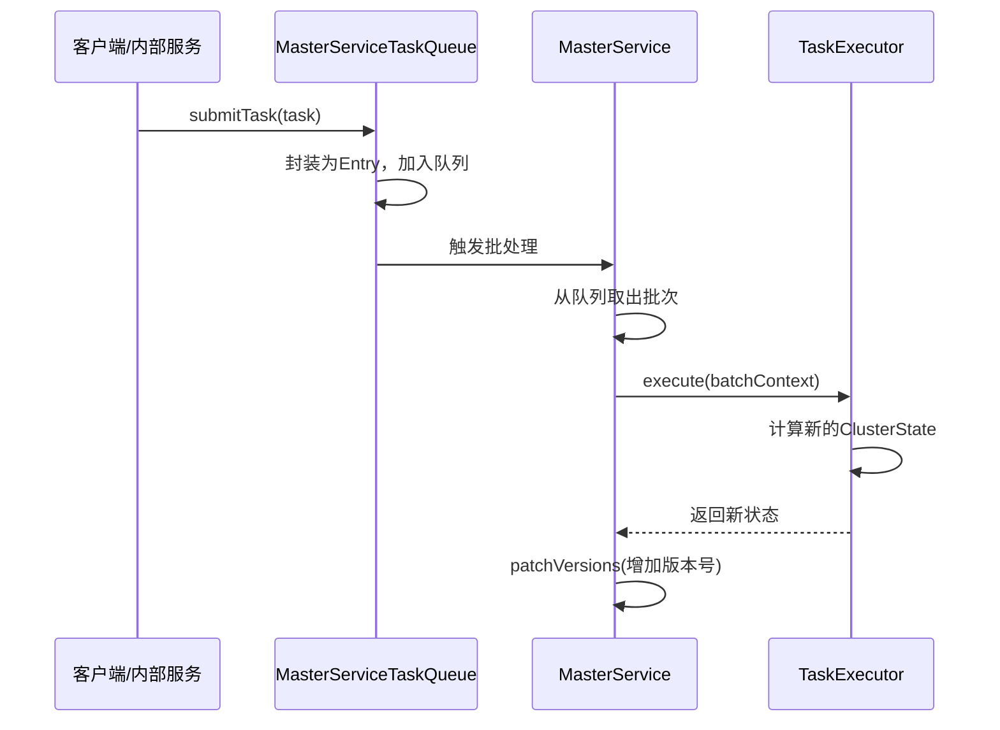

**详细步骤**：

1. **任务提交**：
   - 各个服务（如MetadataMappingService）通过`MasterServiceTaskQueue.submitTask()`提交任务
   - 任务被封装为`Entry`对象，包含source、task、timeout等信息

2. **批处理**：
   - MasterService维护多个优先级队列（`queuesByPriority`）
   - 当队列从空变为非空时，触发`queuesProcessor`
   - 处理器从最高优先级队列取出一个批次

3. **状态计算**：
   - 调用`executor.execute()`执行任务
   - executor根据任务类型修改集群状态
   - 返回新的`ClusterState`对象

4. **版本管理**：
   - `patchVersions()`方法增加集群状态版本号
   - 如果metadata变化，也增加metadata版本号

### 阶段2：发布准备

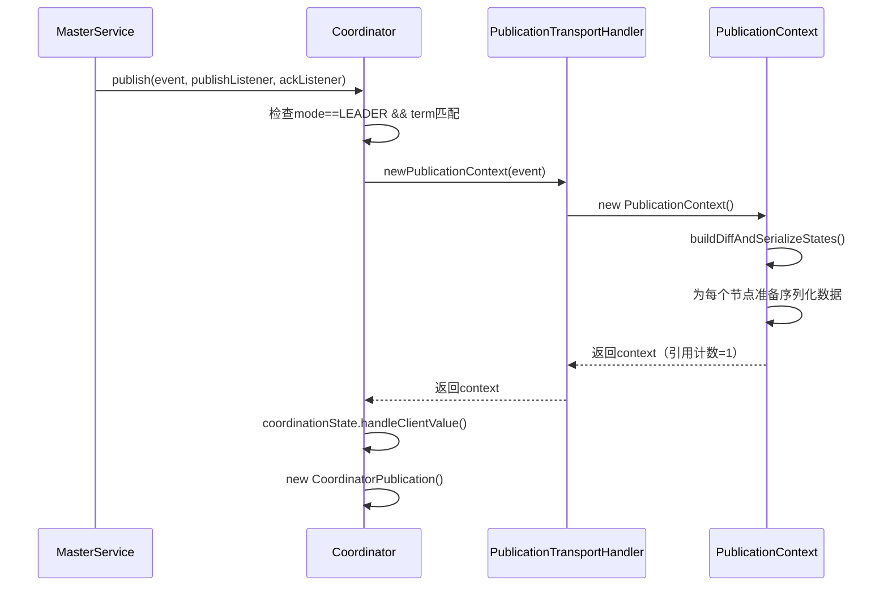

**详细步骤**：

1. **发布入口**：
   - MasterService调用`clusterStatePublisher.publish()`
   - 实际调用`Coordinator.publish()`

2. **前置检查**：
   ```java
   if (mode != Mode.LEADER || getCurrentTerm() != newState.term()) {
       throw new FailedToCommitClusterStateException("node is no longer master");
   }
   if (currentPublication.isPresent()) {
       throw new FailedToCommitClusterStateException("publication already in progress");
   }
   ```

3. **创建PublicationContext**：
   - 调用`publicationHandler.newPublicationContext()`
   - 在构造函数中调用`buildDiffAndSerializeStates()`
   - 遍历所有节点，决定发送全量状态还是diff：
     ```java
     if (sendFullVersion || previousState.nodes().nodeExists(node) == false) {
         // 发送全量状态
         serializedStates.computeIfAbsent(version, v -> serializeFullClusterState(...));
     } else {
         // 发送diff
         serializedDiffs.computeIfAbsent(version, v -> serializeDiffClusterState(...));
     }
     ```

4. **序列化优化**：
   - 同一个TransportVersion只序列化一次
   - 使用`ConcurrentHashMap`存储结果
   - 每个序列化结果都是`ReleasableBytesReference`，支持引用计数

5. **创建PublishRequest**：
   - 调用`coordinationState.handleClientValue(clusterState)`
   - 生成`PublishRequest`对象，包含新状态和term

### 阶段3：发布执行

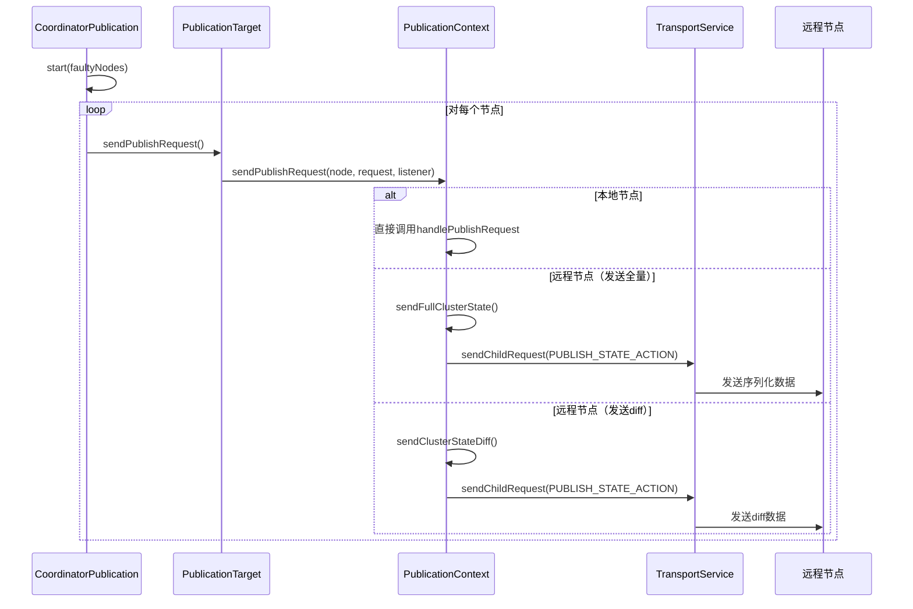

**详细步骤**：

1. **启动发布**：
   ```java
   publication.start(followersChecker.getFaultyNodes());
   ```
   - 标记已知故障节点为FAILED
   - 对每个`PublicationTarget`调用`sendPublishRequest()`

2. **区分本地和远程节点**：

   **本地节点**：
   ```java
   if (destination.equals(discoveryNodes.getLocalNode())) {
       // 直接在cluster coordination线程池执行
       clusterCoordinationExecutor.execute(() -> {
           return handlePublishRequest.apply(publishRequest);
       });
   }
   ```

   **远程节点**：
   - 判断发送全量还是diff
   - 从`PublicationContext`获取序列化数据
   - 调用`transportService.sendChildRequest()`发送

3. **发送全量状态**：
   ```java
   private void sendFullClusterState(DiscoveryNode destination, ActionListener listener) {
       Transport.Connection connection = nodeConnections.get(destination);
       ReleasableBytesReference bytes = serializedStates.get(connection.getTransportVersion());
       sendClusterState(connection, bytes, listener);
   }
   ```

4. **发送diff状态**：
   ```java
   private void sendClusterStateDiff(DiscoveryNode destination, ActionListener listener) {
       ReleasableBytesReference bytes = serializedDiffs.get(connection.getTransportVersion());
       sendClusterState(connection, bytes, listener.delegateResponse((delegate, e) -> {
           if (e instanceof IncompatibleClusterStateVersionException) {
               // diff失败，回退到发送全量状态
               sendFullClusterState(destination, delegate);
           }
       }));
   }
   ```

### 阶段4：远程节点处理

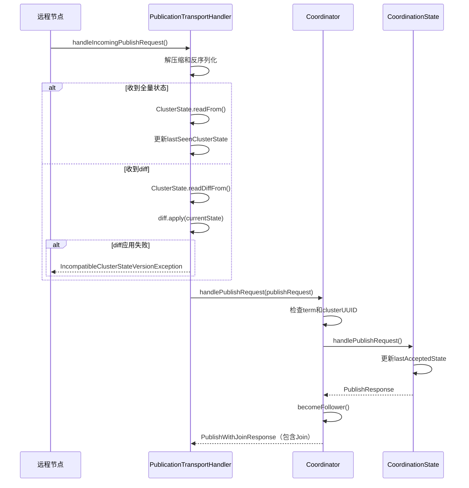

**详细步骤**：

1. **接收请求**：
   - TransportService接收到`PUBLISH_STATE_ACTION_NAME`请求
   - 调用`PublicationTransportHandler.handleIncomingPublishRequest()`

2. **反序列化**：
   ```java
   StreamInput in = request.bytes().streamInput();
   if (compressor != null) {
       in = compressor.threadLocalInputStream(in);
   }
   if (in.readBoolean()) {
       // 全量状态
       ClusterState incomingState = ClusterState.readFrom(input, localNode);
       fullClusterStateReceivedCount.incrementAndGet();
   } else {
       // diff状态
       Diff<ClusterState> diff = ClusterState.readDiffFrom(input, localNode);
       ClusterState incomingState = diff.apply(currentState);
       compatibleClusterStateDiffReceivedCount.incrementAndGet();
   }
   ```

3. **应用状态**：
   - 切换到cluster coordination线程池
   - 调用`Coordinator.handlePublishRequest()`
   - 执行验证：
     ```java
     // 验证clusterUUID
     if (localState.metadata().clusterUUIDCommitted()
         && !localState.metadata().clusterUUID().equals(newState.metadata().clusterUUID())) {
         throw new CoordinationStateRejectedException("different cluster uuid");
     }

     // 如果term更大，执行join验证
     if (newState.term() > localState.term()) {
         onJoinValidators.forEach(a -> a.accept(getLocalNode(), newState));
     }
     ```

4. **更新状态**：
   ```java
   ensureTermAtLeast(sourceNode, newState.term());
   PublishResponse publishResponse = coordinationState.get().handlePublishRequest(publishRequest);
   becomeFollower("handlePublishRequest", sourceNode);
   ```

5. **返回响应**：
   - 构造`PublishWithJoinResponse`
   - 包含`PublishResponse`和可选的`Join`
   - Join表示该节点投票给Master

### 阶段5：收集响应与Quorum判断

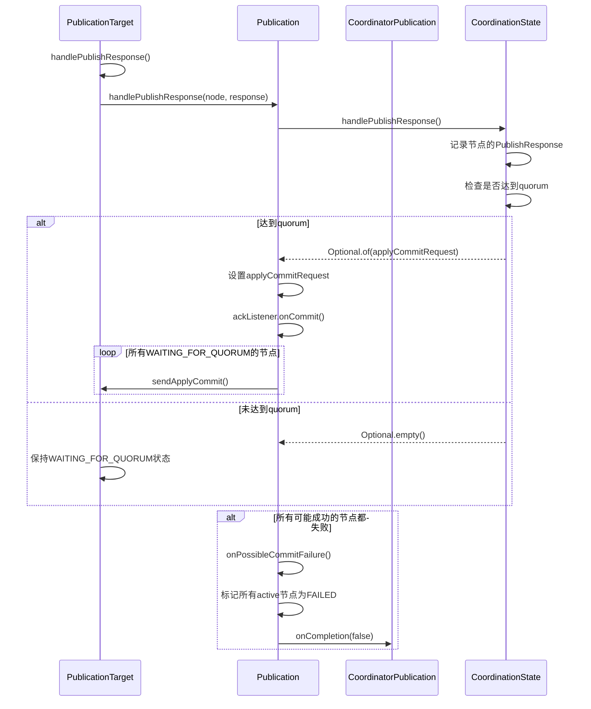

**详细步骤**：

1. **接收PublishResponse**：
   ```java
   void handlePublishResponse(PublishResponse publishResponse) {
       assert isWaitingForQuorum();
       Publication.this.handlePublishResponse(discoveryNode, publishResponse).ifPresent(applyCommit -> {
           // 达到quorum
           applyCommitRequest = Optional.of(applyCommit);
           ackListener.onCommit(commitTime);
           // 通知所有等待的节点
           publicationTargets.stream()
               .filter(PublicationTarget::isWaitingForQuorum)
               .forEach(PublicationTarget::sendApplyCommit);
       });
   }
   ```

2. **Quorum判断**：
   ```java
   protected boolean isPublishQuorum(VoteCollection votes) {
       return coordinationState.get().isPublishQuorum(votes);
   }
   ```
   - 基于`lastAcceptedConfiguration`和`lastCommittedConfiguration`
   - 需要大多数节点（quorum）响应成功

3. **处理Join**：
   ```java
   if (response.getJoin().isPresent()) {
       Join join = response.getJoin().get();
       onJoin(join);  // 记录join投票
   } else {
       onMissingJoin(discoveryNode);  // 节点没有投票，可能需要bump term
   }
   ```

4. **失败检测**：
   ```java
   private void onPossibleCommitFailure() {
       VoteCollection possiblySuccessfulNodes = new VoteCollection();
       for (PublicationTarget target : publicationTargets) {
           if (target.mayCommitInFuture()) {
               possiblySuccessfulNodes.addVote(target.discoveryNode);
           }
       }

       if (isPublishQuorum(possiblySuccessfulNodes) == false) {
           // 无法达到quorum，发布失败
           Exception e = new FailedToCommitClusterStateException("non-failed nodes do not form a quorum");
           publicationTargets.stream().filter(PublicationTarget::isActive)
               .forEach(pt -> pt.setFailed(e));
           onPossibleCompletion();
       }
   }
   ```

### 阶段6：Commit阶段

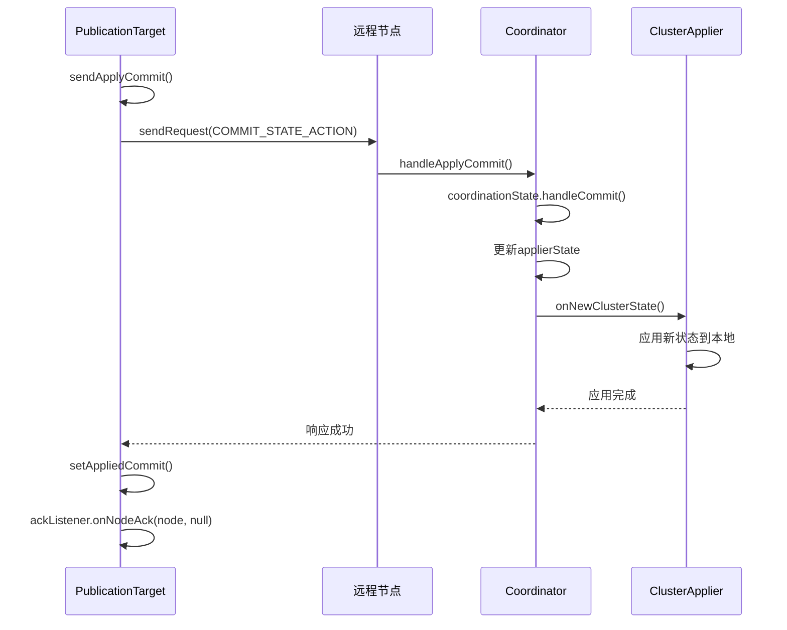

**详细步骤**：

1. **发送Commit请求**：
   ```java
   void sendApplyCommit() {
       assert state == WAITING_FOR_QUORUM;
       state = SENT_APPLY_COMMIT;
       applyCommitRequest.get().addListener(listener -> {
           Publication.this.sendApplyCommit(discoveryNode, applyCommitRequest, responseHandler);
       });
   }
   ```

2. **远程节点处理Commit**：
   ```java
   private void handleApplyCommit(ApplyCommitRequest request, ActionListener<Void> listener) {
       synchronized (mutex) {
           coordinationState.get().handleCommit(request);
           ClusterState committedState = coordinationState.get().getLastAcceptedState();
           applierState = mode == Mode.CANDIDATE
               ? clusterStateWithNoMasterBlock(committedState)
               : committedState;

           if (request.getSourceNode().equals(getLocalNode())) {
               // Master节点在发布结束时应用，不在这里
               listener.onResponse(null);
           } else {
               // Follower节点应用状态
               clusterApplier.onNewClusterState(request.toString(),
                   () -> applierState,
                   listener.map(r -> {
                       onClusterStateApplied();
                       return r;
                   }));
           }
       }
   }
   ```

3. **ClusterApplier应用状态**：
   - 在`ClusterApplierService`的专用线程执行
   - 调用所有注册的`ClusterStateListener`
   - 更新本地的路由表、索引元数据等

4. **收集ACK**：
   ```java
   void setAppliedCommit() {
       assert state == SENT_APPLY_COMMIT;
       state = APPLIED_COMMIT;
       ackOnce(null);  // 通知ackListener
   }
   ```

### 阶段7：Master节点完成发布

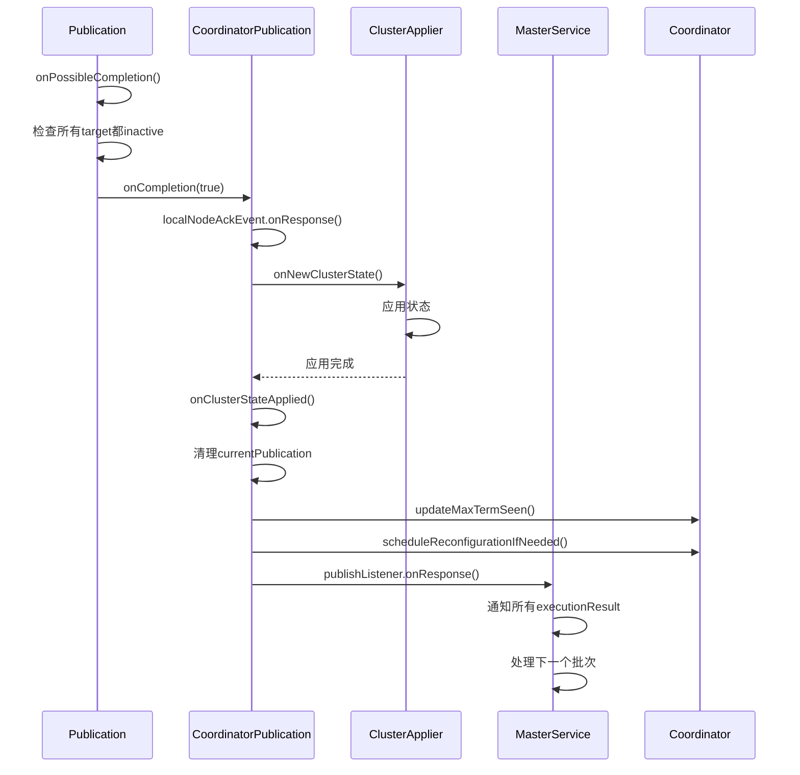

**详细步骤**：

1. **检查完成条件**：
   ```java
   private void onPossibleCompletion() {
       if (isCompleted) return;

       if (cancelled == false) {
           for (PublicationTarget target : publicationTargets) {
               if (target.isActive()) {
                   return;  // 还有活跃的target，未完成
               }
           }
       }

       if (applyCommitRequest.isPresent() == false) {
           // 未达到quorum，发布失败
           isCompleted = true;
           onCompletion(false);
           return;
       }

       // 发布成功
       isCompleted = true;
       onCompletion(true);
   }
   ```

2. **Master应用状态**：
   ```java
   localNodeAckEvent.addListener(listener -> {
       // 收集所有receivedJoins
       receivedJoins.forEach(this::handleAssociatedJoin);

       // Master应用状态
       clusterApplier.onNewClusterState(toString(), () -> applierState, new ActionListener<>() {
           @Override
           public void onResponse(Void ignored) {
               onClusterStateApplied();
               synchronized (mutex) {
                   currentPublication = Optional.empty();
                   updateMaxTermSeen(getCurrentTerm());

                   if (mode == Mode.LEADER) {
                       // 检查是否需要abdicate或reconfigure
                       if (localNodeMayWinElection(state).mayWin() == false) {
                           // 寻找合适的节点abdicate
                           abdicateTo(masterCandidates.get(random.nextInt(size)));
                       } else {
                           scheduleReconfigurationIfNeeded();
                       }
                   }

                   lagDetector.startLagDetector(version);
               }
               publishListener.onResponse(null);
           }

           @Override
           public void onFailure(Exception e) {
               removePublicationAndPossiblyBecomeCandidate("clusterApplier failed");
               publishListener.onFailure(e);
           }
       });
   });
   ```

3. **通知MasterService**：
   ```java
   // 在MasterService中
   @Override
   public void onResponse(Void unused) {
       for (ExecutionResult<T> executionResult : executionResults) {
           executionResult.onPublishSuccess(newClusterState);
       }
       executor.clusterStatePublished(newClusterState);
   }
   ```

4. **清理资源**：
   - `PublicationContext.decRef()`释放序列化数据
   - 清理超时处理器
   - 重置发布状态

---

## 协调与容错机制

### 1. 如何协调多个节点

#### Quorum机制
Elasticsearch使用**多数派（Quorum）**机制确保一致性：

```java
public boolean isPublishQuorum(VoteCollection votes) {
    return votes.isQuorum(lastAcceptedConfiguration)
        || votes.isQuorum(lastCommittedConfiguration);
}
```

**关键点**：
- 需要`lastAcceptedConfiguration`或`lastCommittedConfiguration`中的大多数节点响应
- 配置通常包含所有master-eligible节点
- 例如：5个master节点，需要至少3个响应成功

#### 两阶段提交
发布过程类似两阶段提交：

**Phase 1 - Publish**：
- Master发送新状态给所有节点
- 节点验证并接受状态
- 返回PublishResponse（包含Join投票）

**Phase 2 - Commit**：
- Master收集到quorum后，发送ApplyCommit
- 节点应用状态到本地
- 返回ACK

### 2. 部分失败处理

#### 节点失败分类

**1. 发送失败**：
```java
@Override
public void onFailure(Exception e) {
    logger.debug("PublishResponseHandler: [{}] failed", discoveryNode, e);
    setFailed(getRootCause(e));
    onPossibleCommitFailure();
}
```
- 网络异常、节点断开等
- 立即标记为FAILED
- 触发quorum检查

**2. Diff应用失败**：
```java
sendClusterState(connection, bytes, listener.delegateResponse((delegate, e) -> {
    if (e instanceof IncompatibleClusterStateVersionException) {
        // 回退到发送全量状态
        sendFullClusterState(destination, delegate);
        return;
    }
    delegate.onFailure(e);
}));
```
- Diff不兼容时自动回退到全量状态
- 透明重试，不影响发布流程

**3. Commit失败**：
```java
@Override
public void onFailure(Exception e) {
    logger.debug("ApplyCommitResponseHandler: [{}] failed", discoveryNode, e);
    setFailed((Exception) exp.getRootCause());
    onPossibleCompletion();
}
```
- 节点应用状态失败
- 标记为FAILED，但不影响已达到quorum的发布

#### 失败容忍度

**发布成功条件**：
```java
if (isPublishQuorum(possiblySuccessfulNodes) == false) {
    // 无法达到quorum，整个发布失败
    Exception e = new FailedToCommitClusterStateException("non-failed nodes do not form a quorum");
    publicationTargets.stream().filter(PublicationTarget::isActive)
        .forEach(pt -> pt.setFailed(e));
    onPossibleCompletion();
}
```

**示例**：
- 5个master节点的集群
- 至少3个节点成功 → 发布成功
- 少于3个节点成功 → 发布失败，Master可能step down

### 3. 重试机制

#### Diff回退到全量状态
```java
private void sendClusterStateDiff(DiscoveryNode destination, ActionListener listener) {
    if (tryIncRef() == false) {
        listener.onFailure(new IllegalStateException("publication context released"));
        return;
    }

    sendClusterState(connection, bytes, ActionListener.runAfter(
        listener.delegateResponse((delegate, e) -> {
            if (e.unwrapCause() instanceof IncompatibleClusterStateVersionException) {
                // 自动重试，发送全量状态
                sendFullClusterState(destination, delegate);
                return;
            }
            delegate.onFailure(e);
        }),
        this::decRef
    ));
}
```

**特点**：
- 自动重试，对上层透明
- 只重试一次（diff → full）
- 使用引用计数确保资源不被提前释放

#### 无自动重试的场景
- 网络连接失败：不重试，直接标记失败
- 节点应用状态失败：不重试，标记失败
- 整个发布失败：Master可能step down，触发新的选举

**原因**：
- 避免无限重试导致的延迟
- 快速失败，让集群进入新的稳定状态
- 依赖选举机制恢复

### 4. 同步等待机制

#### 发布是异步的
```java
public void publish(
    ClusterStatePublicationEvent event,
    ActionListener<Void> publishListener,  // 异步回调
    AckListener ackListener                 // 异步ACK回调
)
```

**但MasterService会等待发布完成**：
```java
ActionListener.run(
    new DelegatingActionListener<Void, Void>(
        ActionListener.runAfter(listener, () -> taskManager.unregister(task))
            .delegateResponse((l, e) -> {
                handleException(summary, publicationStartTime, newClusterState, e);
                l.onResponse(null);
            })
    ),
    l -> publishClusterStateUpdate(...)
);
```

#### 超时机制

**发布超时**：
```java
this.timeoutHandler = transportService.getThreadPool().schedule(new Runnable() {
    @Override
    public void run() {
        synchronized (mutex) {
            cancel("timed out after " + publishTimeout);
        }
    }
}, publishTimeout, clusterCoordinationExecutor);
```
- 默认30秒（`cluster.publish.timeout`）
- 超时后取消发布，触发失败处理

**信息超时**：
```java
this.infoTimeoutHandler = transportService.getThreadPool().schedule(new Runnable() {
    @Override
    public void run() {
        synchronized (mutex) {
            logIncompleteNodes(Level.INFO);
        }
    }
}, publishInfoTimeout, clusterCoordinationExecutor);
```
- 默认10秒（`cluster.publish.info_timeout`）
- 记录慢节点信息，不影响发布

#### ACK等待

**TaskAckListener**：
```java
private static class TaskAckListener {
    private final CountDown countDown;  // 等待的节点数
    private volatile Scheduler.Cancellable ackTimeoutCallback;

    public void onCommit(TimeValue commitTime) {
        TimeValue ackTimeout = contextPreservingAckListener.ackTimeout();
        if (ackTimeout.millis() < 0) {
            // 不等待ACK
            if (countDown.countDown()) {
                finish();
            }
            return;
        }

        TimeValue timeLeft = TimeValue.timeValueNanos(
            Math.max(0, ackTimeout.nanos() - commitTime.nanos())
        );
        if (timeLeft.nanos() == 0L) {
            onTimeout();
        } else if (countDown.countDown()) {
            finish();
        } else {
            // 调度超时处理
            this.ackTimeoutCallback = threadPool.schedule(
                this::onTimeout, timeLeft, threadPool.generic()
            );
        }
    }
}
```

**特点**：
- 等待所有必须ACK的节点（`mustAck()`返回true）
- 支持超时配置
- 超时不影响发布成功，只影响客户端响应

### 5. 故障节点处理

#### FollowersChecker
```java
private final FollowersChecker followersChecker;

// 在发布开始时
publication.start(followersChecker.getFaultyNodes());
```

**功能**：
- Master定期检查Follower节点健康
- 发现故障节点，标记为faulty
- 发布时跳过faulty节点

#### 故障节点移除
```java
public void onFaultyNode(DiscoveryNode faultyNode) {
    publicationTargets.forEach(t -> t.onFaultyNode(faultyNode));
    onPossibleCompletion();
}

void onFaultyNode(DiscoveryNode faultyNode) {
    if (isActive() && discoveryNode.equals(faultyNode)) {
        setFailed(new ElasticsearchException("faulty node"));
        onPossibleCommitFailure();
    }
}
```

**流程**：
1. FollowersChecker检测到节点故障
2. 调用`removeNode(node, reason)`
3. 提交`NodeLeftExecutor.Task`到MasterService
4. 生成新的集群状态（移除节点）
5. 发布新状态

---

## 关键类职责

### 类职责总结表

| 类名 | 职责 | 关键方法 | 生命周期 |
|------|------|----------|----------|
| **MasterService** | 集群状态更新的入口和协调者 | `publishClusterStateUpdate()` | 节点启动到关闭 |
| **Coordinator** | 集群协调器，实现发布接口 | `publish()`, `becomeLeader()` | 节点启动到关闭 |
| **CoordinatorPublication** | 单次发布的执行器 | `start()`, `onCompletion()` | 单次发布 |
| **Publication** | 发布流程的抽象基类 | `handlePublishResponse()` | 单次发布 |
| **PublicationTarget** | 单个节点的发布状态管理 | `sendPublishRequest()`, `sendApplyCommit()` | 单次发布 |
| **PublicationTransportHandler** | 序列化和网络传输 | `newPublicationContext()`, `handleIncomingPublishRequest()` | 节点启动到关闭 |
| **PublicationContext** | 序列化结果的引用计数管理 | `buildDiffAndSerializeStates()`, `sendPublishRequest()` | 单次发布 |
| **CoordinationState** | 维护协调状态和投票 | `handlePublishRequest()`, `handleCommit()` | 节点启动到关闭 |

### 类之间的关系

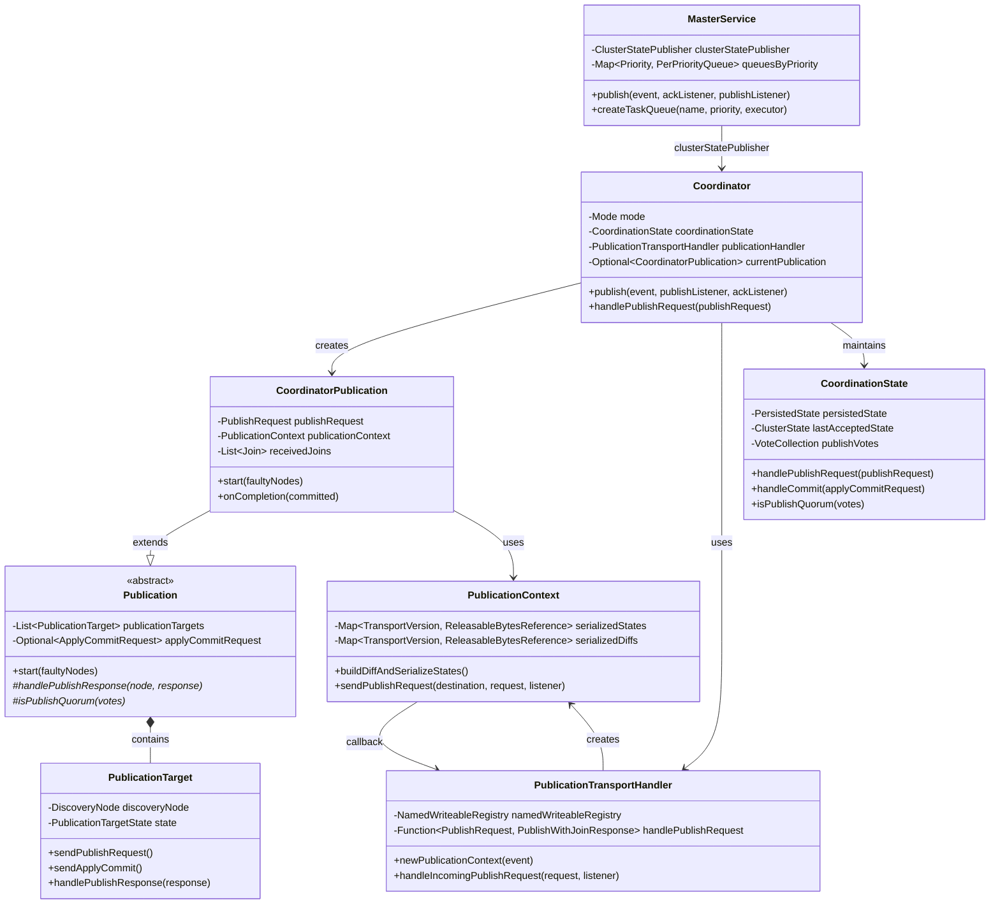

### 数据流转

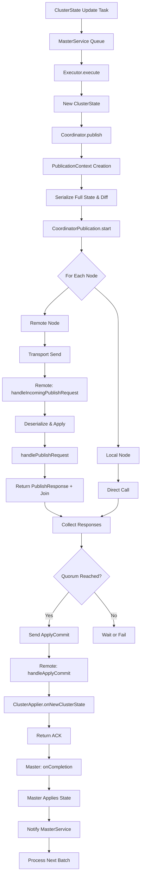

---

## 流程图

### 完整发布流程

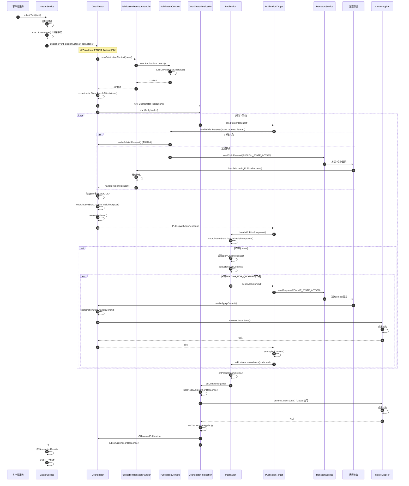

### 状态机图

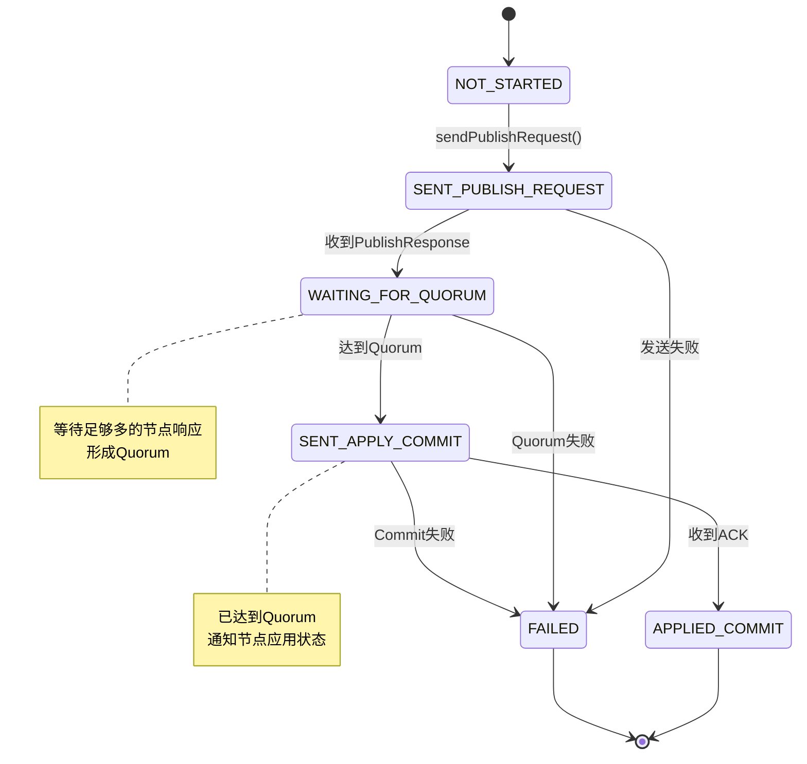

### 失败处理流程

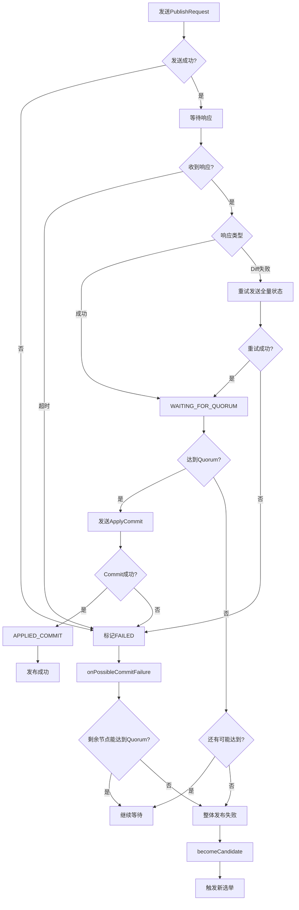

---

## 总结

### 关键设计亮点

1. **序列化优化**：
   - 同一状态只序列化一次
   - 使用引用计数管理内存
   - 支持diff机制减少传输

2. **容错性**：
   - Quorum机制保证一致性
   - 部分节点失败不影响整体
   - 自动回退和重试

3. **异步非阻塞**：
   - 全程使用异步回调
   - 不阻塞Master Service线程
   - 支持并发发布到多个节点

4. **状态机管理**：
   - 清晰的状态转换
   - 每个节点独立状态跟踪
   - 便于调试和监控

5. **资源管理**：
   - 引用计数防止内存泄漏
   - 超时机制防止无限等待
   - 及时清理临时资源

### 性能考虑

1. **网络优化**：
   - 压缩传输数据
   - Diff机制减少数据量
   - 复用TCP连接

2. **CPU优化**：
   - 序列化结果复用
   - 并行发送到多个节点
   - 避免重复计算

3. **内存优化**：
   - 引用计数管理
   - 及时释放序列化缓冲区
   - 避免大对象长时间驻留

### 可靠性保证

1. **一致性**：
   - Quorum机制
   - 两阶段提交
   - Term和Version校验

2. **可用性**：
   - 容忍部分节点失败
   - 快速失败和恢复
   - 自动选举新Master

3. **持久性**：
   - 状态持久化到磁盘
   - Commit后才应用
   - 重启后恢复状态

---

## 参考

- [Elasticsearch源码](https://github.com/elastic/elasticsearch)
- [Raft论文](https://raft.github.io/raft.pdf)
- [Elasticsearch官方文档 - Cluster Coordination](https://www.elastic.co/guide/en/elasticsearch/reference/current/modules-discovery.html)
