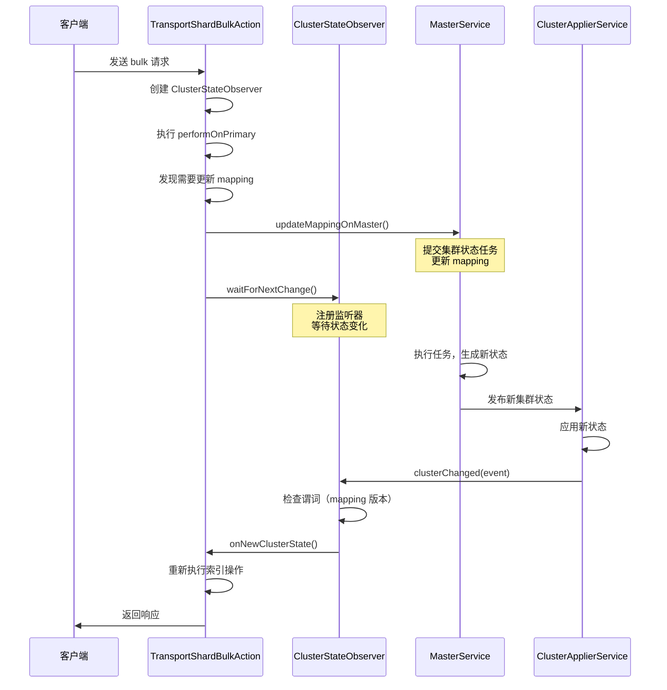
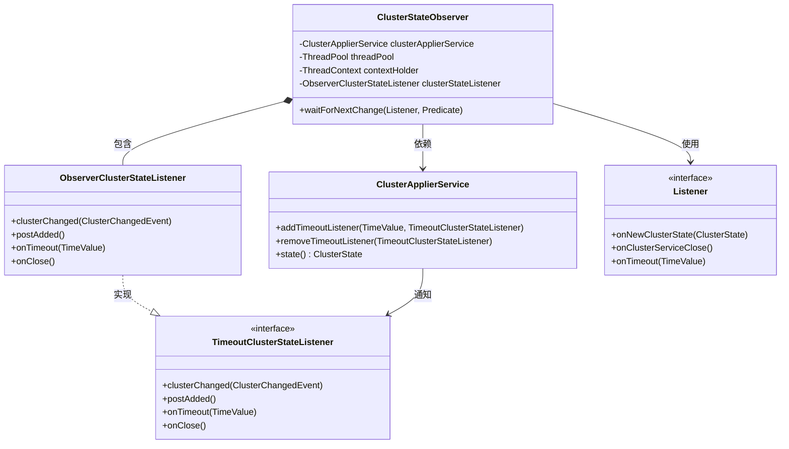

# ClusterStateObserver

## 一句话总结

**`ClusterStateObserver` 是 Elasticsearch 中用于等待集群状态变化的观察者工具，它简化了"基于当前状态尝试操作，失败后等待新状态并重试"的编程模式。**

---

## 问题背景（Why - 为什么需要它？）

### 现有方案的不足

在分布式系统中，许多操作依赖于集群状态的特定条件。例如：

1. **Mapping 更新场景**：写入文档时发现需要动态更新 mapping，必须等待 mapping 版本更新后才能继续写入
2. **Shard 激活场景**：读取文档时发现 shard 未激活，需要等待 shard 变为 active 状态
3. **Master 选举场景**：某些操作需要等待 master 节点选举完成

如果没有统一的等待机制，开发者需要：
- 手动注册 `ClusterStateListener` 到 `ClusterApplierService`
- 自己管理监听器的生命周期（注册、注销）
- 处理超时逻辑
- 处理谓词判断（什么样的集群状态才满足条件）
- 保证线程上下文的正确传递

### 典型痛点场景

```java
// ❌ 没有 ClusterStateObserver 的复杂代码
ClusterStateListener listener = new ClusterStateListener() {
    @Override
    public void clusterChanged(ClusterChangedEvent event) {
        if (mappingVersion != event.state().metadata().index(index).getMappingVersion()) {
            // 满足条件，执行回调
            clusterService.removeListener(this); // 需要手动注销
            callback.onResponse(null);
        }
    }
};
clusterService.addListener(listener);
// 还需要处理超时、线程上下文等...
```

### 不解决的后果

- **代码重复**：每个需要等待集群状态的地方都要写类似的样板代码
- **容易出错**：忘记注销监听器导致内存泄漏，超时处理不当导致请求挂起
- **难以维护**：监听器管理逻辑分散在各处，难以统一优化
- **线程安全问题**：手动管理状态容易出现竞态条件

---

## 解决方案（What - 它是什么？）

### 核心定位

`ClusterStateObserver` 是一个**轻量级的集群状态观察者工具类**，它封装了"等待集群状态变化"的通用逻辑，提供简洁的 API 让开发者专注于业务逻辑。

### 核心特性

1. **简化的 API**：一行代码即可等待集群状态变化
2. **谓词支持**：灵活定义什么样的集群状态才满足条件
3. **自动管理**：自动注册/注销监听器，无需手动管理生命周期
4. **超时控制**：支持全局超时和单次等待超时
5. **线程上下文保持**：自动保存和恢复 `ThreadContext`
6. **快速路径优化**：如果当前状态已满足条件，直接回调，不注册监听器
7. **并发安全**：使用 `AtomicReference` 保证线程安全

### 与相关模块的对比

| 特性 | ClusterStateObserver | 直接使用 ClusterStateListener | ClusterApplierService |
|------|---------------------|------------------------------|----------------------|
| **使用复杂度** | ✅ 简单（一行代码） | ❌ 复杂（需手动管理） | ❌ 底层 API |
| **生命周期管理** | ✅ 自动管理 | ❌ 手动注册/注销 | ⚠️ 需要手动管理 |
| **超时支持** | ✅ 内置支持 | ❌ 需自己实现 | ⚠️ 部分支持 |
| **谓词过滤** | ✅ 内置支持 | ❌ 需自己实现 | ❌ 不支持 |
| **线程上下文** | ✅ 自动保持 | ❌ 需手动处理 | ❌ 不处理 |
| **快速路径** | ✅ 自动优化 | ❌ 需自己实现 | ❌ 不支持 |
| **适用场景** | 临时等待状态变化 | 长期监听状态变化 | 底层基础设施 |

### 设计理念

1. **封装复杂性**：将监听器管理、超时控制、谓词判断等复杂逻辑封装起来
2. **一次性使用**：每次等待创建新实例，用完即弃，避免状态管理复杂性
3. **快速失败**：如果当前状态已满足条件，立即回调，不等待
4. **优雅降级**：超时、关闭等异常情况都有明确的回调处理

---

## 使用指南（How - 如何使用它？）

### 基本使用流程

```java
// 1. 创建观察者（指定超时时间）
ClusterStateObserver observer = new ClusterStateObserver(
    clusterService,           // 集群服务
    request.timeout(),        // 超时时间（可为 null 表示无限等待）
    logger,                   // 日志记录器
    threadPool.getThreadContext()  // 线程上下文
);

// 2. 等待集群状态变化
observer.waitForNextChange(
    new ClusterStateObserver.Listener() {
        @Override
        public void onNewClusterState(ClusterState state) {
            // 集群状态满足条件时的回调
            logger.info("New cluster state: version={}", state.version());
        }

        @Override
        public void onClusterServiceClose() {
            // 集群服务关闭时的回调
            listener.onFailure(new NodeClosedException(clusterService.localNode()));
        }

        @Override
        public void onTimeout(TimeValue timeout) {
            // 超时时的回调
            listener.onFailure(new ElasticsearchTimeoutException("Timeout waiting for cluster state"));
        }
    },
    statePredicate  // 谓词：定义什么样的集群状态才满足条件
);
```

### 典型场景示例

#### 场景 1：等待 Mapping 更新

```java
// 在 TransportShardBulkAction 中等待 mapping 更新
ClusterStateObserver observer = new ClusterStateObserver(
    clusterService,
    request.timeout(),
    logger,
    threadPool.getThreadContext()
);

// 提交 mapping 更新任务到 MasterService
mappingUpdatedAction.updateMappingOnMaster(shardId.getIndex(), update, mappingListener);

// 等待本地集群状态应用新的 mapping
observer.waitForNextChange(
    new ClusterStateObserver.Listener() {
        @Override
        public void onNewClusterState(ClusterState state) {
            // Mapping 已更新，重新执行索引操作
            mappingUpdateListener.onResponse(null);
        }

        @Override
        public void onClusterServiceClose() {
            mappingUpdateListener.onFailure(new NodeClosedException(clusterService.localNode()));
        }

        @Override
        public void onTimeout(TimeValue timeout) {
            mappingUpdateListener.onFailure(
                new MapperException("timed out while waiting for a dynamic mapping update")
            );
        }
    },
    // 谓词：判断 mapping 版本是否已更新
    clusterState -> {
        var indexMetadata = clusterState.metadata().index(primary.shardId().getIndex());
        return indexMetadata == null
            || (indexMetadata.mapping() != null
                && indexMetadata.getMappingVersion() != initialMappingVersion);
    }
);
```

#### 场景 2：等待 Shard 激活

```java
// 在 TransportGetAction 中等待 shard 激活
final var observer = new ClusterStateObserver(
    clusterService.state(),
    clusterService,
    null,  // 无超时限制
    logger,
    clusterService.threadPool().getThreadContext()
);

observer.waitForNextChange(
    new ClusterStateObserver.Listener() {
        @Override
        public void onNewClusterState(ClusterState state) {
            // Shard 已激活，重新执行 get 操作
            doExecute(task, request, listener);
        }

        @Override
        public void onClusterServiceClose() {
            listener.onFailure(new NodeClosedException(clusterService.localNode()));
        }

        @Override
        public void onTimeout(TimeValue timeout) {
            listener.onFailure(new ElasticsearchTimeoutException("Timeout"));
        }
    },
    // 谓词：判断 shard 是否已激活
    state -> state.routingTable().shardRoutingTable(shardId).primaryShard().active()
);
```

#### 场景 3：等待 Master 节点选举

```java
// 等待 master 节点选举完成
ClusterStateObserver observer = new ClusterStateObserver(
    clusterService,
    TimeValue.timeValueSeconds(30),
    logger,
    threadPool.getThreadContext()
);

observer.waitForNextChange(
    listener,
    ClusterStateObserver.NON_NULL_MASTER_PREDICATE  // 内置谓词：master 不为 null
);
```

### 核心 API 说明

#### 构造函数

```java
// 方式 1：从 ClusterService 创建
public ClusterStateObserver(
    ClusterService clusterService,
    @Nullable TimeValue timeout,      // 全局超时时间
    Logger logger,
    ThreadContext contextHolder
)

// 方式 2：指定初始状态
public ClusterStateObserver(
    ClusterState initialState,
    ClusterService clusterService,
    @Nullable TimeValue timeout,
    Logger logger,
    ThreadContext contextHolder
)

// 方式 3：指定初始版本（最底层）
public ClusterStateObserver(
    long initialVersion,
    ClusterApplierService clusterApplierService,
    @Nullable TimeValue timeout,
    Logger logger,
    ThreadContext contextHolder
)
```

#### 等待方法

```java
// 等待任意状态变化
public void waitForNextChange(Listener listener)

// 等待满足谓词的状态变化
public void waitForNextChange(Listener listener, Predicate<ClusterState> statePredicate)

// 等待满足谓词的状态变化（指定超时）
public void waitForNextChange(
    Listener listener,
    Predicate<ClusterState> statePredicate,
    @Nullable TimeValue timeOutValue
)
```

#### 静态工具方法

```java
// 等待集群状态满足条件（如果当前已满足则立即回调）
public static void waitForState(
    ClusterService clusterService,
    ThreadContext threadContext,
    Listener listener,
    Predicate<ClusterState> statePredicate,
    @Nullable TimeValue timeout,
    Logger logger
)
```

#### 内置谓词

```java
// 等待 master 节点不为 null
ClusterStateObserver.NON_NULL_MASTER_PREDICATE

// 等待任意状态变化
Predicates.always()
```

### 使用注意事项

⚠️ **重要提示**：

1. **一次性使用**：每次等待都应该创建新的 `ClusterStateObserver` 实例
2. **不要阻塞**：`Listener` 的回调方法在 `ClusterApplierService` 线程中执行，不要执行耗时操作
3. **轻量操作可以直接执行**：发送请求（如 `Client` 或 `TransportService`）等轻量操作可以直接在回调中执行
4. **重操作需要 fork**：如果需要执行重操作，应该 fork 到其他线程池
5. **超时时间**：如果指定了全局超时，所有 `waitForNextChange` 调用共享这个超时时间
6. **不能并发等待**：同一个 `ClusterStateObserver` 实例不能同时等待多个状态变化

```java
// ❌ 错误：重用同一个 observer
ClusterStateObserver observer = new ClusterStateObserver(...);
observer.waitForNextChange(listener1, predicate1);
observer.waitForNextChange(listener2, predicate2);  // 抛出异常！

// ✅ 正确：每次等待创建新的 observer
ClusterStateObserver observer1 = new ClusterStateObserver(...);
observer1.waitForNextChange(listener1, predicate1);

ClusterStateObserver observer2 = new ClusterStateObserver(...);
observer2.waitForNextChange(listener2, predicate2);
```

---

## 实现原理（How it works - 它如何实现？）

### 核心数据结构

```java
public class ClusterStateObserver {
    // 集群状态应用服务（单例，全局共享）
    private final ClusterApplierService clusterApplierService;

    // 线程池（用于获取当前时间）
    private final ThreadPool threadPool;

    // 线程上下文（用于保存和恢复上下文）
    private final ThreadContext contextHolder;

    // 全局超时时间
    volatile TimeValue timeOutValue;

    // 最后观察到的集群状态版本号
    private volatile long lastObservedVersion;

    // 内部监听器（注册到 ClusterApplierService）
    final TimeoutClusterStateListener clusterStateListener = new ObserverClusterStateListener();

    // 当前观察上下文（包含用户的 listener 和 predicate）
    // null 表示没有在等待，非 null 表示正在等待
    final AtomicReference<ObservingContext> observingContext = new AtomicReference<>(null);

    // 开始等待的时间（用于计算超时）
    volatile Long startTimeMS;

    // 是否已超时
    volatile boolean timedOut;
}
```

### 关键实现机制

#### 1. 快速路径优化

在 `waitForNextChange` 方法中，首先检查当前集群状态是否已满足条件：

```java
public void waitForNextChange(Listener listener, Predicate<ClusterState> statePredicate, TimeValue timeOutValue) {
    // ... 超时检查 ...

    // 获取当前集群状态
    ClusterState newState = clusterApplierService.state();

    // 快速路径：如果当前状态已满足条件，直接回调
    if (lastObservedVersion < newState.version() && statePredicate.test(newState)) {
        logger.trace("observer: sampled state accepted by predicate ({})", newState);
        lastObservedVersion = newState.version();
        listener.onNewClusterState(newState);  // ✅ 直接回调，不注册监听器
    } else {
        // 慢速路径：注册监听器，等待下一次状态变化
        logger.trace("observer: sampled state rejected by predicate ({}). adding listener", newState);
        final ObservingContext context = new ObservingContext(listener, statePredicate);
        if (observingContext.compareAndSet(null, context) == false) {
            throw new ElasticsearchException("already waiting for a cluster state change");
        }
        clusterApplierService.addTimeoutListener(timeoutTimeLeftMS, clusterStateListener);
    }
}
```

#### 2. 双重检查机制

为了避免竞态条件（在注册监听器的过程中集群状态发生变化），使用了 `postAdded` 回调：

```java
class ObserverClusterStateListener implements TimeoutClusterStateListener {
    @Override
    public void postAdded() {
        ObservingContext context = observingContext.get();
        if (context == null) return;

        // 双重检查：注册后再次检查当前状态
        ClusterState newState = clusterApplierService.state();
        if (lastObservedVersion < newState.version() && context.statePredicate.test(newState)) {
            if (observingContext.compareAndSet(context, null)) {
                logger.trace("observer: post adding listener: accepting current cluster state");
                clusterApplierService.removeTimeoutListener(this);
                lastObservedVersion = newState.version();
                context.listener.onNewClusterState(newState);
            }
        }
    }
}
```

#### 3. 集群状态变化通知

当集群状态发生变化时，`ClusterApplierService` 会调用所有注册的监听器：

```java
class ObserverClusterStateListener implements TimeoutClusterStateListener {
    @Override
    public void clusterChanged(ClusterChangedEvent event) {
        ObservingContext context = observingContext.get();
        if (context == null) return;  // 已经处理过了

        final ClusterState state = event.state();

        // 检查谓词是否满足
        if (context.statePredicate.test(state)) {
            // CAS 操作：确保只有一个线程能处理
            if (observingContext.compareAndSet(context, null)) {
                clusterApplierService.removeTimeoutListener(this);  // 注销监听器
                logger.trace("observer: accepting cluster state change ({})", state);
                lastObservedVersion = state.version();
                context.listener.onNewClusterState(state);  // 回调用户
            }
        } else {
            logger.trace("observer: predicate rejected change (version {})", state.version());
        }
    }
}
```

#### 4. 超时处理

```java
@Override
public void onTimeout(TimeValue timeout) {
    ObservingContext context = observingContext.getAndSet(null);
    if (context != null) {
        clusterApplierService.removeTimeoutListener(this);
        lastObservedVersion = clusterApplierService.state().version();
        timedOut = true;
        context.listener.onTimeout(timeOutValue);  // 回调用户的超时处理
    }
}
```

#### 5. 线程上下文保持

使用 `ContextPreservingListener` 包装用户的 `Listener`，确保回调时恢复正确的线程上下文：

```java
private static final class ContextPreservingListener implements Listener {
    private final Listener delegate;
    private final Supplier<ThreadContext.StoredContext> contextSupplier;

    @Override
    public void onNewClusterState(ClusterState state) {
        try (ThreadContext.StoredContext context = contextSupplier.get()) {
            delegate.onNewClusterState(state);  // 在正确的上下文中执行
        }
    }

    // onClusterServiceClose 和 onTimeout 同理
}
```

### 状态转换图

```
                    ┌─────────────────────────────────────┐
                    │   创建 ClusterStateObserver         │
                    │   lastObservedVersion = current     │
                    └──────────────┬──────────────────────┘
                                   │
                                   ▼
                    ┌──────────────────────────────────────┐
                    │   调用 waitForNextChange()           │
                    │   observingContext = null            │
                    └──────────────┬───────────────────────┘
                                   │
                    ┌──────────────┴──────────────┐
                    │                             │
                    ▼                             ▼
        ┌───────────────────────┐     ┌──────────────────────────┐
        │  快速路径              │     │  慢速路径                 │
        │  当前状态已满足条件    │     │  当前状态不满足条件       │
        └───────────┬───────────┘     └──────────┬───────────────┘
                    │                             │
                    │                             ▼
                    │              ┌──────────────────────────────┐
                    │              │  注册监听器到                 │
                    │              │  ClusterApplierService        │
                    │              │  observingContext = context   │
                    │              └──────────┬───────────────────┘
                    │                         │
                    │                         ▼
                    │              ┌──────────────────────────────┐
                    │              │  postAdded() 双重检查         │
                    │              └──────────┬───────────────────┘
                    │                         │
                    │              ┌──────────┴──────────┐
                    │              │                     │
                    │              ▼                     ▼
                    │   ┌─────────────────┐   ┌─────────────────────┐
                    │   │  仍不满足条件    │   │  现在满足条件了      │
                    │   └────────┬────────┘   └──────────┬──────────┘
                    │            │                        │
                    │            ▼                        │
                    │   ┌─────────────────────────────┐  │
                    │   │  等待集群状态变化            │  │
                    │   │  clusterChanged() 被调用     │  │
                    │   └────────┬────────────────────┘  │
                    │            │                        │
                    │   ┌────────┴────────┐              │
                    │   │                 │              │
                    │   ▼                 ▼              │
                    │ ┌──────┐      ┌──────────┐        │
                    │ │超时  │      │谓词满足  │        │
                    │ └──┬───┘      └────┬─────┘        │
                    │    │               │              │
                    ▼    ▼               ▼              ▼
        ┌────────────────────────────────────────────────────┐
        │  CAS 设置 observingContext = null                  │
        │  注销监听器                                         │
        │  回调用户 Listener                                  │
        │  - onNewClusterState(state)                        │
        │  - onTimeout(timeout)                              │
        │  - onClusterServiceClose()                         │
        └────────────────────────────────────────────────────┘
```

### 并发控制机制

`ClusterStateObserver` 使用多种机制保证线程安全：

1. **AtomicReference**：`observingContext` 使用 `AtomicReference`，通过 CAS 操作保证只有一个线程能处理状态变化
2. **volatile**：关键字段使用 `volatile` 保证可见性
3. **双重检查**：在 `postAdded` 中再次检查状态，避免竞态条件
4. **单次处理**：通过 CAS 操作确保每个状态变化只被处理一次

```java
// CAS 操作示例
if (observingContext.compareAndSet(context, null)) {
    // 只有一个线程能进入这里
    clusterApplierService.removeTimeoutListener(this);
    context.listener.onNewClusterState(state);
}
```

### 设计亮点

1. **快速路径优化**：避免不必要的监听器注册，提高性能
2. **双重检查**：避免竞态条件，确保不会错过状态变化
3. **自动清理**：使用 CAS 操作自动注销监听器，避免内存泄漏
4. **线程上下文保持**：自动保存和恢复线程上下文，简化使用
5. **超时控制**：支持全局超时和单次超时，灵活控制等待时间
6. **优雅降级**：超时、关闭等异常情况都有明确的回调处理

---

## 完整使用实例

### 实例 1：Bulk 写入等待 Mapping 更新

这是 `ClusterStateObserver` 最典型的使用场景，展示了完整的"提交任务 → 等待状态变化 → 重试"流程。

```java
// TransportShardBulkAction.java
@Override
protected void dispatchedShardOperationOnPrimary(
    BulkShardRequest request,
    IndexShard primary,
    ActionListener<PrimaryResult<BulkShardRequest, BulkShardResponse>> listener
) {
    // 1. 创建集群状态观察者
    ClusterStateObserver observer = new ClusterStateObserver(
        clusterService,
        request.timeout(),  // 使用请求的超时时间
        logger,
        threadPool.getThreadContext()
    );

    // 2. 执行主分片操作
    performOnPrimary(
        request,
        primary,
        updateHelper,
        threadPool::absoluteTimeInMillis,

        // 3. Mapping 更新回调（当需要更新 mapping 时被调用）
        (update, shardId, mappingListener) -> {
            // 提交 mapping 更新任务到 MasterService
            mappingUpdatedAction.updateMappingOnMaster(
                shardId.getIndex(),
                update,
                mappingListener
            );
        },

        // 4. 等待 mapping 更新完成的回调
        (mappingUpdateListener, initialMappingVersion) -> {
            // 使用 observer 等待集群状态变化
            observer.waitForNextChange(
                new ClusterStateObserver.Listener() {
                    @Override
                    public void onNewClusterState(ClusterState state) {
                        // Mapping 已更新，通知继续执行
                        mappingUpdateListener.onResponse(null);
                    }

                    @Override
                    public void onClusterServiceClose() {
                        mappingUpdateListener.onFailure(
                            new NodeClosedException(clusterService.localNode())
                        );
                    }

                    @Override
                    public void onTimeout(TimeValue timeout) {
                        mappingUpdateListener.onFailure(
                            new MapperException("timed out while waiting for a dynamic mapping update")
                        );
                    }
                },
                // 5. 谓词：判断 mapping 版本是否已更新
                clusterState -> {
                    var indexMetadata = clusterState.metadata().index(primary.shardId().getIndex());
                    return indexMetadata == null
                        || (indexMetadata.mapping() != null
                            && indexMetadata.getMappingVersion() != initialMappingVersion);
                }
            );
        },
        listener,
        executor(primary),
        postWriteRefresh,
        postWriteAction,
        documentParsingProvider
    );
}
```

**流程说明**：



### 实例 2：Get 操作等待 Shard 激活

```java
// TransportGetAction.java
@Override
protected void doExecute(Task task, GetRequest request, ActionListener<GetResponse> listener) {
    // 1. 获取当前集群状态
    final ClusterState clusterState = clusterService.state();
    final ShardId shardId = clusterState.metadata().index(request.index()).getShardId(request.shardId());

    // 2. 检查 shard 是否激活
    final ShardRouting primaryShard = clusterState.routingTable()
        .shardRoutingTable(shardId)
        .primaryShard();

    if (primaryShard.active() == false) {
        // 3. Shard 未激活，创建观察者等待
        final var observer = new ClusterStateObserver(
            clusterState,
            clusterService,
            null,  // 无超时限制
            logger,
            clusterService.threadPool().getThreadContext()
        );

        // 4. 等待 shard 激活
        observer.waitForNextChange(
            new ClusterStateObserver.Listener() {
                @Override
                public void onNewClusterState(ClusterState state) {
                    // Shard 已激活，重新执行 get 操作
                    doExecute(task, request, listener);
                }

                @Override
                public void onClusterServiceClose() {
                    listener.onFailure(new NodeClosedException(clusterService.localNode()));
                }

                @Override
                public void onTimeout(TimeValue timeout) {
                    listener.onFailure(new ElasticsearchTimeoutException("Timeout waiting for shard"));
                }
            },
            // 5. 谓词：判断 shard 是否已激活
            state -> state.routingTable().shardRoutingTable(shardId).primaryShard().active()
        );
    } else {
        // Shard 已激活，直接执行
        shardOperation(request, listener);
    }
}
```

### 实例 3：Health API 等待集群状态满足条件

```java
// TransportClusterHealthAction.java
@Override
protected void masterOperation(
    Task task,
    ClusterHealthRequest request,
    ClusterState state,
    ActionListener<ClusterHealthResponse> listener
) {
    // 1. 计算当前健康状态
    ClusterHealthStatus currentStatus = calculateHealthStatus(state);

    // 2. 如果当前状态已满足要求，直接返回
    if (request.waitForStatus() == null || currentStatus.value() <= request.waitForStatus().value()) {
        listener.onResponse(new ClusterHealthResponse(state));
        return;
    }

    // 3. 创建观察者等待健康状态改善
    final ClusterStateObserver observer = new ClusterStateObserver(
        state,
        clusterService,
        request.timeout(),
        logger,
        threadPool.getThreadContext()
    );

    // 4. 等待集群状态变化
    observer.waitForNextChange(
        new ClusterStateObserver.Listener() {
            @Override
            public void onNewClusterState(ClusterState newState) {
                // 健康状态已改善，返回新状态
                listener.onResponse(new ClusterHealthResponse(newState));
            }

            @Override
            public void onClusterServiceClose() {
                listener.onFailure(new NodeClosedException(clusterService.localNode()));
            }

            @Override
            public void onTimeout(TimeValue timeout) {
                // 超时，返回当前状态（即使不满足要求）
                listener.onResponse(new ClusterHealthResponse(clusterService.state()));
            }
        },
        // 5. 谓词：判断健康状态是否满足要求
        newState -> {
            ClusterHealthStatus newStatus = calculateHealthStatus(newState);
            return newStatus.value() <= request.waitForStatus().value();
        }
    );
}
```

---

## 最佳实践

### ✅ 推荐做法

#### 1. 每次等待创建新实例

```java
// ✅ 正确：每次等待创建新的 observer
void retryOperation() {
    ClusterStateObserver observer = new ClusterStateObserver(
        clusterService,
        timeout,
        logger,
        threadPool.getThreadContext()
    );
    observer.waitForNextChange(listener, predicate);
}
```

#### 2. 使用合适的超时时间

```java
// ✅ 正确：使用请求的超时时间
ClusterStateObserver observer = new ClusterStateObserver(
    clusterService,
    request.timeout(),  // 使用请求的超时
    logger,
    threadPool.getThreadContext()
);

// ✅ 正确：对于长期等待，可以不设置超时
ClusterStateObserver observer = new ClusterStateObserver(
    clusterService,
    null,  // 无超时限制
    logger,
    threadPool.getThreadContext()
);
```

#### 3. 编写精确的谓词

```java
// ✅ 正确：精确的谓词，只在真正满足条件时返回 true
observer.waitForNextChange(
    listener,
    clusterState -> {
        var indexMetadata = clusterState.metadata().index(indexName);
        // 检查索引存在且 mapping 版本已更新
        return indexMetadata != null
            && indexMetadata.mapping() != null
            && indexMetadata.getMappingVersion() > initialVersion;
    }
);
```

#### 4. 在回调中避免阻塞操作

```java
// ✅ 正确：轻量操作可以直接执行
@Override
public void onNewClusterState(ClusterState state) {
    // 发送请求是轻量操作，可以直接执行
    transportService.sendRequest(node, action, request, handler);
}

// ✅ 正确：重操作 fork 到其他线程池
@Override
public void onNewClusterState(ClusterState state) {
    threadPool.executor(ThreadPool.Names.GENERIC).execute(() -> {
        // 执行重操作
        performHeavyOperation(state);
    });
}
```

#### 5. 使用静态工具方法简化代码

```java
// ✅ 正确：使用 waitForState 简化代码
ClusterStateObserver.waitForState(
    clusterService,
    threadPool.getThreadContext(),
    listener,
    state -> state.nodes().getMasterNode() != null,  // 等待 master 选举完成
    TimeValue.timeValueSeconds(30),
    logger
);
```

### ❌ 常见陷阱

#### 1. 重用同一个 observer 实例

```java
// ❌ 错误：重用同一个 observer
ClusterStateObserver observer = new ClusterStateObserver(...);
observer.waitForNextChange(listener1, predicate1);
observer.waitForNextChange(listener2, predicate2);  // 抛出异常！

// ✅ 正确：每次等待创建新实例
ClusterStateObserver observer1 = new ClusterStateObserver(...);
observer1.waitForNextChange(listener1, predicate1);

ClusterStateObserver observer2 = new ClusterStateObserver(...);
observer2.waitForNextChange(listener2, predicate2);
```

#### 2. 谓词过于宽松

```java
// ❌ 错误：谓词总是返回 true，会在任何状态变化时触发
observer.waitForNextChange(
    listener,
    clusterState -> true  // 错误！
);

// ✅ 正确：精确的谓词
observer.waitForNextChange(
    listener,
    clusterState -> {
        // 只在真正满足条件时返回 true
        return clusterState.metadata().index(indexName).getMappingVersion() > initialVersion;
    }
);
```

#### 3. 在回调中执行阻塞操作

```java
// ❌ 错误：在回调中执行阻塞操作
@Override
public void onNewClusterState(ClusterState state) {
    // 阻塞 ClusterApplierService 线程！
    Thread.sleep(1000);
    performHeavyOperation(state);
}

// ✅ 正确：fork 到其他线程池
@Override
public void onNewClusterState(ClusterState state) {
    threadPool.executor(ThreadPool.Names.GENERIC).execute(() -> {
        performHeavyOperation(state);
    });
}
```

#### 4. 忘记处理超时和关闭

```java
// ❌ 错误：没有处理超时和关闭
observer.waitForNextChange(
    new ClusterStateObserver.Listener() {
        @Override
        public void onNewClusterState(ClusterState state) {
            listener.onResponse(result);
        }

        @Override
        public void onClusterServiceClose() {
            // 忘记处理！
        }

        @Override
        public void onTimeout(TimeValue timeout) {
            // 忘记处理！
        }
    },
    predicate
);

// ✅ 正确：完整处理所有情况
observer.waitForNextChange(
    new ClusterStateObserver.Listener() {
        @Override
        public void onNewClusterState(ClusterState state) {
            listener.onResponse(result);
        }

        @Override
        public void onClusterServiceClose() {
            listener.onFailure(new NodeClosedException(clusterService.localNode()));
        }

        @Override
        public void onTimeout(TimeValue timeout) {
            listener.onFailure(new ElasticsearchTimeoutException("Timeout"));
        }
    },
    predicate
);
```

#### 5. 谓词中访问外部可变状态

```java
// ❌ 错误：谓词中访问外部可变状态
long expectedVersion = getCurrentVersion();  // 可变状态
observer.waitForNextChange(
    listener,
    clusterState -> {
        // 危险！expectedVersion 可能在其他线程中被修改
        return clusterState.version() > expectedVersion;
    }
);

// ✅ 正确：使用 final 变量或不可变对象
final long expectedVersion = getCurrentVersion();  // final
observer.waitForNextChange(
    listener,
    clusterState -> {
        return clusterState.version() > expectedVersion;
    }
);
```

### 解决方案

| 问题 | 解决方案 |
|------|---------|
| 需要等待多个条件 | 创建多个 `ClusterStateObserver` 实例，或使用复合谓词 |
| 超时时间不够 | 增加超时时间，或使用 `null` 表示无限等待 |
| 谓词判断复杂 | 将谓词逻辑提取为独立方法，提高可读性 |
| 需要取消等待 | 目前不支持取消，可以在回调中检查是否仍需要继续 |
| 需要重试多次 | 在 `onNewClusterState` 中检查条件，不满足则创建新 observer 继续等待 |

---

## 与其他组件的关系

### 依赖关系



### 协作关系

1. **ClusterStateObserver → ClusterApplierService**
   - `ClusterStateObserver` 通过 `ClusterApplierService` 注册监听器
   - `ClusterApplierService` 在集群状态变化时通知所有监听器

2. **ClusterStateObserver → Listener**
   - 用户实现 `Listener` 接口，定义状态变化时的回调逻辑
   - `ClusterStateObserver` 在满足条件时调用 `Listener` 的方法

3. **ClusterStateObserver → MasterService**（间接）
   - 用户通常在等待前先向 `MasterService` 提交任务（如更新 mapping）
   - `MasterService` 执行任务后发布新集群状态
   - `ClusterApplierService` 应用新状态并通知 `ClusterStateObserver`

### 使用场景对比

| 场景 | 使用组件 | 说明 |
|------|---------|------|
| 临时等待集群状态变化 | **ClusterStateObserver** | ✅ 最佳选择 |
| 长期监听集群状态变化 | `ClusterStateListener` | 需要手动管理生命周期 |
| 提交集群状态任务 | `MasterService` | 在 master 节点上执行 |
| 应用集群状态 | `ClusterApplierService` | 底层基础设施 |
| 等待多个异步操作完成 | `RefCountingRunnable` | 不同的使用场景 |

---

## 总结

### 适用场景

✅ **适合使用 `ClusterStateObserver` 的场景**：

1. **等待 Mapping 更新**：写入时发现需要动态更新 mapping
2. **等待 Shard 激活**：读取时发现 shard 未激活
3. **等待 Master 选举**：某些操作需要 master 节点
4. **等待索引创建**：操作依赖于索引的存在
5. **等待集群健康状态**：Health API 等待集群状态改善
6. **等待节点加入/离开**：某些操作依赖于特定节点

### 不适用场景

❌ **不适合使用 `ClusterStateObserver` 的场景**：

1. **长期监听集群状态**：应该使用 `ClusterStateListener`
2. **不需要等待状态变化**：直接使用当前集群状态即可
3. **需要取消等待**：目前不支持取消机制
4. **需要等待多个独立条件**：需要创建多个 observer 实例

### 关键要点

1. **一次性使用**：每次等待创建新实例，用完即弃
2. **快速路径优化**：如果当前状态已满足条件，立即回调
3. **双重检查**：避免竞态条件，确保不会错过状态变化
4. **自动管理**：自动注册/注销监听器，无需手动管理
5. **线程上下文保持**：自动保存和恢复线程上下文
6. **超时控制**：支持全局超时和单次超时
7. **并发安全**：使用 CAS 操作保证线程安全

### 与其他工具的对比

| 特性 | ClusterStateObserver | ClusterStateListener | RefCountingRunnable | SubscribableListener |
|------|---------------------|---------------------|---------------------|---------------------|
| **用途** | 等待集群状态变化 | 长期监听集群状态 | 等待多个异步操作 | 多订阅者共享结果 |
| **生命周期** | 短暂（一次性） | 长期 | 短暂 | 短暂 |
| **自动管理** | ✅ 是 | ❌ 否 | ✅ 是 | ✅ 是 |
| **超时支持** | ✅ 是 | ❌ 否 | ❌ 否 | ✅ 是 |
| **谓词过滤** | ✅ 是 | ❌ 否 | N/A | N/A |
| **快速路径** | ✅ 是 | ❌ 否 | N/A | ✅ 是 |
| **使用复杂度** | 简单 | 中等 | 简单 | 简单 |

---

## 参考资料

- [ClusterStateObserver.java](../../server/src/main/java/org/elasticsearch/cluster/ClusterStateObserver.java) - 源码
- [ClusterApplierService.java](../../server/src/main/java/org/elasticsearch/cluster/service/ClusterApplierService.java) - 集群状态应用服务
- [TransportShardBulkAction.java](../../server/src/main/java/org/elasticsearch/action/bulk/TransportShardBulkAction.java) - 使用示例
- [集群状态发布机制](../cluster-state-publication-mechanism.md) - 相关文档
