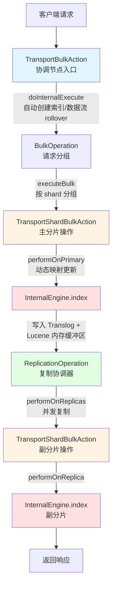
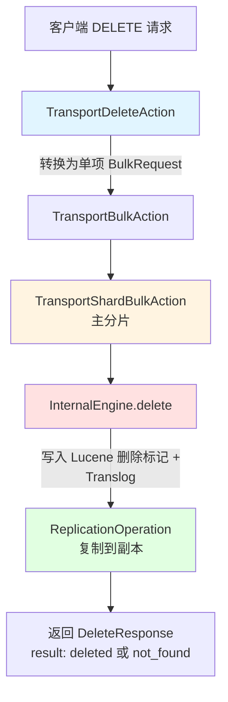
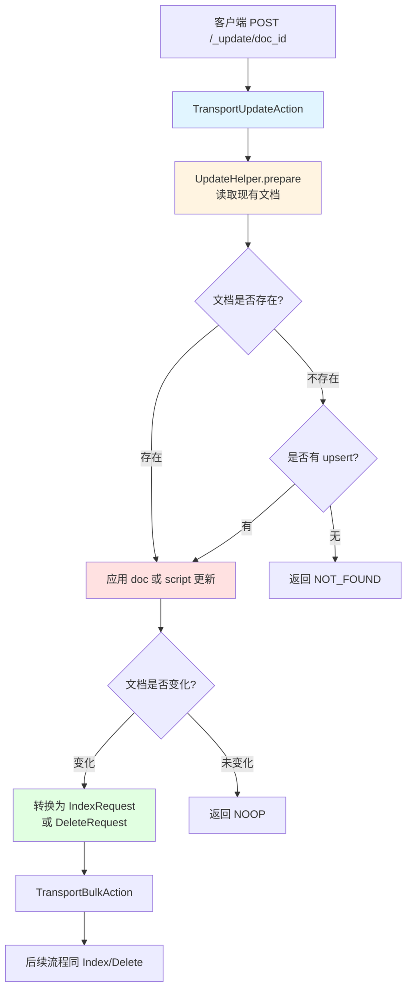
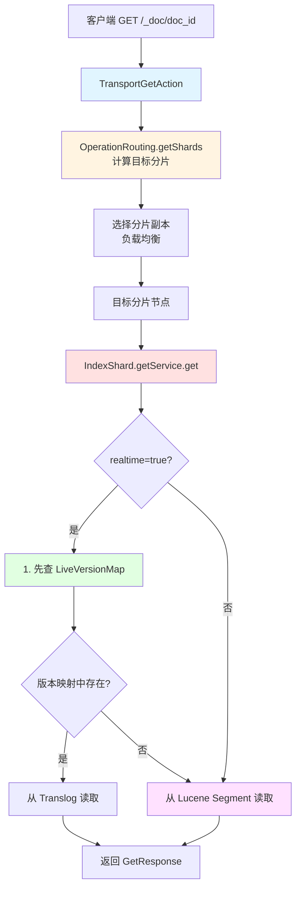
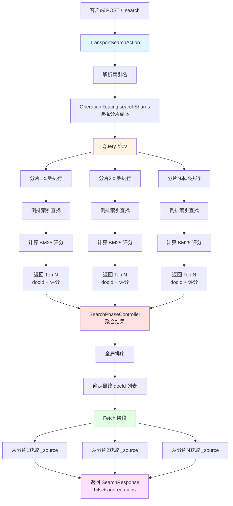
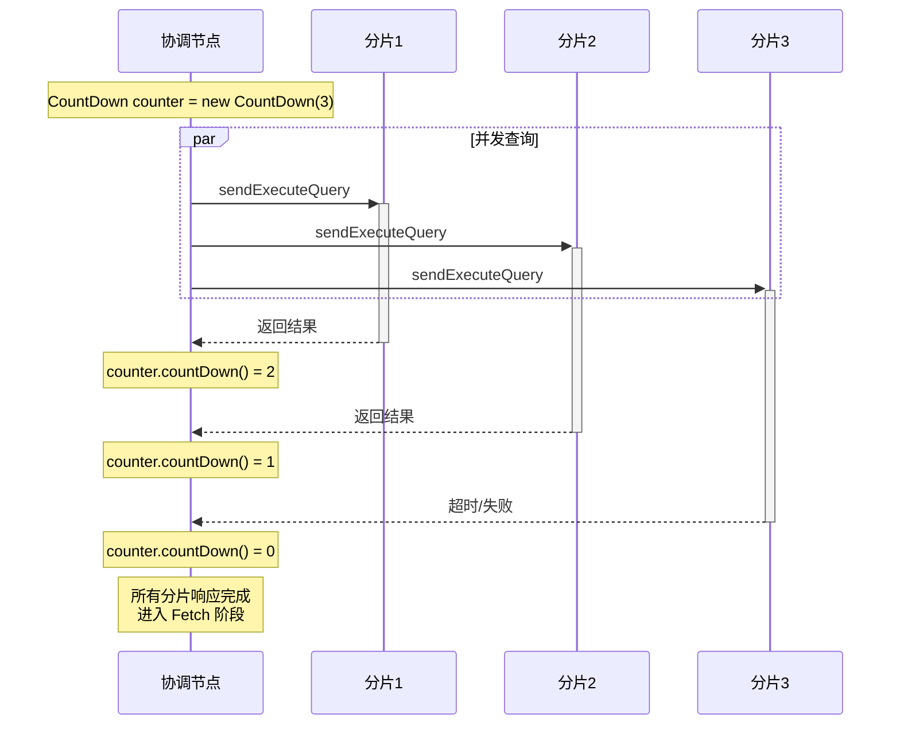
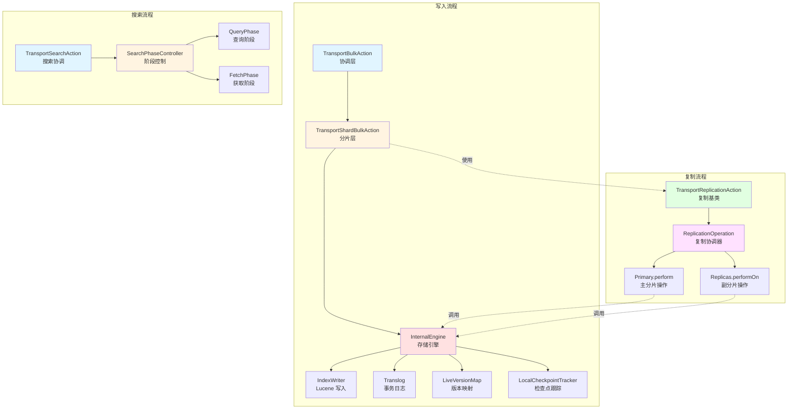
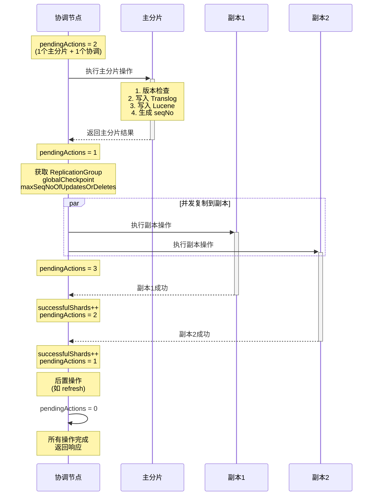

## 索引CURD（基于 Elasticsearch 8.14 源码分析）

本文档基于 Elasticsearch 8.14 实际源码，详细描述文档的增删改查（CRUD）操作流程。

---

## 一、写入流程（Index/Create）

### 导向性问题

在学习写入流程源码时，请带着以下问题去阅读和理解：

1. **协调层问题**：
   - 单文档索引请求（Index）是如何转换为 Bulk 请求的？为什么要这样设计？
   - 自动创建索引的逻辑在哪里触发？如果索引已存在会走什么路径？
   - 数据流的 rollover 检查是在什么时机执行的？

2. **路由和分片问题**：
   - 文档 ID 是如何计算出目标分片的？路由算法是什么？
   - 如果指定了自定义 routing 参数，路由计算会有什么不同？
   - BulkRequest 中的多个文档是如何按 ShardId 分组的？

3. **主分片执行问题**：
   - 动态映射更新是如何触发的？更新失败后会重试吗？
   - 映射更新后为什么要等待集群状态传播？使用的是什么等待机制？
   - 版本冲突（VersionConflictEngineException）是在哪个阶段检测的？

4. **存储引擎问题**：
   - Append-Only 优化的判断条件是什么？为什么自动生成 ID 就能使用 append 模式？
   - `versionMap.acquireLock(uid)` 锁的粒度是什么？如何保证并发安全？
   - 序列号（seqNo）是在主分片上如何生成的？为什么副分片不生成？
   - Translog 和 Lucene 的写入顺序是怎样的？如果 Lucene 写入失败，Translog 会回滚吗？

5. **复制协调问题**：
   - `pendingActions` 计数器的初始值是多少？什么时候递增和递减？
   - 副分片的复制是串行还是并发的？如果有 10 个副本，性能会怎样？
   - 如果某个副本分片超时或失败，主分片的操作会回滚吗？
   - `wait_for_active_shards` 参数是如何影响写入响应时间的？

6. **一致性问题**：
   - globalCheckpoint 和 localCheckpoint 的更新时机分别是什么？
   - 副分片如何利用 seqNo 保证和主分片的数据一致性？
   - 如果主分片在复制过程中宕机，副分片会如何处理？

### 1.1 宏观流程图



### 1.2 详细源码分析

#### 步骤1：TransportBulkAction - 协调节点入口
**文件位置**: `server/src/main/java/org/elasticsearch/action/bulk/TransportBulkAction.java`

```java
// 核心方法：doInternalExecute()
public class TransportBulkAction extends TransportAbstractBulkAction {
    @Override
    protected void doInternalExecute(Task task, BulkRequest bulkRequest,
                                      Executor executor, ActionListener<BulkResponse> listener) {
        // 1. 解析并确定需要创建的索引和需要 rollover 的数据流
        populateMissingTargets(clusterState, bulkRequest, ...);

        // 2. 自动创建不存在的索引
        createMissingIndicesAndIndexData(...);

        // 3. 执行批量操作
        executeBulk(task, bulkRequest, ...);
    }
}
```

**关键点**：
- 所有单文档写入（Index/Delete）都会转换为 Bulk 操作
- 自动创建索引和数据流的懒加载 rollover
- 支持失败存储（Failure Store）机制

#### 步骤2：BulkOperation - 请求按 Shard 分组
**文件位置**: `server/src/main/java/org/elasticsearch/action/bulk/BulkOperation.java`

```java
// 核心职责：将批量请求按目标分片分组
class BulkOperation {
    void executeBulk() {
        // 1. 按 ShardId 分组请求项
        Map<ShardId, List<BulkItemRequest>> requestsByShard = groupByShard(bulkRequest);

        // 2. 为每个分片创建 BulkShardRequest
        for (Map.Entry<ShardId, List<BulkItemRequest>> entry : requestsByShard.entrySet()) {
            BulkShardRequest shardRequest = new BulkShardRequest(entry.getKey(), ...);

            // 3. 调用 TransportShardBulkAction 执行分片级操作
            shardBulkAction.execute(shardRequest, ...);
        }
    }
}
```

#### 步骤3：TransportShardBulkAction - 主分片写入
**文件位置**: `server/src/main/java/org/elasticsearch/action/bulk/TransportShardBulkAction.java`

```java
// 继承 TransportWriteAction，处理分片级批量操作
public class TransportShardBulkAction extends TransportWriteAction<...> {

    // 主分片执行入口
    @Override
    protected void dispatchedShardOperationOnPrimary(BulkShardRequest request,
                                                      IndexShard primary,
                                                      ActionListener<PrimaryResult<...>> listener) {
        // 执行主分片操作
        performOnPrimary(request, primary, updateHelper, ...);
    }

    public static void performOnPrimary(...) {
        // 遍历每个批量项
        for (BulkItemRequest item : request.items()) {
            // 1. 处理动态映射更新
            if (needsMappingUpdate) {
                mappingUpdater.updateMappingOnMaster(...);
                waitForMappingUpdate(...); // 等待映射传播到集群
            }

            // 2. 根据操作类型执行
            if (item.request() instanceof IndexRequest) {
                result = executeBulkItemRequest(item, primary, ...);
            } else if (item.request() instanceof DeleteRequest) {
                // 删除操作
            } else if (item.request() instanceof UpdateRequest) {
                // 更新操作（内部转换为 Index 或 Delete）
            }
        }
    }

    // 副分片执行
    @Override
    protected void performOnReplica(BulkShardRequest request, IndexShard replica) {
        // 副分片直接应用操作，不需要重复版本检查和映射更新
        for (BulkItemRequest item : request.items()) {
            replicaItemExecutionMode(...).execute(item, replica, ...);
        }
    }
}
```

**关键点**：
- **动态映射更新**：主分片检测到新字段时，向 master 发送映射更新请求
- **映射等待机制**：使用 `ClusterStateObserver` 等待映射版本变更
- **版本冲突处理**：通过 `_seq_no` 和 `_primary_term` 实现乐观锁

#### 步骤4：InternalEngine.index() - 存储引擎写入
**文件位置**: `server/src/main/java/org/elasticsearch/index/engine/InternalEngine.java`

```java
public class InternalEngine extends Engine {
    private final IndexWriter indexWriter;        // Lucene 写入器
    private final Translog translog;              // 事务日志
    private final LiveVersionMap versionMap;      // 版本映射（实时读取）
    private final LocalCheckpointTracker localCheckpointTracker; // 本地检查点

    @Override
    public IndexResult index(Index index) throws IOException {
        try (Releasable ignored = versionMap.acquireLock(index.uid())) {
            // 1. 决定索引策略（append vs update）
            final IndexingStrategy plan = indexingStrategyForOperation(index);

            // 2. 生成序列号（主分片）
            if (index.origin() == Operation.Origin.PRIMARY) {
                index = assignSeqNo(index, generateSeqNoForOperationOnPrimary(index));

                // 如果是 update 操作，推进 maxSeqNoOfUpdatesOrDeletes
                if (plan.useLuceneUpdateDocument) {
                    advanceMaxSeqNoOfUpdatesOnPrimary(index.seqNo());
                }
            } else {
                markSeqNoAsSeen(index.seqNo()); // 副分片标记已见序列号
            }

            // 3. 写入 Lucene
            IndexResult indexResult = indexIntoLucene(index, plan);

            // 4. 写入 Translog（仅主分片和首次索引）
            if (index.origin().isFromTranslog() == false) {
                if (indexResult.getResultType() == Result.Type.SUCCESS) {
                    location = translog.add(new Translog.Index(index, indexResult));
                } else {
                    // 失败操作记录为 NoOp
                    location = innerNoOp(...).getTranslogLocation();
                }
            }

            // 5. 更新版本映射（用于实时读取）
            if (indexResult.getResultType() == Result.Type.SUCCESS) {
                versionMap.putUnderLock(index.uid(),
                    new VersionValue(index.version(), index.seqNo(), index.primaryTerm()));
            }

            return indexResult;
        }
    }

    private IndexResult indexIntoLucene(Index index, IndexingStrategy plan) throws IOException {
        // 准备 Lucene 文档
        List<LuceneDocument> docs = index.parsedDoc().docs();

        // 根据策略选择写入方式
        if (plan.useLuceneUpdateDocument) {
            // 更新现有文档（先删除再添加）
            indexWriter.updateDocuments(index.uid(), docs);
            numDocUpdates.inc(docs.size());
        } else {
            // 追加新文档（append-only 优化）
            indexWriter.addDocuments(docs);
            numDocAppends.inc(docs.size());
        }

        return new IndexResult(index.version(), index.primaryTerm(),
                               index.seqNo(), true, index.id());
    }
}
```

**关键细节**：
- **Append-Only 优化**：自动生成ID且非重试的文档使用 `addDocuments()`，性能更高
- **版本映射锁**：`versionMap.acquireLock(uid)` 保证同一文档的并发安全
- **序列号生成**：主分片生成全局唯一的序列号，副分片直接使用
- **Translog 写入**：先写 Translog（WAL），后写 Lucene

#### 步骤5：ReplicationOperation - 复制协调
**文件位置**: `server/src/main/java/org/elasticsearch/action/support/replication/ReplicationOperation.java`

```java
public class ReplicationOperation<Request, ReplicaRequest, PrimaryResultT> {
    private final AtomicInteger pendingActions = new AtomicInteger();
    private final AtomicInteger successfulShards = new AtomicInteger();

    public void execute() throws Exception {
        // 1. 检查活跃分片数
        final String activeShardCountFailure = checkActiveShardCount();
        if (activeShardCountFailure != null) {
            finishAsFailed(new UnavailableShardsException(...));
            return;
        }

        // 2. 在主分片执行操作
        pendingActions.incrementAndGet(); // 增加待处理计数
        primary.perform(request, ActionListener.wrap(
            this::handlePrimaryResult,
            this::finishAsFailed
        ));
    }

    private void handlePrimaryResult(final PrimaryResultT primaryResult) {
        this.primaryResult = primaryResult;

        // 3. 获取复制组（包含所有副本分片）
        final ReplicationGroup replicationGroup = primary.getReplicationGroup();

        // 4. 标记不可用分片为过期
        markUnavailableShardsAsStale(replicaRequest, replicationGroup);

        // 5. 在副分片上执行复制
        performOnReplicas(replicaRequest, globalCheckpoint,
                          maxSeqNoOfUpdatesOrDeletes, replicationGroup, ...);

        // 6. 执行后置操作（如 refresh）
        primaryResult.runPostReplicationActions(...);
    }

    private void performOnReplicas(ReplicaRequest replicaRequest, ...) {
        for (ShardRouting shard : replicationGroup.getReplicationTargets()) {
            if (shard.primary()) continue; // 跳过主分片

            pendingActions.incrementAndGet();
            replicasProxy.performOn(shard, replicaRequest, ...,
                ActionListener.wrap(
                    replicaResponse -> {
                        successfulShards.incrementAndGet();
                        decPendingAndFinishIfNeeded();
                    },
                    exception -> {
                        shardReplicaFailures.add(...);
                        decPendingAndFinishIfNeeded();
                    }
                )
            );
        }
    }

    private void decPendingAndFinishIfNeeded() {
        // 原子递减待处理计数
        if (pendingActions.decrementAndGet() == 0) {
            finish(); // 所有操作完成，返回响应
        }
    }
}
```

**关键点**：
- **等待机制**：使用 `AtomicInteger pendingActions` 计数，所有操作完成后才返回
- **并发复制**：副分片复制是并发执行的，不是串行
- **部分成功**：即使部分副本失败，只要满足 `wait_for_active_shards`，操作仍然成功
- **超时处理**：默认 60 秒超时，可通过 `timeout` 参数配置

### 1.3 关键技术点

#### Translog 持久化策略
```java
// index.translog.durability 配置
- request: 每次写入都 fsync（默认，安全但慢）
- async: 每 5 秒 fsync 一次（快但可能丢数据）
```

#### Refresh 机制
```java
// 三种 refresh 模式
- false/null: 不立即刷新，等待默认 1 秒自动刷新
- true: 立即刷新，操作完成后数据可搜索（影响性能）
- wait_for: 等待下次自动刷新完成后返回
```

#### 序列号和检查点
```java
// 每个操作都有唯一的序列号
- seqNo: 操作的全局序列号（从 0 开始递增）
- primaryTerm: 主分片的任期号（处理脑裂）
- localCheckpoint: 当前分片已处理的最大连续 seqNo
- globalCheckpoint: 所有副本都已确认的最大 seqNo
```

---

## 二、删除流程（Delete）

### 导向性问题

在学习删除流程源码时，请带着以下问题去阅读和理解：

1. **删除转换问题**：
   - Delete 请求是在哪里转换为 BulkRequest 的？为什么要转换？
   - 转换后的 BulkRequest 包含几个项？与批量删除有什么区别？

2. **软删除机制问题**：
   - 什么是软删除（Soft Deletes）？它和物理删除有什么区别？
   - 软删除是如何在 Lucene 中实现的？添加的是什么字段？
   - 被软删除的文档什么时候会被真正删除？Merge 过程如何清理？
   - 为什么 ES 7.x+ 要引入软删除？它解决了什么问题？

3. **删除和更新的关系**：
   - `advanceMaxSeqNoOfUpdatesOnPrimary()` 在删除时为什么要调用？
   - maxSeqNoOfUpdatesOrDeletes 的作用是什么？如何影响 Get 请求？

4. **版本映射问题**：
   - `putDeleteUnderLock()` 和 `putUnderLock()` 有什么区别？
   - 删除后的文档在 LiveVersionMap 中存储的是什么信息？
   - 如果删除一个不存在的文档，result 是什么？版本映射会更新吗？

5. **Translog 记录问题**：
   - 删除操作在 Translog 中是如何记录的？和写入操作的格式一样吗？
   - 如果 Translog 中有删除记录，恢复时如何重放？

### 2.1 宏观流程



### 2.2 源码分析

**InternalEngine.delete()** 核心逻辑：
```java
@Override
public DeleteResult delete(Delete delete) throws IOException {
    try (Releasable ignored = versionMap.acquireLock(delete.uid())) {
        // 1. 决定删除策略
        final DeletionStrategy plan = deletionStrategyForOperation(delete);

        // 2. 生成序列号
        if (delete.origin() == Operation.Origin.PRIMARY) {
            delete = assignSeqNo(delete, generateSeqNoForOperationOnPrimary(delete));
            advanceMaxSeqNoOfUpdatesOnPrimary(delete.seqNo());
        }

        // 3. Lucene 软删除（标记删除，不立即物理删除）
        if (plan.deleteFromLucene) {
            // 添加软删除标记字段
            softDeletesField.setLongValue(delete.seqNo());
            indexWriter.softUpdateDocument(delete.uid(), softDeletesField, ...);
            numDocDeletes.inc();
        }

        // 4. 写入 Translog
        if (delete.origin().isFromTranslog() == false) {
            location = translog.add(new Translog.Delete(delete, deleteResult));
        }

        // 5. 更新版本映射
        versionMap.putDeleteUnderLock(delete.uid(),
            new DeleteVersionValue(delete.version(), delete.seqNo(), ...));

        return deleteResult;
    }
}
```

**软删除机制**：
- ES 7.x+ 使用软删除（Soft Deletes）代替物理删除
- 删除的文档保留在 Segment 中，标记为已删除
- 后台 Merge 过程真正清理被删除的文档
- 用于支持跨集群复制（CCR）和快速恢复

---

## 三、更新流程（Update）

### 导向性问题

在学习更新流程源码时，请带着以下问题去阅读和理解：

1. **更新本质问题**：
   - 为什么说"ES 中没有原地更新"？更新的本质是什么？
   - Update 操作最终会转换为什么操作？什么情况下会转为 Delete？

2. **Get-Modify-Index 模式问题**：
   - `UpdateHelper.prepare()` 中是如何读取现有文档的？读取的是实时数据吗？
   - 如果文档不存在，upsert 逻辑是如何生效的？
   - 如果既没有文档也没有 upsert，返回的结果是什么？

3. **脚本执行问题**：
   - Painless 脚本是在哪个节点执行的？主分片还是协调节点？
   - 脚本执行时可以访问哪些上下文数据（ctx.\_source、ctx.\_id 等）？
   - 如果脚本执行出错，会如何处理？

4. **变化检测问题**：
   - `detectNoop()` 的实现原理是什么？如何判断文档是否真的变化了？
   - 如果检测到 NOOP，还会写入 Translog 吗？还会复制到副本吗？
   - detect_noop 参数的默认值是什么？为什么要设计这个参数？

5. **并发控制问题**：
   - `if_seq_no` 和 `if_primary_term` 的作用是什么？
   - 如果版本冲突，`retry_on_conflict` 如何实现自动重试？
   - 重试时是重新执行整个 Get-Modify-Index 过程吗？
   - 最多重试几次？重试间隔是多少？

6. **部分更新问题**：
   - doc 参数和完整文档有什么区别？如何实现字段级的合并？
   - 嵌套字段的更新是如何处理的（如 `doc: {user.name: "new"}`）？
   - doc_as_upsert 参数的作用是什么？

### 3.1 宏观流程



### 3.2 源码分析

**TransportUpdateAction** 核心逻辑：
```java
protected void doExecute(Task task, UpdateRequest request, ActionListener<UpdateResponse> listener) {
    // 1. 准备更新操作
    UpdateHelper.Result prepareResult = updateHelper.prepare(request, primary, nowInMillis);

    switch (prepareResult.getResponseResult()) {
        case UPDATED:
            // 2. 转换为 IndexRequest
            IndexRequest indexRequest = prepareResult.action();
            // 3. 调用 TransportBulkAction 执行
            bulkAction.execute(wrapBulkRequest(indexRequest), ...);
            break;

        case DELETED:
            // 转换为 DeleteRequest
            DeleteRequest deleteRequest = prepareResult.action();
            bulkAction.execute(wrapBulkRequest(deleteRequest), ...);
            break;

        case NOOP:
            // 文档未变化，直接返回
            listener.onResponse(prepareResult.action());
            break;
    }
}
```

**UpdateHelper.prepare()** 详细流程：
```java
public Result prepare(UpdateRequest request, IndexShard indexShard, LongSupplier nowInMillis) {
    // 1. 从 Lucene 或 Translog 读取现有文档
    GetResult getResult = indexShard.getService().get(...);

    if (getResult.isExists() == false) {
        // 文档不存在
        if (request.upsert() != null) {
            // 执行 upsert
            return new Result(prepareUpsert(request), ...);
        } else {
            return new Result(null, ..., NOT_FOUND);
        }
    }

    // 2. 应用更新
    Map<String, Object> sourceAsMap = getResult.sourceAsMap();

    if (request.script() != null) {
        // 执行 Painless 脚本
        executeScript(request.script(), sourceAsMap, ...);
    } else if (request.doc() != null) {
        // 合并 doc 字段
        XContentHelper.update(sourceAsMap, request.doc().sourceAsMap(), ...);
    }

    // 3. 检测变化
    if (request.detectNoop() && isNoop(sourceAsMap, getResult)) {
        return new Result(null, ..., NOOP);
    }

    // 4. 构造新的 IndexRequest
    IndexRequest indexRequest = new IndexRequest(request.index())
        .id(request.id())
        .source(sourceAsMap)
        .setIfSeqNo(getResult.getSeqNo())
        .setIfPrimaryTerm(getResult.getPrimaryTerm());

    return new Result(indexRequest, ..., UPDATED);
}
```

**关键点**：
- **Update = Get + Modify + Index**：ES 中没有原地更新
- **并发控制**：使用 `if_seq_no` 和 `if_primary_term` 实现乐观锁
- **重试机制**：`retry_on_conflict` 参数控制版本冲突时的自动重试次数

---

## 四、查询流程（Get API）

### 导向性问题

在学习 Get API 流程源码时，请带着以下问题去阅读和理解：

1. **路由和分片选择问题**：
   - Get 请求如何确定目标分片？和 routing 参数有什么关系？
   - `OperationRouting.getShards()` 返回的是什么？为什么是迭代器？
   - 负载均衡策略有哪些？preference 参数如何影响分片选择？
   - 什么是 `_local`、`_primary`、`_replica` 这些偏好值的作用？

2. **实时读取问题**：
   - realtime=true 和 realtime=false 的区别是什么？
   - 为什么 realtime=true 能读取未 refresh 的数据？
   - LiveVersionMap 中存储的是什么数据？什么时候会更新？
   - 如果文档刚写入但还没 refresh，Get 请求会经过哪些路径？

3. **版本映射查询问题**：
   - `versionMap.getUnderLock()` 为什么要加锁？
   - 如果版本映射中发现文档被标记为删除，会返回什么？
   - 版本映射的 key 是什么？是 doc_id 还是 uid？

4. **Translog 读取问题**：
   - `getFromTranslog()` 是如何根据 seqNo 查找文档的？
   - Translog 中的数据结构是什么？是顺序存储还是索引存储？
   - 如果 Translog 中没有找到对应的 seqNo，会怎么处理？

5. **Lucene 查询问题**：
   - `getFromLucene()` 使用的是什么查询方式？Term Query 吗？
   - Lucene 的 Segment 是如何组织的？如何快速定位到 doc_id？
   - 如果有多个 Segment，查询会遍历所有 Segment 吗？

6. **性能优化问题**：
   - Get 请求为什么比 Search 快？
   - stored_fields 参数如何影响性能？
   - _source_includes 和 _source_excludes 的过滤在哪个阶段执行？

### 4.1 宏观流程



### 4.2 源码分析

**TransportGetAction** 路由选择：
```java
@Override
protected ShardIterator shards(ClusterState state, InternalRequest request) {
    // 使用 OperationRouting 计算目标分片
    ShardIterator iterator = clusterService.operationRouting().getShards(
        clusterService.state(),
        request.concreteIndex(),
        request.request().id(),      // doc_id
        request.request().routing(), // 自定义路由
        request.request().preference() // 偏好参数（如 _local, _primary）
    );

    // 过滤可搜索的分片
    return new PlainShardIterator(
        iterator.shardId(),
        iterator.getShardRoutings().stream()
            .filter(shardRouting -> OperationRouting.canSearchShard(shardRouting, state))
            .toList()
    );
}
```

**IndexShard.getService().get()** 实时读取：
```java
public GetResult get(String id, boolean realtime, ...) {
    Engine.GetResult getResult = null;

    if (realtime) {
        // 实时模式：先查版本映射和 Translog
        getResult = engine.get(
            new Engine.Get(realtime, id, ...),
            this::wrapSearcher
        );
    } else {
        // 非实时模式：仅查 Lucene Segment
        refresh("realtime_get");
        getResult = engine.get(
            new Engine.Get(false, id, ...),
            this::wrapSearcher
        );
    }

    return getResult.exists() ?
        new GetResult(index, id, getResult.source(), ...) :
        GetResult.NOT_EXISTS;
}
```

**InternalEngine.get()** 实现：
```java
@Override
public GetResult get(Get get, BiFunction<String, SearcherScope, Engine.Searcher> searcherFactory) {
    if (get.realtime()) {
        // 1. 先查版本映射（LiveVersionMap）
        VersionValue versionValue = versionMap.getUnderLock(get.uid());
        if (versionValue != null) {
            if (versionValue.isDelete()) {
                // 文档已删除
                return GetResult.NOT_EXISTS;
            }
            // 从 Translog 读取最新版本
            return getFromTranslog(get, versionValue.seqNo());
        }
    }

    // 2. 从 Lucene Segment 读取
    return getFromLucene(get, searcherFactory);
}
```

**关键点**：
- **实时性保证**：`realtime=true`（默认）能读取未 refresh 的数据
- **负载均衡**：从主分片和副本分片中轮询或根据响应时间选择
- **路由一致性**：查询时必须提供与写入时相同的 routing 参数

---

## 五、搜索流程（Search API）

### 导向性问题

在学习 Search API 流程源码时，请带着以下问题去阅读和理解：

1. **查询重写和优化问题**：
   - `Rewriteable.rewriteAndFetch()` 做了什么优化？
   - 查询的重写阶段会改变查询语义吗？举例说明
   - 为什么要在协调节点重写查询，而不是在分片节点？

2. **分片路由问题**：
   - `searchShards()` 如何选择每个索引的哪些分片？
   - 如果索引有 5 个主分片和 2 个副本，会查询几个分片？
   - preference 参数如何影响副本选择？
   - routing 参数如何减少查询的分片数量？

3. **Query Then Fetch 问题**：
   - 为什么要分为 Query 和 Fetch 两个阶段？不能一次返回完整文档吗？
   - Query 阶段每个分片返回的是什么数据？只有 docId 和评分吗？
   - 如果 from=990, size=10，每个分片需要返回多少条记录？为什么？
   - 深度分页为什么会有性能问题？协调节点需要处理多少数据？

4. **并发和等待机制问题**：
   - `CountDown` 的实现原理是什么？和 Java 的 CountDownLatch 有什么区别？
   - 为什么使用 CountDown 而不是阻塞等待所有分片返回？
   - 如果某个分片查询很慢，协调节点会等多久？
   - 超时参数是如何工作的？超时后会取消分片任务吗？

5. **分片失败处理问题**：
   - 如果 5 个分片中有 2 个失败，查询会失败吗？
   - `allow_partial_search_results` 参数的默认值是什么？
   - 部分失败时，SearchResponse 中如何表示失败信息？
   - 什么情况下分片失败会导致整个查询失败？

6. **结果聚合和排序问题**：
   - `SearchPhaseController.reducedQueryPhase()` 如何合并多个分片的 TopDocs？
   - 全局排序的算法是什么？是归并排序吗？
   - 如果每个分片返回的评分范围不同，如何保证全局排序的正确性？
   - 聚合结果如何合并（sum、avg、cardinality 等不同类型）？

7. **Fetch 阶段问题**：
   - `fillDocIdsToLoad()` 如何确定需要 fetch 的文档？
   - 为什么不是 fetch 所有 Query 阶段返回的文档？
   - Fetch 阶段是串行还是并发的？
   - 如果某个文档在 Fetch 阶段已被删除，会如何处理？

8. **DFS Query Then Fetch 问题**：
   - DFS 阶段的作用是什么？为什么需要收集全局词频？
   - 什么场景下需要使用 DFS Query Then Fetch？
   - DFS 会增加多少查询延迟？

9. **倒排索引查询问题**：
   - 分片节点如何利用倒排索引查找匹配文档？
   - BM25 评分算法的计算过程是怎样的？
   - 跳表（Skip List）在查询中的作用是什么？

10. **性能优化问题**：
    - 为什么说 search_after 比 from/size 深度分页性能好？
    - Scroll API 的原理是什么？为什么被废弃了？
    - PIT (Point In Time) + search_after 的组合如何使用？
    - _source 过滤如何减少网络传输？

### 5.1 宏观流程（Query Then Fetch）



#### 并发等待机制



### 5.2 源码分析

**TransportSearchAction.doExecute()**：
```java
@Override
protected void doExecute(Task task, SearchRequest searchRequest, ActionListener<SearchResponse> listener) {
    final ClusterState clusterState = clusterService.state();

    // 1. 解析索引名称
    final ResolvedIndices resolvedIndices = ResolvedIndices.resolveWithIndicesRequest(
        searchRequest, clusterState, indexNameExpressionResolver, ...
    );

    // 2. 重写查询（优化）
    Rewriteable.rewriteAndFetch(searchRequest, ..., rewriteListener);
}

private void executeLocalSearch(...) {
    // 3. 计算目标分片
    final GroupShardsIterator<ShardIterator> shardIterators = clusterService
        .operationRouting()
        .searchShards(clusterState, concreteIndices, routingMap, searchRequest.preference());

    // 4. 创建搜索阶段
    SearchPhase searchPhase = new QueryPhase(
        searchRequest, shardIterators, searchPhaseController, ...
    );

    // 5. 执行搜索
    searchPhase.run();
}
```

**Query 阶段**：
```java
class QueryPhase extends SearchPhase {
    @Override
    public void run() {
        final CountDown counter = new CountDown(shardIterators.size());

        // 并发查询所有分片
        for (ShardIterator shardIt : shardIterators) {
            searchTransportService.sendExecuteQuery(
                shardIt.nextOrNull(),
                querySearchRequest,
                task,
                ActionListener.wrap(
                    result -> {
                        // 收集查询结果
                        queryResults.set(shardIndex, result);
                        if (counter.countDown()) {
                            // 所有分片查询完成，进入 Fetch 阶段
                            onPhaseDone();
                        }
                    },
                    exception -> {
                        // 处理分片失败
                        onShardFailure(shardIndex, exception);
                        if (counter.countDown()) {
                            onPhaseDone();
                        }
                    }
                )
            );
        }
    }

    @Override
    protected void onPhaseDone() {
        // 聚合所有分片的查询结果
        SearchPhaseController.ReducedQueryPhase reducedQueryPhase =
            searchPhaseController.reducedQueryPhase(queryResults, ...);

        // 进入 Fetch 阶段
        new FetchPhase(reducedQueryPhase, ...).run();
    }
}
```

**SearchPhaseController 聚合**：
```java
public ReducedQueryPhase reducedQueryPhase(Collection<QuerySearchResult> results, ...) {
    // 1. 合并所有分片的 TopDocs
    List<TopDocs> topDocsList = new ArrayList<>();
    for (QuerySearchResult result : results) {
        topDocsList.add(result.topDocs());
    }

    // 2. 全局排序
    TopDocs mergedTopDocs = TopDocs.merge(
        searchRequest.source().size(),
        topDocsList.toArray(new TopDocs[0])
    );

    // 3. 合并聚合结果
    InternalAggregations aggregations = reduceAggs(...);

    return new ReducedQueryPhase(
        mergedTopDocs,
        aggregations,
        successfulShards,
        shardFailures
    );
}
```

**Fetch 阶段**：
```java
class FetchPhase extends SearchPhase {
    @Override
    public void run() {
        // 1. 确定需要 fetch 的文档
        IntArrayList[] docIdsToLoad = searchPhaseController.fillDocIdsToLoad(numShards, topDocs);

        final CountDown counter = new CountDown(numFetches);

        // 2. 从相关分片获取完整文档
        for (int i = 0; i < docIdsToLoad.length; i++) {
            if (docIdsToLoad[i].isEmpty()) continue;

            searchTransportService.sendExecuteFetch(
                shardIt.get(i),
                fetchSearchRequest,
                task,
                ActionListener.wrap(
                    fetchResult -> {
                        fetchResults.set(i, fetchResult);
                        if (counter.countDown()) {
                            onFetchDone();
                        }
                    },
                    exception -> onShardFailure(i, exception)
                )
            );
        }
    }

    private void onFetchDone() {
        // 3. 构造最终的 SearchResponse
        SearchHits hits = searchPhaseController.merge(
            reducedQueryPhase,
            fetchResults,
            ...
        );

        listener.onResponse(new SearchResponse(
            hits,
            aggregations,
            totalShards,
            successfulShards,
            shardFailures,
            ...
        ));
    }
}
```

### 5.3 超时和失败处理

**超时机制**：
```java
// 默认超时 30 秒
public static final TimeValue DEFAULT_SEARCH_TIMEOUT = TimeValue.MINUS_ONE; // 无限制

// 使用 CountDown 等待所有分片
class CountDown {
    private final AtomicInteger countDown;

    public boolean countDown() {
        return countDown.decrementAndGet() == 0;
    }
}

// 超时后取消任务
if (timeout) {
    taskManager.cancel(task, "search timeout", ...);
}
```

**部分结果处理**：
```java
// allow_partial_search_results=true（默认）
if (successfulShards > 0 && successfulShards < totalShards) {
    // 返回部分结果，包含失败信息
    return new SearchResponse(
        hits,
        aggregations,
        totalShards,
        successfulShards,
        shardFailures, // 包含失败分片的异常信息
        ...
    );
}

// allow_partial_search_results=false
if (shardFailures.size() > 0) {
    throw new SearchPhaseExecutionException("query", "Shard failures", shardFailures);
}
```

### 5.4 关键技术点

**DFS Query Then Fetch**：
```java
// 启用全局词频统计（更准确的评分）
searchRequest.searchType(SearchType.DFS_QUERY_THEN_FETCH);

// 额外的 DFS 阶段
1. DFS 阶段：收集所有分片的词频统计（IDF）
2. Query 阶段：使用全局 IDF 计算评分
3. Fetch 阶段：获取文档
```

**深度分页问题**：
```java
// 问题：from + size 越大，协调节点需要处理的数据越多
// 每个分片返回 from + size 条记录，协调节点排序后取 size 条

// 解决方案 1：search_after（推荐）
searchRequest.source().searchAfter(new Object[]{lastScore, lastDocId});

// 解决方案 2：Scroll API（已废弃，建议用 PIT + search_after）
searchRequest.scroll(TimeValue.timeValueMinutes(1));
```

**聚合合并**：
```java
// SearchPhaseController.aggregateDfs()
- 求和类：直接相加
- 平均值：加权平均
- 基数（cardinality）：使用 HyperLogLog 近似算法
- 桶聚合：合并各分片的桶
```

---

## 六、关键组件总结

### 导向性问题

在学习核心组件时，请带着以下问题去理解：

1. **序列号系统问题**：
   - seqNo 和 primaryTerm 的生命周期是怎样的？
   - localCheckpoint 和 globalCheckpoint 如何更新？更新频率如何？
   - 为什么需要 maxSeqNoOfUpdatesOrDeletes？它解决了什么问题？
   - 如果主分片宕机重新选举，primaryTerm 如何变化？
   - 副分片如何利用 globalCheckpoint 来清理 Translog？

2. **版本控制问题**：
   - ES 8.x 为什么放弃了 _version，改用 _seq_no + _primary_term？
   - 如何使用 if_seq_no 和 if_primary_term 实现乐观锁？
   - 版本冲突的根本原因是什么？如何避免？

3. **Translog 问题**：
   - Translog 的文件格式是怎样的？如何追加写入？
   - fsync 的时机有哪些？durability=request 和 async 的区别？
   - Translog 何时会被清理？和 globalCheckpoint 有什么关系？
   - 如果节点重启，Translog 如何用于恢复？

4. **LiveVersionMap 问题**：
   - LiveVersionMap 的数据结构是什么？ConcurrentHashMap 吗？
   - 什么时候需要加锁访问？锁的粒度是什么？
   - LiveVersionMap 的内存占用如何控制？会不会无限增长？
   - refresh 操作对 LiveVersionMap 有什么影响？

5. **IndexWriter 问题**：
   - IndexWriter 的配置参数有哪些？ES 如何调优？
   - addDocuments 和 updateDocuments 的性能差异是什么？
   - IndexWriter 的内存缓冲区如何刷盘？

6. **ReplicationOperation 问题**：
   - 复制失败如何影响主分片操作？
   - 如何标记不可用分片为 stale？
   - 复制超时的默认值是多少？

### 6.1 核心类关系图



#### 复制操作详细时序图



### 6.2 并发和一致性机制

**序列号系统**：
```
- seqNo: 操作的全局唯一序列号（从 0 递增）
- primaryTerm: 主分片的任期号（选举时递增）
- localCheckpoint: 当前分片已完成的最大连续 seqNo
- globalCheckpoint: 所有副本已确认的最大 seqNo

一致性保证：
1. 主分片生成 seqNo，副分片使用相同 seqNo
2. 恢复时重放 globalCheckpoint 之后的操作
3. 脑裂时通过 primaryTerm 判断主分片合法性
```

**版本控制**：
```java
// ES 8.x 使用 _seq_no + _primary_term 替代 _version
PUT /index/_doc/1?if_seq_no=5&if_primary_term=1
{
  "field": "value"
}

// 乐观锁：仅当 seqNo 和 primaryTerm 匹配时才更新
if (request.ifSeqNo() != currentSeqNo || request.ifPrimaryTerm() != currentPrimaryTerm) {
    throw new VersionConflictEngineException(...);
}
```

### 6.3 性能优化建议

**写入优化**：
```
1. 增大 refresh_interval：index.refresh_interval=30s
2. 使用 Bulk API：批量写入，减少网络开销
3. 减少副本数：写入时副本越少越快（牺牲可用性）
4. 异步 Translog：index.translog.durability=async（牺牲持久性）
5. 禁用不必要的字段：_source、doc_values、norms
```

**查询优化**：
```
1. 使用 Filter 代替 Query：Filter 可缓存
2. 避免深度分页：使用 search_after
3. _source 过滤：只返回需要的字段
4. 预热缓存：定期执行热门查询
5. 合理设置分片数：避免分片过多或过大
```

**集群设计**：
```
1. 分片大小：5-20GB per shard
2. 分片数量：节点数的 1-3 倍
3. 副本数量：根据可用性需求设置（通常 1-2 个副本）
4. 硬件：SSD、足够内存（堆内存不超过 31GB）
```

---

## 七、源码学习路径建议

### 阶段1：写入流程
1. `TransportBulkAction.java:70-210` - 协调入口和索引创建
2. `TransportShardBulkAction.java:188-350` - 分片级批量操作
3. `InternalEngine.java:1146-1260` - 存储引擎写入
4. `ReplicationOperation.java:108-200` - 复制协调

### 阶段2：查询流程
1. `TransportGetAction.java:99-160` - GET API 实现
2. `TransportSearchAction.java:314-400` - Search API 入口
3. `SearchPhaseController.java:86-150` - 查询结果聚合

### 阶段3：核心组件
1. `InternalEngine.java:234-300` - 引擎初始化
2. `Translog.java` - 事务日志实现
3. `LiveVersionMap.java` - 版本映射
4. `OperationRouting.java` - 路由计算

祝你源码学习顺利！有问题随时提问。
