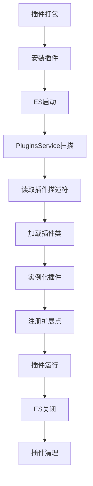

# ES插件开发

## 一、ES插件机制概述

### 1.1 什么是ES插件？

Elasticsearch 插件是一种扩展 ES 核心功能的机制，允许开发者在不修改 ES 源码的情况下，添加自定义功能。插件可以扩展 ES 的各个方面，包括：

- **分析器（Analysis）**：自定义分词器、Token Filter、Char Filter
- **映射器（Mapper）**：自定义字段类型和元数据字段
- **REST API**：添加新的 REST 端点
- **搜索功能（Search）**：自定义评分函数、聚合、查询类型
- **数据处理（Ingest）**：自定义数据处理管道
- **集群管理**：自定义发现机制、分配策略
- **脚本扩展**：添加自定义脚本语言或函数
- **安全认证**：自定义认证和授权引擎

### 1.2 插件的作用

1. **功能扩展**：在不修改核心代码的情况下添加新功能
2. **业务定制**：根据特定业务需求定制 ES 行为
3. **性能优化**：针对特定场景优化性能
4. **集成第三方**：集成外部系统和服务
5. **模块化开发**：保持代码的模块化和可维护性

### 1.3 插件的类型

根据功能划分，ES 插件主要有以下类型：

| 插件类型 | 接口 | 用途 | 示例 |
|---------|------|------|------|
| 分析插件 | `AnalysisPlugin` | 自定义分词器、过滤器 | analysis-icu, analysis-phonetic |
| 映射插件 | `MapperPlugin` | 自定义字段类型 | mapper-size, mapper-murmur3 |
| REST插件 | `ActionPlugin` | 添加REST API | rest-handler |
| 搜索插件 | `SearchPlugin` | 自定义查询、聚合、评分 | rank-eval |
| 数据处理插件 | `IngestPlugin` | 自定义数据处理器 | ingest-attachment |
| 集群插件 | `ClusterPlugin` | 自定义集群行为 | discovery-ec2 |
| 脚本插件 | `ScriptPlugin` | 自定义脚本功能 | lang-painless |
| 网络插件 | `NetworkPlugin` | 自定义网络传输 | transport-nio |

## 二、ES插件架构分析

### 2.1 核心架构

ES 插件架构基于 **SPI（Service Provider Interface）** 机制和 **模块化设计**，主要包含以下核心组件：

```
┌─────────────────────────────────────────────────────────┐
│                    Elasticsearch Node                    │
├─────────────────────────────────────────────────────────┤
│                    PluginsService                        │
│  ┌───────────────────────────────────────────────────┐  │
│  │  Plugin Discovery & Loading                       │  │
│  │  - 扫描 plugins 目录                               │  │
│  │  - 读取 plugin-descriptor.properties              │  │
│  │  - 加载插件类和依赖                                │  │
│  └───────────────────────────────────────────────────┘  │
│                                                           │
│  ┌───────────────────────────────────────────────────┐  │
│  │  Plugin Initialization                            │  │
│  │  - 实例化插件主类                                  │  │
│  │  - 注册扩展点                                      │  │
│  │  - 初始化组件                                      │  │
│  └───────────────────────────────────────────────────┘  │
│                                                           │
│  ┌───────────────────────────────────────────────────┐  │
│  │  Plugin Integration                               │  │
│  │  - ActionPlugin → REST Handlers                   │  │
│  │  - AnalysisPlugin → Analyzers/Filters            │  │
│  │  - MapperPlugin → Field Mappers                   │  │
│  │  - SearchPlugin → Queries/Aggregations            │  │
│  │  - IngestPlugin → Processors                      │  │
│  └───────────────────────────────────────────────────┘  │
└─────────────────────────────────────────────────────────┘
```

### 2.2 插件生命周期



### 2.3 插件基类：Plugin

所有插件都必须继承 `org.elasticsearch.plugins.Plugin` 抽象类：

```java
public abstract class Plugin implements Closeable {
    // 创建插件组件
    public Collection<?> createComponents(PluginServices services) {
        return Collections.emptyList();
    }

    // 提供额外的节点设置
    public Settings additionalSettings() {
        return Settings.EMPTY;
    }

    // 注册自定义设置
    public List<Setting<?>> getSettings() {
        return Collections.emptyList();
    }

    // 注册命名可写对象（用于网络传输）
    public List<NamedWriteableRegistry.Entry> getNamedWriteables() {
        return Collections.emptyList();
    }

    // 注册命名XContent解析器
    public List<NamedXContentRegistry.Entry> getNamedXContent() {
        return Collections.emptyList();
    }

    // 索引模块回调
    public void onIndexModule(IndexModule indexModule) {}

    // 自定义线程池
    public List<ExecutorBuilder<?>> getExecutorBuilders(Settings settings) {
        return Collections.emptyList();
    }

    // 启动检查
    public List<BootstrapCheck> getBootstrapChecks() {
        return Collections.emptyList();
    }

    // 关闭资源
    @Override
    public void close() throws IOException {}
}
```

### 2.4 插件扩展接口

插件通过实现特定接口来扩展不同功能：

#### 2.4.1 ActionPlugin - REST API扩展

```java
public interface ActionPlugin {
    // 注册Action处理器
    default Collection<ActionHandler<?, ?>> getActions() {
        return Collections.emptyList();
    }

    // 注册REST处理器
    default Collection<RestHandler> getRestHandlers(
        Settings settings,
        RestController restController,
        ClusterSettings clusterSettings
        // ... 其他参数
    ) {
        return Collections.emptyList();
    }

    // 注册Action过滤器
    default Collection<ActionFilter> getActionFilters() {
        return Collections.emptyList();
    }
}
```

#### 2.4.2 AnalysisPlugin - 分析器扩展

```java
public interface AnalysisPlugin {
    // 注册Token Filter
    default Map<String, AnalysisProvider<TokenFilterFactory>> getTokenFilters() {
        return emptyMap();
    }

    // 注册Tokenizer
    default Map<String, AnalysisProvider<TokenizerFactory>> getTokenizers() {
        return emptyMap();
    }

    // 注册Char Filter
    default Map<String, AnalysisProvider<CharFilterFactory>> getCharFilters() {
        return emptyMap();
    }

    // 注册Analyzer
    default Map<String, AnalysisProvider<AnalyzerProvider<?>>> getAnalyzers() {
        return emptyMap();
    }
}
```

#### 2.4.3 MapperPlugin - 字段映射扩展

```java
public interface MapperPlugin {
    // 注册字段类型
    default Map<String, Mapper.TypeParser> getMappers() {
        return Collections.emptyMap();
    }

    // 注册元数据字段
    default Map<String, MetadataFieldMapper.TypeParser> getMetadataMappers() {
        return Collections.emptyMap();
    }

    // 注册运行时字段
    default Map<String, RuntimeField.Parser> getRuntimeFields() {
        return Collections.emptyMap();
    }
}
```

#### 2.4.4 IngestPlugin - 数据处理扩展

```java
public interface IngestPlugin {
    // 注册Processor
    default Map<String, Processor.Factory> getProcessors(
        Processor.Parameters parameters
    ) {
        return Map.of();
    }
}
```

#### 2.4.5 SearchPlugin - 搜索功能扩展

```java
public interface SearchPlugin {
    // 注册查询解析器
    default List<QuerySpec<?>> getQueries() {
        return emptyList();
    }

    // 注册聚合
    default List<AggregationSpec> getAggregations() {
        return emptyList();
    }

    // 注册评分函数
    default List<ScoreFunctionSpec<?>> getScoreFunctions() {
        return emptyList();
    }

    // 注册Suggester
    default List<SuggesterSpec<?>> getSuggesters() {
        return emptyList();
    }
}
```

### 2.5 插件加载机制

ES 通过 `PluginsService` 类管理插件的加载和生命周期：

1. **插件发现**：扫描 `plugins` 目录下的所有子目录
2. **描述符解析**：读取每个插件的 `plugin-descriptor.properties` 文件
3. **依赖检查**：验证插件依赖和版本兼容性
4. **类加载**：为每个插件创建独立的 ClassLoader
5. **实例化**：通过反射创建插件实例
6. **注册扩展**：调用插件的各个扩展方法，注册功能
7. **组件创建**：调用 `createComponents()` 创建插件组件

### 2.6 代表性插件分析

#### 2.6.1 mapper-size 插件（简单映射插件）

**功能**：添加 `_size` 元数据字段，记录文档的原始大小。

**核心代码**：
```java
public class MapperSizePlugin extends Plugin implements MapperPlugin {
    @Override
    public Map<String, MetadataFieldMapper.TypeParser> getMetadataMappers() {
        return Collections.singletonMap(
            SizeFieldMapper.NAME,
            SizeFieldMapper.PARSER
        );
    }
}
```

**特点**：
- 结构简单，只有一个主类
- 实现 `MapperPlugin` 接口
- 注册一个元数据字段映射器

#### 2.6.2 analysis-uppercase 插件（分析插件）

**功能**：提供将文本转换为大写的 Token Filter。

**核心代码**：
```java
public class AnalysisUppercasePlugin extends Plugin implements AnalysisPlugin {
    @Override
    public Map<String, AnalysisProvider<TokenFilterFactory>> getTokenFilters() {
        Map<String, AnalysisProvider<TokenFilterFactory>> extra = new HashMap<>();
        extra.put("custom_uppercase", UppercaseTokenFilterFactory::new);
        return extra;
    }
}
```

**特点**：
- 实现 `AnalysisPlugin` 接口
- 注册自定义 Token Filter Factory
- 支持配置参数（如 `preserve_original`）

#### 2.6.3 rest-handler 插件（REST API扩展）

**功能**：添加自定义 REST API 端点。

**核心代码**：
```java
public class ExampleRestHandlerPlugin extends Plugin implements ActionPlugin {
    @Override
    public List<RestHandler> getRestHandlers(
        final Settings settings,
        final RestController restController
        // ... 其他参数
    ) {
        return singletonList(new ExampleCatAction());
    }
}

public class ExampleCatAction extends AbstractCatAction {
    @Override
    public List<Route> routes() {
        return List.of(
            new Route(GET, "/_cat/example"),
            new Route(POST, "/_cat/example")
        );
    }

    @Override
    protected RestChannelConsumer doCatRequest(
        final RestRequest request,
        final NodeClient client
    ) {
        // 处理请求逻辑
    }
}
```

**特点**：
- 实现 `ActionPlugin` 接口
- 注册 REST 处理器
- 支持多种 HTTP 方法

#### 2.6.4 custom-settings 插件（配置管理）

**功能**：演示如何定义和使用自定义配置。

**核心代码**：
```java
public class ExampleCustomSettingsPlugin extends Plugin {
    private final ExampleCustomSettingsConfig config;

    public ExampleCustomSettingsPlugin(
        final Settings settings,
        final Path configPath
    ) {
        this.config = new ExampleCustomSettingsConfig(
            new Environment(settings, configPath)
        );
    }

    @Override
    public List<Setting<?>> getSettings() {
        return Arrays.asList(
            ExampleCustomSettingsConfig.SIMPLE_SETTING,
            ExampleCustomSettingsConfig.BOOLEAN_SETTING,
            ExampleCustomSettingsConfig.VALIDATED_SETTING,
            ExampleCustomSettingsConfig.FILTERED_SETTING,
            ExampleCustomSettingsConfig.SECURED_SETTING,
            ExampleCustomSettingsConfig.LIST_SETTING
        );
    }

    @Override
    public Settings additionalSettings() {
        final Settings.Builder builder = Settings.builder();
        builder.put(
            ExampleCustomSettingsConfig.SIMPLE_SETTING.getKey(),
            config.getSimple()
        );
        return builder.build();
    }
}
```

**特点**：
- 支持多种配置类型（字符串、布尔、列表等）
- 支持配置验证
- 支持敏感配置（SecureSetting）
- 支持动态配置更新

### 2.7 插件配置文件

每个插件必须包含 `plugin-descriptor.properties` 文件：

```properties
# 插件描述
description=Uppercase Analysis Plugin
# 插件版本
version=8.16.1
# 插件名称（唯一标识）
name=analysis-uppercase
# 插件主类全限定名
classname=org.elasticsearch.plugin.analysis.uppercase.AnalysisUppercasePlugin
# 所需Java版本
java.version=21
# 所需ES版本
elasticsearch.version=8.16.1
```

## 三、如何实现自己的插件

### 3.1 需求定义

在开始开发之前，需要明确以下问题：

1. **功能需求**：插件要解决什么问题？
2. **扩展类型**：需要实现哪种类型的插件？
3. **依赖关系**：是否依赖其他插件或外部库？
4. **性能要求**：是否有特殊的性能要求？
5. **兼容性**：需要支持哪些ES版本？

### 3.2 方案设计

#### 3.2.1 示例需求

假设我们要开发一个 **自定义手机号脱敏插件**，需求如下：

- 在索引时自动对手机号进行脱敏处理
- 支持多种脱敏策略（中间4位、后4位等）
- 提供 REST API 查询脱敏规则
- 支持配置白名单（某些索引不脱敏）

#### 3.2.2 技术方案

**插件类型**：
- `IngestPlugin`：实现数据处理管道
- `ActionPlugin`：提供 REST API

**核心组件**：
1. `PhoneMaskPlugin`：插件主类
2. `PhoneMaskProcessor`：手机号脱敏处理器
3. `PhoneMaskProcessorFactory`：处理器工厂
4. `PhoneMaskRestHandler`：REST API 处理器
5. `PhoneMaskSettings`：配置管理

**架构设计**：
```
phone-mask-plugin/
├── src/
│   ├── main/
│   │   ├── java/
│   │   │   └── org/elasticsearch/plugin/phonemask/
│   │   │       ├── PhoneMaskPlugin.java          # 插件主类
│   │   │       ├── PhoneMaskProcessor.java       # 脱敏处理器
│   │   │       ├── PhoneMaskProcessorFactory.java # 工厂类
│   │   │       ├── PhoneMaskRestHandler.java     # REST处理器
│   │   │       └── PhoneMaskSettings.java        # 配置类
│   │   └── resources/
│   │       └── plugin-metadata/
│   │           └── plugin-descriptor.properties   # 插件描述符
│   └── test/
│       └── java/
│           └── org/elasticsearch/plugin/phonemask/
│               ├── PhoneMaskProcessorTests.java   # 单元测试
│               └── PhoneMaskPluginIT.java         # 集成测试
├── build.gradle                                    # 构建配置
└── README.md                                       # 文档
```

### 3.3 基于插件框架实现

#### 3.3.1 创建项目结构

```bash
# 在 ES 源码的 plugins 目录下创建插件目录
cd /Users/cdj/code/work/elasticsearch/plugins
mkdir phone-mask-plugin
cd phone-mask-plugin

# 创建标准目录结构
mkdir -p src/main/java/org/elasticsearch/plugin/phonemask
mkdir -p src/main/resources/plugin-metadata
mkdir -p src/test/java/org/elasticsearch/plugin/phonemask
mkdir -p src/yamlRestTest/java/org/elasticsearch/plugin/phonemask
mkdir -p src/yamlRestTest/resources/rest-api-spec/test/phonemask
```

#### 3.3.2 配置根目录 settings.gradle

在根目录的 `settings.gradle` 文件中需要添加插件项目引用：

```gradle
// 在文件末尾添加插件项目引用
include 'plugins:phone-mask-plugin'
findProject(':plugins:phone-mask-plugin')?.name = 'phone-mask-plugin'
```

**注意事项**：
- `include` 语句用于包含插件项目
- `findProject` 用于设置项目名称
- 插件项目路径应该与实际的目录结构一致

#### 3.3.3 编写 build.gradle

```gradle
apply plugin: 'elasticsearch.esplugin'

esplugin {
  name 'phone-mask-plugin'
  description 'Phone Number Masking Plugin for Elasticsearch'
  classname 'org.elasticsearch.plugin.phonemask.PhoneMaskPlugin'
}

// 处理重复文件问题
tasks.named('bundlePlugin').configure {
    duplicatesStrategy = DuplicatesStrategy.EXCLUDE
}
tasks.named('explodedBundlePlugin').configure {
    duplicatesStrategy = DuplicatesStrategy.EXCLUDE
}

dependencies {
  compileOnly project(':server')
  testImplementation project(':server')
  testImplementation project(':test:framework')
}

test {
  systemProperty 'tests.security.manager', 'false'
}
```

**关键配置说明**：
- `esplugin` 块：定义插件的基本信息
- `duplicatesStrategy`：解决构建时的重复文件问题
- `dependencies`：定义插件的依赖关系
- `test` 配置：禁用安全管理器以便测试运行

#### 3.3.3 编写插件描述符

`src/main/resources/plugin-metadata/plugin-descriptor.properties`：

```properties
description=Phone Number Masking Plugin
version=8.16.1
name=phone-mask-plugin
classname=org.elasticsearch.plugin.phonemask.PhoneMaskPlugin
java.version=21
elasticsearch.version=8.16.1
```

#### 3.3.4 实现插件主类

`PhoneMaskPlugin.java`：

```java
package org.elasticsearch.plugin.phonemask;

import org.elasticsearch.cluster.metadata.IndexNameExpressionResolver;
import org.elasticsearch.cluster.node.DiscoveryNodes;
import org.elasticsearch.common.io.stream.NamedWriteableRegistry;
import org.elasticsearch.common.settings.ClusterSettings;
import org.elasticsearch.common.settings.IndexScopedSettings;
import org.elasticsearch.common.settings.Setting;
import org.elasticsearch.common.settings.Settings;
import org.elasticsearch.common.settings.SettingsFilter;
import org.elasticsearch.features.NodeFeature;
import org.elasticsearch.ingest.Processor;
import org.elasticsearch.plugins.ActionPlugin;
import org.elasticsearch.plugins.IngestPlugin;
import org.elasticsearch.plugins.Plugin;
import org.elasticsearch.rest.RestController;
import org.elasticsearch.rest.RestHandler;

import java.util.List;
import java.util.Map;
import java.util.function.Predicate;
import java.util.function.Supplier;

/**
 * 手机号脱敏插件
 */
public class PhoneMaskPlugin extends Plugin implements IngestPlugin, ActionPlugin {

    @Override
    public Map<String, Processor.Factory> getProcessors(Processor.Parameters parameters) {
        return Map.of(PhoneMaskProcessor.TYPE, new PhoneMaskProcessorFactory());
    }

    @Override
    public List<RestHandler> getRestHandlers(
        final Settings settings,
        final NamedWriteableRegistry namedWriteableRegistry,
        final RestController restController,
        final ClusterSettings clusterSettings,
        final IndexScopedSettings indexScopedSettings,
        final SettingsFilter settingsFilter,
        final IndexNameExpressionResolver indexNameExpressionResolver,
        final Supplier<DiscoveryNodes> nodesInCluster,
        final Predicate<NodeFeature> clusterSupportsFeature
    ) {
        return List.of(new PhoneMaskRestHandler());
    }

    @Override
    public List<Setting<?>> getSettings() {
        return List.of(
            PhoneMaskSettings.WHITELIST_INDICES,
            PhoneMaskSettings.DEFAULT_MASK_STRATEGY
        );
    }
}
```

#### 3.3.5 实现脱敏处理器

`PhoneMaskProcessor.java`：

```java
package org.elasticsearch.plugin.phonemask;

import org.elasticsearch.ingest.AbstractProcessor;
import org.elasticsearch.ingest.IngestDocument;
import org.elasticsearch.ingest.Processor;

import java.util.Map;
import java.util.regex.Pattern;

/**
 * 手机号脱敏处理器
 */
public class PhoneMaskProcessor extends AbstractProcessor {

    public static final String TYPE = "phone_mask";

    private static final Pattern PHONE_PATTERN = Pattern.compile(
        "1[3-9]\\d{9}"
    );

    private final String field;
    private final String targetField;
    private final MaskStrategy strategy;

    public enum MaskStrategy {
        MIDDLE_FOUR,  // 中间4位：138****5678
        LAST_FOUR,    // 后4位：1380000****
        FIRST_THREE   // 前3位：***00005678
    }

    protected PhoneMaskProcessor(
        String tag,
        String description,
        String field,
        String targetField,
        MaskStrategy strategy
    ) {
        super(tag, description);
        this.field = field;
        this.targetField = targetField;
        this.strategy = strategy;
    }

    @Override
    public IngestDocument execute(IngestDocument document) {
        String value = document.getFieldValue(field, String.class);
        if (value != null && PHONE_PATTERN.matcher(value).matches()) {
            String masked = maskPhone(value, strategy);
            document.setFieldValue(targetField, masked);
        }
        return document;
    }

    @Override
    public String getType() {
        return TYPE;
    }

    private String maskPhone(String phone, MaskStrategy strategy) {
        return switch (strategy) {
            case MIDDLE_FOUR -> phone.substring(0, 3) + "****" + phone.substring(7);
            case LAST_FOUR -> phone.substring(0, 7) + "****";
            case FIRST_THREE -> "***" + phone.substring(3);
        };
    }

    public static final class Factory implements Processor.Factory {
        @Override
        public PhoneMaskProcessor create(
            Map<String, Processor.Factory> registry,
            String tag,
            String description,
            Map<String, Object> config
        ) {
            String field = (String) config.get("field");
            String targetField = (String) config.getOrDefault("target_field", field);
            String strategyStr = (String) config.getOrDefault("strategy", "MIDDLE_FOUR");
            MaskStrategy strategy = MaskStrategy.valueOf(strategyStr);

            return new PhoneMaskProcessor(tag, description, field, targetField, strategy);
        }
    }
}
```

#### 3.3.6 实现处理器工厂

`PhoneMaskProcessorFactory.java`：

```java
package org.elasticsearch.plugin.phonemask;

import org.elasticsearch.ingest.Processor;

import java.util.Map;

/**
 * 手机号脱敏处理器工厂
 */
public class PhoneMaskProcessorFactory implements Processor.Factory {

    @Override
    public PhoneMaskProcessor create(
        Map<String, Processor.Factory> registry,
        String processorTag,
        String description,
        Map<String, Object> config
    ) throws Exception {
        String field = (String) config.get("field");
        if (field == null) {
            throw new IllegalArgumentException("field is required");
        }

        String targetField = (String) config.getOrDefault("target_field", field);
        String strategyStr = (String) config.getOrDefault("strategy", "MIDDLE_FOUR");

        PhoneMaskProcessor.MaskStrategy strategy;
        try {
            strategy = PhoneMaskProcessor.MaskStrategy.valueOf(strategyStr.toUpperCase());
        } catch (IllegalArgumentException e) {
            throw new IllegalArgumentException(
                "Invalid strategy: " + strategyStr +
                ". Valid values are: MIDDLE_FOUR, LAST_FOUR, FIRST_THREE"
            );
        }

        return new PhoneMaskProcessor(processorTag, description, field, targetField, strategy);
    }
}
```

#### 3.3.7 实现 REST 处理器

`PhoneMaskRestHandler.java`：

```java
package org.elasticsearch.plugin.phonemask;

import org.elasticsearch.client.internal.node.NodeClient;
import org.elasticsearch.rest.BaseRestHandler;
import org.elasticsearch.rest.RestRequest;
import org.elasticsearch.rest.RestResponse;
import org.elasticsearch.rest.RestStatus;
import org.elasticsearch.xcontent.XContentBuilder;

import java.io.IOException;
import java.util.List;

import static org.elasticsearch.rest.RestRequest.Method.GET;

/**
 * 手机号脱敏规则查询 REST 处理器
 */
public class PhoneMaskRestHandler extends BaseRestHandler {

    @Override
    public List<Route> routes() {
        return List.of(
            new Route(GET, "/_phone_mask/strategies")
        );
    }

    @Override
    public String getName() {
        return "phone_mask_strategies_handler";
    }

    @Override
    protected RestChannelConsumer prepareRequest(RestRequest request, NodeClient client) {
        return channel -> {
            try {
                XContentBuilder builder = channel.newBuilder();
                builder.startObject();
                builder.field("strategies", List.of(
                    "MIDDLE_FOUR",
                    "LAST_FOUR",
                    "FIRST_THREE"
                ));
                builder.field("default", "MIDDLE_FOUR");
                builder.endObject();

                channel.sendResponse(
                    new RestResponse(RestStatus.OK, builder)
                );
            } catch (IOException e) {
                channel.sendResponse(new RestResponse(channel, e));
            }
        };
    }
}
```

#### 3.3.8 实现配置类

`PhoneMaskSettings.java`：

```java
package org.elasticsearch.plugin.phonemask;

import org.elasticsearch.common.settings.Setting;
import org.elasticsearch.common.settings.Setting.Property;

import java.util.List;

/**
 * 手机号脱敏插件配置
 */
public class PhoneMaskSettings {

    /**
     * 白名单索引列表（这些索引不进行脱敏）
     */
    public static final Setting<List<String>> WHITELIST_INDICES = Setting.listSetting(
        "phone_mask.whitelist_indices",
        List.of(),
        s -> s,
        Property.NodeScope,
        Property.Dynamic
    );

    /**
     * 默认脱敏策略
     */
    public static final Setting<String> DEFAULT_MASK_STRATEGY = Setting.simpleString(
        "phone_mask.default_strategy",
        "MIDDLE_FOUR",
        Property.NodeScope,
        Property.Dynamic
    );
}
```

### 3.4 如何测试

#### 3.4.1 单元测试

`PhoneMaskProcessorTests.java`：

```java
package org.elasticsearch.plugin.phonemask;

import org.elasticsearch.ingest.IngestDocument;
import org.elasticsearch.test.ESTestCase;

import java.util.HashMap;
import java.util.Map;

public class PhoneMaskProcessorTests extends ESTestCase {

    public void testMiddleFourMask() {
        Map<String, Object> document = new HashMap<>();
        document.put("phone", "13800138000");
        IngestDocument ingestDocument = new IngestDocument(document, new HashMap<>());

        PhoneMaskProcessor processor = new PhoneMaskProcessor(
            "tag",
            "description",
            "phone",
            "phone_masked",
            PhoneMaskProcessor.MaskStrategy.MIDDLE_FOUR
        );

        processor.execute(ingestDocument);

        assertEquals("138****8000", ingestDocument.getFieldValue("phone_masked", String.class));
    }

    public void testLastFourMask() {
        Map<String, Object> document = new HashMap<>();
        document.put("phone", "13800138000");
        IngestDocument ingestDocument = new IngestDocument(document, new HashMap<>());

        PhoneMaskProcessor processor = new PhoneMaskProcessor(
            "tag",
            "description",
            "phone",
            "phone_masked",
            PhoneMaskProcessor.MaskStrategy.LAST_FOUR
        );

        processor.execute(ingestDocument);

        assertEquals("1380013****", ingestDocument.getFieldValue("phone_masked", String.class));
    }

    public void testInvalidPhone() {
        Map<String, Object> document = new HashMap<>();
        document.put("phone", "invalid");
        IngestDocument ingestDocument = new IngestDocument(document, new HashMap<>());

        PhoneMaskProcessor processor = new PhoneMaskProcessor(
            "tag",
            "description",
            "phone",
            "phone_masked",
            PhoneMaskProcessor.MaskStrategy.MIDDLE_FOUR
        );

        processor.execute(ingestDocument);

        // 无效手机号不应该被处理
        assertFalse(ingestDocument.hasField("phone_masked"));
    }
}
```

#### 3.4.2 集成测试

`PhoneMaskPluginIT.java`：

```java
package org.elasticsearch.plugin.phonemask;

import org.elasticsearch.action.ingest.PutPipelineRequest;
import org.elasticsearch.action.support.master.AcknowledgedResponse;
import org.elasticsearch.common.bytes.BytesArray;
import org.elasticsearch.common.xcontent.XContentType;
import org.elasticsearch.plugins.Plugin;
import org.elasticsearch.test.ESIntegTestCase;

import java.util.Collection;
import java.util.Collections;

@ESIntegTestCase.ClusterScope(scope = ESIntegTestCase.Scope.SUITE)
public class PhoneMaskPluginIT extends ESIntegTestCase {

    @Override
    protected Collection<Class<? extends Plugin>> nodePlugins() {
        return Collections.singleton(PhoneMaskPlugin.class);
    }

    public void testPhoneMaskPipeline() throws Exception {
        // 创建管道
        String pipelineJson = """
            {
              "description": "Phone mask pipeline",
              "processors": [
                {
                  "phone_mask": {
                    "field": "phone",
                    "target_field": "phone_masked",
                    "strategy": "MIDDLE_FOUR"
                  }
                }
              ]
            }
            """;

        PutPipelineRequest request = new PutPipelineRequest(
            "phone-mask-pipeline",
            new BytesArray(pipelineJson),
            XContentType.JSON
        );

        AcknowledgedResponse response = client().admin()
            .cluster()
            .putPipeline(request)
            .actionGet();

        assertTrue(response.isAcknowledged());

        // 测试文档处理
        // ... 添加文档并验证脱敏效果
    }
}
```

#### 3.4.3 YAML REST 测试

`src/yamlRestTest/resources/rest-api-spec/test/phonemask/10_basic.yml`：

```yaml
---
"Test phone mask processor":
  - do:
      ingest.put_pipeline:
        id: "phone-mask-test"
        body:  >
          {
            "description": "Test phone mask",
            "processors": [
              {
                "phone_mask": {
                  "field": "phone",
                  "target_field": "phone_masked",
                  "strategy": "MIDDLE_FOUR"
                }
              }
            ]
          }
  - match: { acknowledged: true }

  - do:
      index:
        index: test
        id: "1"
        pipeline: "phone-mask-test"
        body: >
          {
            "phone": "13800138000"
          }

  - do:
      get:
        index: test
        id: "1"
  - match: { _source.phone_masked: "138****8000" }

---
"Test phone mask REST API":
  - do:
      phone_mask.get_strategies: {}
  - match: { strategies: ["MIDDLE_FOUR", "LAST_FOUR", "FIRST_THREE"] }
  - match: { default: "MIDDLE_FOUR" }
```

#### 3.4.4 运行测试

```bash
# 运行单元测试
./gradlew :plugins:phone-mask-plugin:test

# 运行集成测试
./gradlew :plugins:phone-mask-plugin:integTest

# 运行 YAML REST 测试
./gradlew :plugins:phone-mask-plugin:yamlRestTest

# 运行所有测试
./gradlew :plugins:phone-mask-plugin:check
```

### 3.5 如何发布

#### 3.5.1 构建插件

```bash
# 清理并构建
./gradlew :plugins:phone-mask-plugin:clean
./gradlew :plugins:phone-mask-plugin:assemble

# 构建产物位置
# build/distributions/phone-mask-plugin-{version}.zip
```

#### 3.5.2 安装插件

**方式1：本地文件安装**

```bash
# 使用绝对路径
bin/elasticsearch-plugin install \
  file:///path/to/phone-mask-plugin-8.16.1.zip

# 使用相对路径（注意：可能遇到路径解析问题）
bin/elasticsearch-plugin install \
  file:./plugins/phone-mask-plugin/build/distributions/phone-mask-plugin-8.16.1.zip

# 推荐使用绝对路径（解决路径解析问题）
bin/elasticsearch-plugin install \
  file:///Users/cdj/code/work/elasticsearch/plugins/phone-mask-plugin/build/distributions/phone-mask-plugin-8.16.1.zip
```

**重要：解决 JDK 路径问题**

如果遇到 "No such file or directory" 错误，可能是因为 ES 期望使用捆绑的 JDK 但目录不存在：

```bash
# 设置 ES_JAVA_HOME 环境变量使用系统 JDK
ES_JAVA_HOME=/Library/Java/JavaVirtualMachines/jdk-21.0.8.jdk/Contents/Home \
./build/distribution/local/elasticsearch-8.16.1-SNAPSHOT/bin/elasticsearch-plugin install \
file:///Users/cdj/code/work/elasticsearch/plugins/phone-mask-plugin/build/distributions/phone-mask-plugin-8.16.1-SNAPSHOT.zip
```

**方式2：HTTP URL 安装**

```bash
# 从 HTTP 服务器安装
bin/elasticsearch-plugin install \
  http://example.com/plugins/phone-mask-plugin-8.16.1.zip
```

**方式3：Maven 仓库安装**

```bash
# 从 Maven 仓库安装
bin/elasticsearch-plugin install \
  com.example:phone-mask-plugin:8.16.1
```

#### 3.5.3 验证安装

```bash
# 列出已安装插件
bin/elasticsearch-plugin list

# 应该看到 phone-mask-plugin

# 启动 ES 并查看日志
bin/elasticsearch

# 日志中应该有：
# [INFO ][o.e.p.PluginsService] [node-1] loaded plugin [phone-mask-plugin]
```

#### 3.5.4 卸载插件

```bash
# 卸载插件
bin/elasticsearch-plugin remove phone-mask-plugin

# 重启 ES 生效
```

#### 3.5.5 生产环境部署

**1. 准备部署包**

```bash
# 创建部署目录
mkdir -p deploy/phone-mask-plugin

# 复制插件包
cp build/distributions/phone-mask-plugin-8.16.1.zip deploy/

# 创建安装脚本
cat > deploy/install.sh << 'EOF'
#!/bin/bash
set -e

ES_HOME=${ES_HOME:-/usr/share/elasticsearch}
PLUGIN_ZIP="phone-mask-plugin-8.16.1.zip"

echo "Installing phone-mask-plugin..."
$ES_HOME/bin/elasticsearch-plugin install file://$(pwd)/$PLUGIN_ZIP

echo "Plugin installed successfully!"
echo "Please restart Elasticsearch to activate the plugin."
EOF

chmod +x deploy/install.sh
```

**2. 集群滚动升级**

```bash
# 对于每个节点：

# 1. 禁用分片分配
curl -X PUT "localhost:9200/_cluster/settings" -H 'Content-Type: application/json' -d'
{
  "persistent": {
    "cluster.routing.allocation.enable": "primaries"
  }
}'

# 2. 停止节点
systemctl stop elasticsearch

# 3. 安装插件
cd /path/to/deploy
./install.sh

# 4. 启动节点
systemctl start elasticsearch

# 5. 等待节点加入集群并恢复
curl -X GET "localhost:9200/_cat/health?v"

# 6. 重新启用分片分配
curl -X PUT "localhost:9200/_cluster/settings" -H 'Content-Type: application/json' -d'
{
  "persistent": {
    "cluster.routing.allocation.enable": null
  }
}'

# 7. 等待集群变绿
curl -X GET "localhost:9200/_cluster/health?wait_for_status=green&timeout=50s"

# 8. 对下一个节点重复以上步骤
```

**3. 配置管理**

在 `elasticsearch.yml` 中添加插件配置：

```yaml
# 手机号脱敏插件配置
phone_mask.whitelist_indices:
  - "logs-*"
  - "metrics-*"
phone_mask.default_strategy: "MIDDLE_FOUR"
```

**4. 监控和日志**

```bash
# 查看插件日志
tail -f /var/log/elasticsearch/elasticsearch.log | grep PhoneMask

# 监控插件性能
curl -X GET "localhost:9200/_nodes/stats/ingest?filter_path=nodes.*.ingest.pipelines.phone-mask-pipeline"
```

#### 3.5.6 发布到 Maven 仓库

**配置 build.gradle**：

```gradle
apply plugin: 'maven-publish'

publishing {
    publications {
        maven(MavenPublication) {
            groupId = 'com.example.elasticsearch'
            artifactId = 'phone-mask-plugin'
            version = '8.16.1'

            from components.java

            pom {
                name = 'Elasticsearch Phone Mask Plugin'
                description = 'Phone number masking plugin for Elasticsearch'
                url = 'https://github.com/example/phone-mask-plugin'

                licenses {
                    license {
                        name = 'The Apache License, Version 2.0'
                        url = 'http://www.apache.org/licenses/LICENSE-2.0.txt'
                    }
                }

                developers {
                    developer {
                        id = 'yourname'
                        name = 'Your Name'
                        email = 'your.email@example.com'
                    }
                }
            }
        }
    }

    repositories {
        maven {
            url = "https://your-maven-repo.com/repository/maven-releases/"
            credentials {
                username = project.findProperty("mavenUser") ?: System.getenv("MAVEN_USER")
                password = project.findProperty("mavenPassword") ?: System.getenv("MAVEN_PASSWORD")
            }
        }
    }
}
```

**发布命令**：

```bash
# 发布到 Maven 仓库
./gradlew :plugins:phone-mask-plugin:publish
```

## 四、最佳实践和注意事项

### 4.1 开发最佳实践

1. **遵循命名规范**
    - 插件名使用小写字母和连字符：`phone-mask-plugin`
    - 包名使用标准 Java 规范：`org.elasticsearch.plugin.phonemask`
    - 类名使用驼峰命名：`PhoneMaskProcessor`

2. **错误处理**
    - 使用 ES 的异常类型（如 `ElasticsearchException`）
    - 提供清晰的错误消息
    - 记录详细的日志

3. **性能优化**
    - 避免在热路径上进行重量级操作
    - 使用对象池减少 GC 压力
    - 合理使用缓存

4. **线程安全**
    - 插件实例是单例的，必须是线程安全的
    - 使用不可变对象
    - 正确使用同步机制

5. **资源管理**
    - 实现 `close()` 方法释放资源
    - 使用 try-with-resources
    - 避免资源泄漏

### 4.2 测试最佳实践

1. **完整的测试覆盖**
    - 单元测试：测试核心逻辑
    - 集成测试：测试与 ES 的集成
    - REST 测试：测试 API 接口
    - 性能测试：测试性能指标

2. **测试数据**
    - 使用真实的数据场景
    - 测试边界条件
    - 测试异常情况

3. **持续集成**
    - 配置 CI/CD 流程
    - 自动运行测试
    - 代码质量检查

### 4.3 安全注意事项

1. **输入验证**
    - 验证所有用户输入
    - 防止注入攻击
    - 限制输入大小

2. **权限控制**
    - 使用 ES 的安全框架
    - 实现细粒度权限控制
    - 审计敏感操作

3. **敏感数据**
    - 使用 `SecureSetting` 存储敏感配置
    - 不在日志中输出敏感信息
    - 加密传输敏感数据

### 4.4 兼容性注意事项

1. **版本兼容**
    - 明确支持的 ES 版本范围
    - 使用稳定的 API
    - 避免使用内部 API

2. **向后兼容**
    - 保持配置格式兼容
    - 提供迁移指南
    - 支持平滑升级

3. **依赖管理**
    - 最小化外部依赖
    - 避免依赖冲突
    - 使用 shading 隔离依赖

### 4.5 文档和维护

1. **完善的文档**
    - README：项目介绍和快速开始
    - API 文档：详细的 API 说明
    - 配置文档：所有配置项说明
    - 故障排查：常见问题和解决方案

2. **版本管理**
    - 使用语义化版本
    - 维护 CHANGELOG
    - 标记重大变更

3. **社区支持**
    - 及时响应 issue
    - 接受社区贡献
    - 提供示例代码

## 五、常见问题和故障排查

### 5.1 插件加载失败

**问题**：插件安装后无法加载

**排查步骤**：
1. 检查插件描述符是否正确
2. 检查类名是否正确
3. 查看 ES 日志中的错误信息
4. 验证 ES 版本兼容性

### 5.5 JDK 路径问题

**问题**：安装插件时出现 "No such file or directory" 错误

**错误信息**：
```
./build/distribution/local/elasticsearch-8.16.1-SNAPSHOT/bin/elasticsearch-cli: line 14: /Users/cdj/code/work/elasticsearch/build/distribution/local/elasticsearch-8.16.1-SNAPSHOT/jdk.app/Contents/Home/bin/java: No such file or directory
```

**原因**：ES 期望使用捆绑的 JDK，但构建目录中缺少 `jdk.app` 目录

**解决方案**：
1. 设置 `ES_JAVA_HOME` 环境变量使用系统 JDK
2. 使用绝对路径安装插件

```bash
# 设置 ES_JAVA_HOME 使用系统 JDK
ES_JAVA_HOME=/Library/Java/JavaVirtualMachines/jdk-21.0.8.jdk/Contents/Home \
./build/distribution/local/elasticsearch-8.16.1-SNAPSHOT/bin/elasticsearch-plugin install \
file:///Users/cdj/code/work/elasticsearch/plugins/phone-mask-plugin/build/distributions/phone-mask-plugin-8.16.1-SNAPSHOT.zip
```

### 5.6 插件包路径问题

**问题**：安装插件时出现 "FileNotFoundException"

**错误信息**：
```
java.io.FileNotFoundException: ./plugins/phone-mask-plugin/build/distributions/phone-mask-plugin-8.16.1-SNAPSHOT.zip (No such file or directory)
```

**原因**：相对路径解析问题，ES 插件安装器无法正确解析相对路径

**解决方案**：使用绝对路径

```bash
# 使用 file:/// 协议的绝对路径
bin/elasticsearch-plugin install \
file:///Users/cdj/code/work/elasticsearch/plugins/phone-mask-plugin/build/distributions/phone-mask-plugin-8.16.1-SNAPSHOT.zip
```

### 5.7 构建配置问题

#### 5.7.1 settings.gradle 配置问题

**问题**：插件项目无法被识别，构建时提示找不到项目

**错误信息**：
```
Project with path ':plugins:phone-mask-plugin' could not be found in project ':'.
```

**解决方案**：在根目录的 `settings.gradle` 文件中添加插件项目引用

```gradle
// 在文件末尾添加插件项目引用
include 'plugins:phone-mask-plugin'
findProject(':plugins:phone-mask-plugin')?.name = 'phone-mask-plugin'
```

#### 5.7.2 build.gradle 重复文件问题

**问题**：Gradle 构建时出现重复文件错误

**错误信息**：
```
Duplicate files copied in APK META-INF/LICENSE
```

**解决方案**：在 `build.gradle` 中添加重复文件处理策略

```gradle
// 添加重复文件处理策略
tasks.named('bundlePlugin').configure {
    duplicatesStrategy = DuplicatesStrategy.EXCLUDE
}
tasks.named('explodedBundlePlugin').configure {
    duplicatesStrategy = DuplicatesStrategy.EXCLUDE
}
```

### 5.2 依赖冲突

**问题**：插件依赖与 ES 核心依赖冲突

**解决方案**：
1. 使用 Gradle shadow 插件重定位依赖
2. 排除冲突的依赖
3. 使用 ES 提供的依赖版本

### 5.3 性能问题

**问题**：插件导致 ES 性能下降

**排查步骤**：
1. 使用 JProfiler 分析性能瓶颈
2. 检查是否有内存泄漏
3. 优化热路径代码
4. 使用异步处理

### 5.4 内存泄漏

**问题**：插件导致内存持续增长

**排查步骤**：
1. 使用 jmap 生成堆转储
2. 使用 MAT 分析内存泄漏
3. 检查是否正确释放资源
4. 检查缓存是否有限制

## 六、实际开发经验总结

### 6.1 手机号脱敏插件开发经验

基于实际开发的 `phone-mask-plugin` 插件，总结以下经验：

#### 6.1.1 架构设计要点

1. **多接口实现**：同时实现 `IngestPlugin` 和 `ActionPlugin` 接口
2. **配置管理**：使用 `Setting` 类管理插件配置
3. **错误处理**：在工厂类中进行参数验证和错误处理
4. **线程安全**：确保插件组件是线程安全的

#### 6.1.2 关键实现细节

**处理器设计**：
```java
public class PhoneMaskProcessor extends AbstractProcessor {
    // 使用正则表达式验证手机号格式
    private static final Pattern PHONE_PATTERN = Pattern.compile("1[3-9]\\d{9}");

    // 支持多种脱敏策略
    public enum MaskStrategy {
        MIDDLE_FOUR, LAST_FOUR, FIRST_THREE
    }
}
```

**工厂类设计**：
```java
public class PhoneMaskProcessorFactory implements Processor.Factory {
    @Override
    public PhoneMaskProcessor create(
        Map<String, Processor.Factory> registry,
        String processorTag,
        String description,
        Map<String, Object> config
    ) throws Exception {
        // 参数验证
        String field = (String) config.get("field");
        if (field == null) {
            throw new IllegalArgumentException("field is required");
        }
        // 策略验证
        String strategyStr = (String) config.getOrDefault("strategy", "MIDDLE_FOUR");
        try {
            PhoneMaskProcessor.MaskStrategy strategy =
                PhoneMaskProcessor.MaskStrategy.valueOf(strategyStr.toUpperCase());
        } catch (IllegalArgumentException e) {
            throw new IllegalArgumentException("Invalid strategy: " + strategyStr);
        }
    }
}
```

#### 6.1.3 测试策略

1. **单元测试**：测试处理器核心逻辑
2. **集成测试**：测试与 ES 的集成
3. **REST 测试**：测试 API 接口
4. **性能测试**：测试处理性能

### 6.2 构建和部署经验

#### 6.2.1 构建配置

**build.gradle 关键配置**：
```gradle
// 解决重复文件问题
bundlePlugin {
    duplicatesStrategy = DuplicatesStrategy.EXCLUDE
}

explodedBundlePlugin {
    duplicatesStrategy = DuplicatesStrategy.EXCLUDE
}

// 测试配置
test {
    systemProperty 'tests.security.manager', 'false'
}
```

#### 6.2.2 安装和验证

**安装命令**：
```bash
# 使用绝对路径和 ES_JAVA_HOME
ES_JAVA_HOME=/Library/Java/JavaVirtualMachines/jdk-21.0.8.jdk/Contents/Home \
./build/distribution/local/elasticsearch-8.16.1-SNAPSHOT/bin/elasticsearch-plugin install \
file:///Users/cdj/code/work/elasticsearch/plugins/phone-mask-plugin/build/distributions/phone-mask-plugin-8.16.1-SNAPSHOT.zip
```

**验证安装**：
```bash
# 列出已安装插件
bin/elasticsearch-plugin list
# 应该看到：phone-mask-plugin
```

### 6.3 调试和故障排查

#### 6.3.1 常见问题

1. **插件加载失败**：检查插件描述符和类名
2. **JDK 路径问题**：设置 ES_JAVA_HOME 环境变量
3. **文件路径问题**：使用绝对路径
4. **依赖冲突**：使用 shadow 插件重定位依赖

#### 6.3.2 调试技巧

1. **查看 ES 日志**：定位插件加载错误
2. **使用调试器**：在 IDE 中调试插件代码
3. **单元测试**：隔离测试插件组件
4. **集成测试**：验证与 ES 的集成

## 七、参考资源

### 7.1 官方文档

- [Elasticsearch Plugin Development](https://www.elastic.co/guide/en/elasticsearch/plugins/current/plugin-authors.html)
- [Elasticsearch Java API](https://www.elastic.co/guide/en/elasticsearch/client/java-api/current/index.html)

### 7.2 示例插件

- ES 源码中的 `plugins/examples` 目录
- 官方插件：analysis-icu, mapper-size 等
- 社区插件：elasticsearch-analysis-ik 等

### 7.3 开发工具

- IntelliJ IDEA：推荐的 IDE
- Gradle：构建工具
- JProfiler：性能分析工具
- MAT：内存分析工具

## 八、总结

通过实际开发 `phone-mask-plugin` 插件的经验，我们总结了以下关键要点：

### 8.1 成功经验

1. **模块化设计**：插件架构清晰，功能模块划分合理
2. **配置管理**：使用 ES 的 Setting 机制管理插件配置
3. **错误处理**：完善的参数验证和错误处理机制
4. **测试覆盖**：完整的单元测试和集成测试

### 8.2 遇到的问题和解决方案

1. **JDK 路径问题**：通过设置 `ES_JAVA_HOME` 环境变量解决
2. **文件路径问题**：使用绝对路径而非相对路径
3. **构建配置问题**：添加重复文件处理策略
4. **语法错误**：仔细检查代码语法，避免使用无效语法

### 8.3 最佳实践

1. **遵循 ES 插件规范**：严格按照 ES 插件开发规范进行开发
2. **代码质量**：保持代码简洁、可读、可维护
3. **文档完善**：提供详细的文档和使用说明
4. **持续集成**：建立自动化测试和构建流程

### 8.4 未来改进方向

1. **性能优化**：进一步优化处理器性能
2. **功能扩展**：支持更多脱敏策略和数据类型
3. **监控集成**：集成 ES 监控功能
4. **社区贡献**：考虑开源并贡献给社区

通过本次插件开发实践，我们不仅成功实现了手机号脱敏功能，还深入理解了 ES 插件开发的全过程，为后续的插件开发积累了宝贵经验。

##
