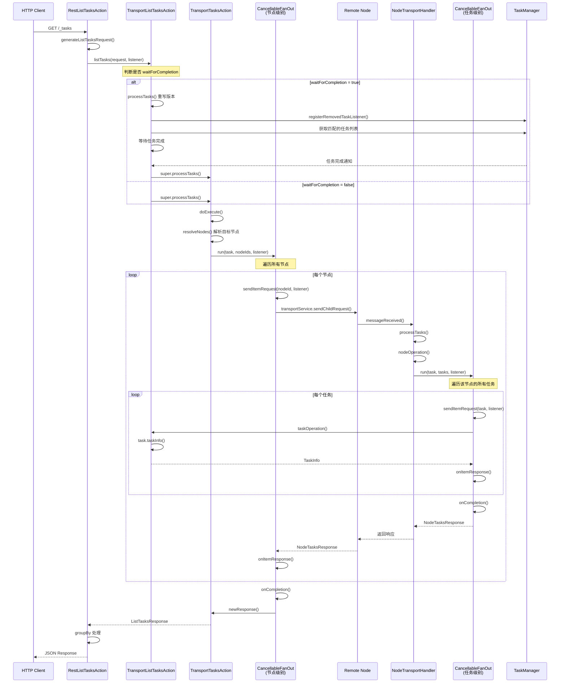

# Elasticsearch Tasks API 架构与执行流程详解

## 概述

本文档详细分析 Elasticsearch 的 `/_tasks` API 的完整执行流程，从 REST 层到 Transport 层
的整体架构设计。通过理解这个 API 的实现，可以举一反三地掌握 Elasticsearch 中其他 REST 和 Transport Action 的框架设计。

## 核心组件

### 1. REST 层
- **RestListTasksAction**: REST 请求的入口点
- 负责解析 HTTP 请求参数
- 将请求转发给 Transport 层

### 2. Transport 层
- **TransportListTasksAction**: 核心业务逻辑处理
- **TransportTasksAction**: 抽象基类，提供通用的任务操作框架
- **HandledTransportAction**: 更底层的抽象基类

### 3. 任务管理
- **TaskManager**: 管理所有正在运行的任务
- **CancellableTask**: 可取消的任务实现

### 4. 通用工具
- **CancellableFanOut**: 扇出模式的通用实现，用于并发处理多个子任务

## 完整执行流程

### 流程图



### 详细步骤说明

#### 第一阶段：REST 层处理

**文件**: `RestListTasksAction.java`

```java
// 1. REST 请求入口
@Override
public RestChannelConsumer prepareRequest(final RestRequest request, final NodeClient client) {
    final ListTasksRequest listTasksRequest = generateListTasksRequest(request);
    final String groupBy = request.param("group_by", "nodes");
    return channel -> new RestCancellableNodeClient(client, request.getHttpChannel())
        .admin()
        .cluster()
        .listTasks(listTasksRequest, listTasksResponseListener(nodesInCluster, groupBy, channel));
}
```

**关键点**:
- 解析请求参数：`detailed`, `nodes`, `actions`, `parent_task_id`, `wait_for_completion`, `timeout`
- 创建 `ListTasksRequest` 对象
- 设置响应监听器，支持 `group_by` 参数（nodes/parents/none）

#### 第二阶段：Transport Action 初始化

**文件**: `TransportListTasksAction.java`

```java
@Inject
public TransportListTasksAction(ClusterService clusterService,
                                TransportService transportService,
                                ActionFilters actionFilters) {
    super(
        TYPE.name(),
        clusterService,
        transportService,
        actionFilters,
        ListTasksRequest::new,
        TaskInfo::from,
        transportService.getThreadPool().executor(ThreadPool.Names.MANAGEMENT)
    );
}
```

**关键点**:
- 继承自 `TransportTasksAction`
- 在构造函数中，父类会注册节点级别的请求处理器：
  ```java
  transportService.registerRequestHandler(
      transportNodeAction,  // "cluster:monitor/tasks/lists[n]"
      nodeExecutor,
      NodeTaskRequest::new,
      new NodeTransportHandler()
  );
  ```

#### 第三阶段：doExecute - 协调节点处理

**文件**: `TransportTasksAction.java`

```java
@Override
protected void doExecute(Task task, TasksRequest request, ActionListener<TasksResponse> listener) {
    final var discoveryNodes = clusterService.state().nodes();
    final String[] nodeIds = resolveNodes(request, discoveryNodes);

    // 创建 CancellableFanOut 实例处理多节点请求
    new CancellableFanOut<String, NodeTasksResponse, TasksResponse>() {
        // ... 实现细节
    }.run(task, Iterators.forArray(nodeIds), listener);
}
```

**关键点**:
1. **resolveNodes()**: 确定需要查询哪些节点
   - 如果指定了 `targetTaskId`，只查询该任务所在节点
   - 否则根据 `nodes` 参数解析节点列表

2. **CancellableFanOut 第一层**（节点级别）:
   - `sendItemRequest()`: 向每个节点发送请求
   - `onItemResponse()`: 收集每个节点的响应
   - `onItemFailure()`: 处理节点失败
   - `onCompletion()`: 所有节点响应后，调用 `newResponse()` 构造最终响应

#### 第四阶段：CancellableFanOut 机制详解

**文件**: `CancellableFanOut.java`

这是一个非常精妙的设计，用于处理扇出请求并支持取消操作。

**核心机制**:

```java
public final void run(@Nullable Task task, Iterator<Item> itemsIterator, ActionListener<FinalResponse> listener) {
    // 1. 创建结果监听器
    final var resultListener = new SubscribableListener<FinalResponse>();

    // 2. 创建结果完成器（在 AtomicReference 中，可以被清除以释放内存）
    final var resultListenerCompleter = new AtomicReference<Runnable>(() -> {
        if (cancellableTask != null && cancellableTask.notifyIfCancelled(resultListener)) {
            return;
        }
        ActionListener.completeWith(resultListener, this::onCompletion);
    });

    // 3. 使用 RefCountingRunnable 确保所有子任务完成后才调用最终监听器
    try (var refs = new RefCountingRunnable(
        new SubtasksCompletionHandler<>(resultListenerCompleter, resultListener, listener))) {
        while (itemsIterator.hasNext()) {
            final var item = itemsIterator.next();
            // 为每个 item 创建监听器
            final ActionListener<ItemResponse> itemResponseListener = ActionListener.notifyOnce(...);
            // 处理 item，持有一个引用计数
            ActionListener.run(
                ActionListener.releaseAfter(itemResponseListener, refs.acquire()),
                l -> sendItemRequest(item, l)
            );
        }
    }
    // 退出 try 块时，refs 会释放一个引用
    // 当所有 item 处理完成后，SubtasksCompletionHandler.run() 被调用
}
```

**关键设计点**:

1. **引用计数**: 使用 `RefCountingRunnable` 确保所有子任务完成后才执行最终回调
2. **取消支持**: 通过 `AtomicReference` 包装完成器，可以在取消时立即释放对 `this` 的引用
3. **内存优化**: 取消时释放部分累积的结果，防止内存泄漏
4. **线程安全**: 使用 `synchronized` 保护共享状态

**onCompletion 的调用时机**:

```java
private static class SubtasksCompletionHandler<FinalResponse> implements Runnable {
    @Override
    public void run() {
        // 当所有子任务完成，RefCountingRunnable 的计数归零时调用
        resultListenerCompleter.getAndSet(() -> {}).run();
        // 这会调用 ActionListener.completeWith(resultListener, this::onCompletion)
        // 从而调用 CancellableFanOut 的 onCompletion() 方法
        resultListener.addListener(listener);
    }
}
```

#### 第五阶段：节点处理 - NodeTransportHandler

**文件**: `TransportTasksAction.java`

```java
class NodeTransportHandler implements TransportRequestHandler<NodeTaskRequest> {
    @Override
    public void messageReceived(final NodeTaskRequest request,
                               final TransportChannel channel,
                               Task task) throws Exception {
        TasksRequest tasksRequest = request.tasksRequest;
        processTasks(
            (CancellableTask) task,
            tasksRequest,
            new ChannelActionListener<NodeTasksResponse>(channel).delegateFailure(
                (l, tasks) -> nodeOperation((CancellableTask) task, l, tasksRequest, tasks)
            )
        );
    }
}
```

**关键点**:
1. 这是在**目标节点**上执行的处理器
2. 调用 `processTasks()` 获取该节点上匹配的任务列表
3. 然后调用 `nodeOperation()` 处理这些任务

#### 第六阶段：processTasks - 任务过滤与等待

**文件**: `TransportListTasksAction.java`

这里有两个版本的 `processTasks()`：

**版本1：基类版本**（简单情况）
```java
// TransportTasksAction.java
protected void processTasks(CancellableTask nodeTask, TasksRequest request,
                           ActionListener<List<OperationTask>> nodeOperation) {
    nodeOperation.onResponse(processTasks(request));
}

protected List<OperationTask> processTasks(TasksRequest request) {
    if (request.getTargetTaskId().isSet()) {
        // 查询特定任务
        Task task = taskManager.getTask(request.getTargetTaskId().getId());
        if (task != null && request.match(task)) {
            return List.of((OperationTask) task);
        }
        throw new ResourceNotFoundException(...);
    } else {
        // 查询所有匹配的任务
        final var tasks = new ArrayList<OperationTask>();
        for (Task task : taskManager.getTasks().values()) {
            if (request.match(task)) {
                tasks.add((OperationTask) task);
            }
        }
        return tasks;
    }
}
```

**版本2：TransportListTasksAction 重写版本**（waitForCompletion 情况）

```java
@Override
protected void processTasks(CancellableTask nodeTask, ListTasksRequest request,
                            ActionListener<List<Task>> nodeOperation) {
    if (request.getWaitForCompletion()) {
        // 复杂的等待逻辑
        final ListenableActionFuture<List<Task>> future = new ListenableActionFuture<>();
        final Set<Task> matchedTasks = ConcurrentCollections.newConcurrentSet();

        // 1. 注册任务移除监听器
        final RemovedTaskListener removedTaskListener = task -> {
            matchedTasks.remove(task);
            if (matchedTasks.isEmpty()) {
                future.onResponse(processedTasks);
            }
        };
        taskManager.registerRemovedTaskListener(removedTaskListener);

        // 2. 收集当前匹配的任务（排除 ListTasks 自身）
        for (final var task : processTasks(request)) {
            if (task.getAction().startsWith(TYPE.name()) == false) {
                matchedTasks.add(task);
            }
            processedTasks.add(task);
        }

        // 3. 设置超时
        future.addTimeout(timeout, threadPool, EsExecutors.DIRECT_EXECUTOR_SERVICE);

        // 4. 支持取消
        nodeTask.addListener(() -> future.onFailure(new TaskCancelledException("task cancelled")));

        // 5. 等待所有任务完成后调用 nodeOperation
        future.addListener(allMatchedTasksRemovedListener, ...);
    } else {
        super.processTasks(nodeTask, request, nodeOperation);
    }
}
```

**关键点**:
- **waitForCompletion=true**: 等待匹配的任务完成后再返回
- 使用 `RemovedTaskListener` 监听任务完成事件
- 排除 ListTasks 自身，避免死锁
- 支持超时和取消

#### 第七阶段：nodeOperation - 任务级别的 CancellableFanOut

**文件**: `TransportTasksAction.java`

```java
private void nodeOperation(
    CancellableTask nodeTask,
    ActionListener<NodeTasksResponse> listener,
    TasksRequest request,
    List<OperationTask> operationTasks
) {
    // CancellableFanOut 第二层（任务级别）
    new CancellableFanOut<OperationTask, TaskResponse, NodeTasksResponse>() {
        final ArrayList<TaskResponse> results = new ArrayList<>(operationTasks.size());
        final ArrayList<TaskOperationFailure> exceptions = new ArrayList<>();

        @Override
        protected void sendItemRequest(OperationTask operationTask,
                                      ActionListener<TaskResponse> listener) {
            // 注意：这里是本地执行，不是远程调用
            ActionListener.run(listener, l -> taskOperation(nodeTask, request, operationTask, l));
        }

        @Override
        protected void onItemResponse(OperationTask operationTask, TaskResponse taskResponse) {
            synchronized (results) {
                results.add(taskResponse);
            }
        }

        @Override
        protected void onItemFailure(OperationTask operationTask, Exception e) {
            synchronized (exceptions) {
                exceptions.add(new TaskOperationFailure(...));
            }
        }

        @Override
        protected NodeTasksResponse onCompletion() {
            return new NodeTasksResponse(clusterService.localNode().getId(), results, exceptions);
        }
    }.run(nodeTask, operationTasks.iterator(), listener);
}
```

**关键点**:
- 这是**第二层** CancellableFanOut
- 处理单个节点上的多个任务
- `sendItemRequest()` 是本地执行，不涉及网络通信

#### 第八阶段：taskOperation - 具体任务处理

**文件**: `TransportListTasksAction.java`

```java
@Override
protected void taskOperation(CancellableTask actionTask,
                            ListTasksRequest request,
                            Task task,
                            ActionListener<TaskInfo> listener) {
    // 简单地获取任务信息
    listener.onResponse(task.taskInfo(clusterService.localNode().getId(), request.getDetailed()));
}
```

**关键点**:
- 这是最终的业务逻辑
- 对于 ListTasks，只是获取任务的信息
- 对于其他 TasksAction（如 CancelTasks），这里会执行实际的操作

#### 第九阶段：响应聚合与返回

**文件**: `TransportTasksAction.java`

```java
@Override
protected ListTasksResponse newResponse(
    ListTasksRequest request,
    List<TaskInfo> tasks,
    List<TaskOperationFailure> taskOperationFailures,
    List<FailedNodeException> failedNodeExceptions
) {
    return new ListTasksResponse(tasks, taskOperationFailures, failedNodeExceptions);
}
```

**文件**: `RestListTasksAction.java`

```java
public static <T extends ListTasksResponse> ActionListener<T> listTasksResponseListener(
    Supplier<DiscoveryNodes> nodesInCluster,
    String groupBy,
    RestChannel channel
) {
    final var listener = new RestChunkedToXContentListener<>(channel);
    return switch (groupBy) {
        case "nodes" -> listener.map(response -> response.groupedByNode(nodesInCluster));
        case "parents" -> listener.map(response -> response.groupedByParent());
        case "none" -> listener.map(response -> response.groupedByNone());
        default -> throw new IllegalArgumentException(...);
    };
}
```

## 架构设计亮点

### 1. 分层架构

```
REST Layer (RestListTasksAction)
    ↓
Transport Layer (TransportListTasksAction)
    ↓
Base Framework (TransportTasksAction)
    ↓
Generic Framework (HandledTransportAction)
```

**优点**:
- 职责清晰：REST 层处理 HTTP，Transport 层处理业务逻辑
- 可复用：TransportTasksAction 可被多个 Action 继承（ListTasks, CancelTasks, GetTask 等）
- 可扩展：新增 Action 只需继承基类并实现少量方法

### 2. CancellableFanOut 模式

**设计目标**:
- 并发处理多个子任务
- 支持取消操作
- 防止内存泄漏（取消时释放部分结果）

**实现技巧**:
- 使用 `RefCountingRunnable` 管理生命周期
- 使用 `AtomicReference` 包装回调，支持清除引用
- 使用 `SubscribableListener` 支持多个订阅者

**应用场景**:
- 第一层：向多个节点发送请求
- 第二层：处理单个节点的多个任务

### 3. 双层请求处理

**协调节点**:
```
doExecute()
  → CancellableFanOut(nodes)
    → sendItemRequest(node)
      → transportService.sendChildRequest()
```

**目标节点**:
```
NodeTransportHandler.messageReceived()
  → processTasks()
    → nodeOperation()
      → CancellableFanOut(tasks)
        → taskOperation()
```

**优点**:
- 清晰的职责划分
- 支持跨节点和单节点两种场景
- 统一的错误处理

### 4. 任务管理机制

**TaskManager 的职责**:
- 注册和注销任务
- 提供任务查询接口
- 支持任务取消
- 支持任务完成监听（RemovedTaskListener）

**关键特性**:
- 线程安全的任务存储（ConcurrentMap）
- 支持可取消任务（CancellableTask）
- 支持父子任务关系
- 支持任务禁止（Ban）机制

### 5. waitForCompletion 机制

**实现原理**:
1. 注册 `RemovedTaskListener` 监听任务完成
2. 收集当前匹配的任务
3. 等待所有任务从 TaskManager 中移除
4. 设置超时保护
5. 支持取消操作

**应用场景**:
- 等待异步任务完成后再返回结果
- 用于测试和调试

## 通用 Action 框架

通过 `/_tasks` API 的分析，我们可以总结出 Elasticsearch 中 Action 的通用框架：

### 创建新的 Action 的步骤

#### 1. 定义 Request 和 Response

```java
public class MyRequest extends BaseTasksRequest<MyRequest> {
    // 请求参数
}

public class MyResponse extends BaseTasksResponse {
    // 响应数据
}
```

#### 2. 创建 REST Action

```java
public class RestMyAction extends BaseRestHandler {
    @Override
    public List<Route> routes() {
        return List.of(new Route(GET, "/_my_action"));
    }

    @Override
    public RestChannelConsumer prepareRequest(RestRequest request, NodeClient client) {
        MyRequest myRequest = parseRequest(request);
        return channel -> client.execute(
            TransportMyAction.TYPE,
            myRequest,
            new RestToXContentListener<>(channel)
        );
    }
}
```

#### 3. 创建 Transport Action

**选项 A：继承 TransportTasksAction**（如果需要操作任务）

```java
public class TransportMyAction extends TransportTasksAction<
    Task,
    MyRequest,
    MyResponse,
    MyTaskResponse
> {
    public static final ActionType<MyResponse> TYPE = new ActionType<>("cluster:admin/my_action");

    @Inject
    public TransportMyAction(
        ClusterService clusterService,
        TransportService transportService,
        ActionFilters actionFilters
    ) {
        super(
            TYPE.name(),
            clusterService,
            transportService,
            actionFilters,
            MyRequest::new,
            MyTaskResponse::new,
            executor
        );
    }

    @Override
    protected void taskOperation(
        CancellableTask actionTask,
        MyRequest request,
        Task task,
        ActionListener<MyTaskResponse> listener
    ) {
        // 实现具体的任务操作逻辑
    }

    @Override
    protected MyResponse newResponse(
        MyRequest request,
        List<MyTaskResponse> tasks,
        List<TaskOperationFailure> taskOperationFailures,
        List<FailedNodeException> failedNodeExceptions
    ) {
        return new MyResponse(tasks, taskOperationFailures, failedNodeExceptions);
    }
}
```

**选项 B：继承 HandledTransportAction**（简单的单节点操作）

```java
public class TransportMyAction extends HandledTransportAction<MyRequest, MyResponse> {
    @Inject
    public TransportMyAction(
        TransportService transportService,
        ActionFilters actionFilters
    ) {
        super(TYPE.name(), transportService, actionFilters, MyRequest::new, executor);
    }

    @Override
    protected void doExecute(Task task, MyRequest request, ActionListener<MyResponse> listener) {
        // 实现业务逻辑
    }
}
```

#### 4. 注册 Action

在模块的 `ActionPlugin` 实现中：

```java
@Override
public List<ActionHandler<? extends ActionRequest, ? extends ActionResponse>> getActions() {
    return List.of(
        new ActionHandler<>(TransportMyAction.TYPE, TransportMyAction.class)
    );
}

@Override
public List<RestHandler> getRestHandlers(...) {
    return List.of(new RestMyAction());
}
```

### 关键抽象类对比

| 类名 | 适用场景 | 特点 |
|------|---------|------|
| `HandledTransportAction` | 简单的单节点操作 | 自动注册请求处理器 |
| `TransportMasterNodeAction` | 需要在 Master 节点执行 | 自动路由到 Master |
| `TransportNodesAction` | 需要在多个节点执行 | 提供节点级别的扇出 |
| `TransportTasksAction` | 需要操作任务 | 提供任务级别的扇出 |
| `TransportBroadcastAction` | 需要广播到所有分片 | 提供分片级别的扇出 |

## 代码细节问题解答

### 问题1：sendItemRequest 后，节点的处理 handler 在哪里？

**答案**：在 `TransportTasksAction` 的构造函数中注册：

```java
transportService.registerRequestHandler(
    transportNodeAction,  // "cluster:monitor/tasks/lists[n]"
    nodeExecutor,
    NodeTaskRequest::new,
    new NodeTransportHandler()  // ← 这就是处理器
);
```

当协调节点调用 `transportService.sendChildRequest()` 时，目标节点的 `TransportService` 会根据 action 名称找到对应的处理器，即 `NodeTransportHandler`。

### 问题2：onCompletion 在哪调用？如何将 response 写入 listener？

**答案**：通过 `RefCountingRunnable` 和 `SubtasksCompletionHandler` 机制：

1. **引用计数管理**：
   ```java
   try (var refs = new RefCountingRunnable(new SubtasksCompletionHandler(...))) {
       // 为每个 item 获取一个引用：refs.acquire()
       // 每个 item 完成时释放引用
   }
   // 退出 try 块时释放初始引用
   ```

2. **当所有引用释放后**：
   ```java
   SubtasksCompletionHandler.run() 被调用
     → resultListenerCompleter.run()
       → ActionListener.completeWith(resultListener, this::onCompletion)
         → onCompletion() 被调用  // ← 在这里！
           → 返回 FinalResponse
             → resultListener.onResponse(finalResponse)
               → listener.onResponse(finalResponse)  // ← 写入外部 listener
   ```

3. **线程上下文**：
   - `onCompletion()` 在最后一个子任务完成的线程上调用
   - 如果所有子任务在 `run()` 返回前完成，则在调用线程上执行

### 问题3：两层 CancellableFanOut 的区别？

**第一层**（节点级别）：
- 在协调节点执行
- 遍历目标节点列表
- `sendItemRequest()` 发送网络请求
- 收集各节点的 `NodeTasksResponse`

**第二层**（任务级别）：
- 在目标节点执行
- 遍历该节点的任务列表
- `sendItemRequest()` 本地执行（`ActionListener.run()`）
- 收集各任务的 `TaskResponse`

### 问题4：为什么 waitForCompletion 要排除 ListTasks 自身？

**答案**：防止死锁！

```java
if (task.getAction().startsWith(TYPE.name()) == false) {
    // 只等待非 ListTasks 的任务
    matchedTasks.add(task);
}
```

如果不排除：
1. ListTasks 任务等待自己完成
2. 但 ListTasks 任务要等待 `matchedTasks` 为空才能完成
3. 形成循环依赖 → 死锁

### 问题5：如何支持任务取消？

**多层取消机制**：

1. **HTTP 层**：客户端关闭连接
   ```java
   new RestCancellableNodeClient(client, request.getHttpChannel())
   ```

2. **Task 层**：CancellableTask 支持取消
   ```java
   nodeTask.addListener(() -> future.onFailure(new TaskCancelledException(...)));
   ```

3. **CancellableFanOut 层**：取消时释放引用
   ```java
   cancellableTask.addListener(() -> {
       resultListenerCompleter.getAndSet(semaphore::acquireUninterruptibly).run();
       cancellableTask.notifyIfCancelled(itemCancellationListener);
   });
   ```

4. **TaskManager 层**：传播取消到子任务
   ```java
   public void cancel(CancellableTask task, String reason, Runnable listener) {
       holder.cancel(reason, listener);
       // 取消所有子任务
   }
   ```

## 性能优化考虑

### 1. 线程池选择

- **协调逻辑**：`DIRECT_EXECUTOR_SERVICE`（O(#nodes) 工作量小）
- **节点操作**：`ThreadPool.Names.MANAGEMENT`（可能耗时）
- **任务操作**：根据具体 Action 选择合适的线程池

### 2. 内存管理

- **取消时释放引用**：防止大量结果占用内存
- **流式响应**：使用 `RestChunkedToXContentListener` 分块发送
- **引用计数**：`NodeTaskRequest` 实现 `RefCounted` 接口

### 3. 并发控制

- **ConcurrentMap**：任务存储使用高并发 Map
- **synchronized 最小化**：只在必要时同步
- **无锁设计**：使用 `AtomicReference`、`AtomicBoolean` 等

## 总结

Elasticsearch 的 `/_tasks` API 展示了一个优秀的分布式系统架构：

1. **清晰的分层**：REST → Transport → Base Framework
2. **强大的抽象**：CancellableFanOut 支持多种扇出场景
3. **完善的生命周期管理**：引用计数、取消支持、超时保护
4. **灵活的扩展性**：通过继承基类快速实现新 Action
5. **健壮的错误处理**：每一层都有完善的异常处理

通过理解这个框架，可以：
- 快速实现新的 REST API
- 理解其他 Action 的实现（如 `_cat/tasks`、`_tasks/_cancel` 等）
- 进行性能优化和问题排查
- 设计自己的分布式任务系统

## 参考代码路径

- REST 层：`server/src/main/java/org/elasticsearch/rest/action/admin/cluster/RestListTasksAction.java`
- Transport 层：`server/src/main/java/org/elasticsearch/action/admin/cluster/node/tasks/list/TransportListTasksAction.java`
- 基础框架：`server/src/main/java/org/elasticsearch/action/support/tasks/TransportTasksAction.java`
- 扇出工具：`server/src/main/java/org/elasticsearch/action/support/CancellableFanOut.java`
- 任务管理：`server/src/main/java/org/elasticsearch/tasks/TaskManager.java`
- 基类：`server/src/main/java/org/elasticsearch/action/support/HandledTransportAction.java`
